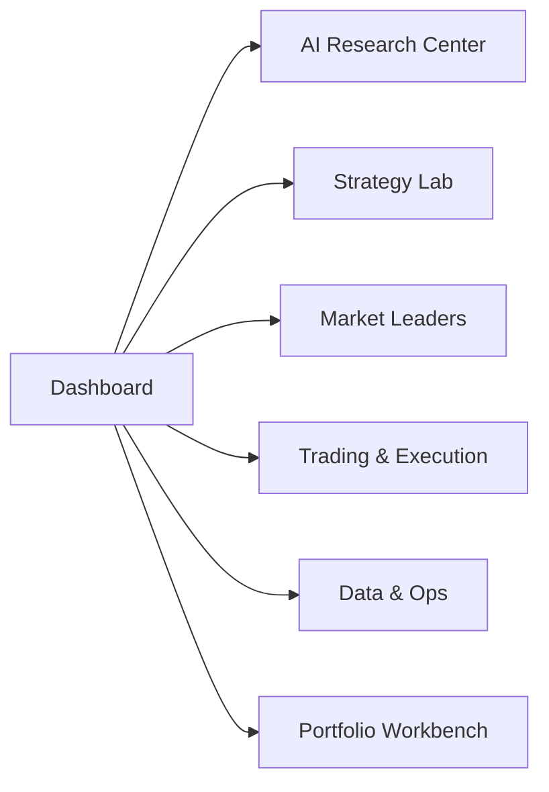

# TradingAgents-Astock 待开发 Backlog

## 1. 文档目标

本文档整理当前仓库后续最值得推进的需求项，按优先级划分为：

- P0：必须尽快收口
- P1：高价值增强
- P2：后续优化

更完整的金融产品优化路线图见 `docs/ASTOCK_PRODUCT_OPTIMIZATION_ROADMAP.md`。Backlog 负责记录执行队列，路线图负责说明为什么做、先做什么、每个模块如何达到金融产品可用口径。

需求到模块、测试和 phase 的映射见 `docs/ASTOCK_REQUIREMENTS_TRACEABILITY_MATRIX.md`。产品指标、运行指标、告警和 Ops 要求见 `docs/ASTOCK_PRODUCT_METRICS_AND_OPS_REQUIREMENTS.md`。

生产级交付还必须同步以下文档：

- API 契约：`docs/ASTOCK_API_CONTRACTS.md`
- 项目风险登记表：`docs/ASTOCK_PROJECT_RISK_REGISTER.md`
- 架构决策记录 ADR：`docs/ASTOCK_ARCHITECTURE_DECISION_RECORDS.md`
- 数据字典与血缘：`docs/ASTOCK_DATA_DICTIONARY_AND_LINEAGE.md`
- 数据迁移与升级手册：`docs/ASTOCK_DATA_MIGRATION_AND_UPGRADE.md`
- 数据源授权与使用边界：`docs/ASTOCK_DATA_SOURCE_LICENSE_AND_USAGE.md`
- AI 模型治理：`docs/ASTOCK_MODEL_GOVERNANCE.md`
- 实盘运行手册：`docs/ASTOCK_LIVE_TRADING_RUNBOOK.md`
- 核心功能部署与环境：`docs/ASTOCK_DEPLOYMENT_AND_ENVIRONMENT.md`
- 测试与验收计划：`docs/ASTOCK_TEST_ACCEPTANCE_PLAN.md`
- 发布与变更管理：`docs/ASTOCK_RELEASE_AND_CHANGE_MANAGEMENT.md`
- 风险披露与合规边界：`docs/ASTOCK_RISK_DISCLOSURE_AND_COMPLIANCE.md`
- WebUI 产品规范：`docs/ASTOCK_WEBUI_PRODUCT_SPEC.md`
- WebUI 页面级验收清单：`docs/ASTOCK_WEBUI_PAGE_ACCEPTANCE_CHECKLIST.md`
- 文档范围登记：`docs/ASTOCK_DOCUMENT_SCOPE_REGISTER.md`

## 2. P0

### BL-000 建立实盘准入清单

现状：

- 当前系统已经能支撑投研分析、回测、模拟盘和 QMT 受控执行
- 但专业金融系统的实盘生产闭环仍缺账户/订单/成交 reconciliation、审计、kill switch、数据质量和组合级风控门槛

目标：

- 建立 `Live Trading Readiness` checklist
- 明确哪些能力属于 `research`、`paper`、`managed`、`live-ready`
- 把实盘准入条件写入状态文档、技术文档和 phase 归档

完成标准：

- 有账户资产、持仓、委托、成交、撤单、拒单、部分成交、券商回报的状态模型要求
- 有 kill switch、最大亏损、最大仓位、最大单笔金额、交易时段、手工确认的硬约束
- 有审计要求：数据快照、AI prompt、模型版本、人工确认、订单回报全链路可追溯
- 文档明确当前系统“可实盘辅助分析”，但“不等于完整自动实盘生产系统”

### BL-001 统一 QMT 能力边界

现状：

- QMT 在执行层已存在
- QMT 在 blueprint/provider 口径里仍保留 placeholder 语义

目标：

- 统一 QMT 在 provider、execution、API、状态文档中的能力定义

完成标准：

- blueprint / status / phase / code 口径一致
- 不再同时出现“已完成执行”和“provider 仍占位”冲突

### BL-002 修正 `qmt/orders` 的 mock 语义

现状：

- `/api/v1/qmt/orders` 返回的是 mock/read-only 响应

目标：

- 接真实 QMT 订单/委托查询，或明确改名为 mock endpoint

完成标准：

- endpoint 语义与返回内容一致
- 文档不再误导为真实订单模块

### BL-003 修正 trade quote / trade state 的能力口径

现状：

- `trade/quote` 使用 EastMoney push2 实时报价 + Sina 降级 + 60s 缓存 — ✅ **已真实**
- `trade/state` 使用 PaperTrader 状态 + 实时报价估值 — ✅ **明确为 Paper Trading 路径**

目标：

- ✅ 已达成 — trade/quote 是实时数据（EastMoney → Sina → 缓存三级降级）
- trade/state 属于 Paper Trading，非实盘，文档已写明

完成标准：

- endpoint 语义与返回内容一致 — ✅ trade/quote 返回实时数据
- 用户不会把 mock 报价误认为真实交易报价 — ✅ trade/quote 已标注 source: "live"|"cache"；trade/state 通过 PaperTrader 路径

### BL-004 为专业交易页建立正式归档

现状：

- `trading.html`、`routes_trade.py`、相关测试已进入代码
- 已建立独立 phase 归档 `docs/phases/phase-29-trading-page.md`

目标：

- ✅ 已达成 — 有 scope、测试、风险说明、commit SHA

完成标准：

- 有 scope — ✅ `phase-29-trading-page.md`
- 有测试 — ✅ WebUI + API 切片 150 passed
- 有风险说明 — ✅ 实时报价依赖/缓存/持久化
- 有 commit SHA — ✅ `268d326`, `87e5b73`, `1960c65` 等

### BL-200 Web-G0 需求冻结 — 更新 backlog / traceability / product-spec / checklist 文档

| 状态 | 备注 |
|------|------|
| ✅ done | Web-G0 phase 文档已创建，backlog/traceability/spec/checklist 均已更新 |

现状：
- Web 工作台竞品对齐矩阵已确定 P0/P1/P2 分组，但尚未写入 backlog 和 traceability
- 默认入口、能力标签和安全边界需要正式冻结，避免开发中反复改方向

目标：
- 将 DSA / AIS / TA / REF / TDX 矩阵映射到需求 ID，写入 backlog 和 traceability
- 固定 `/dashboard` 为默认首页
- 明确 QMT/miniQMT 默认不是自动实盘
- 明确 TDX 行情链路归属 Data & Ops，不归属 Trading & Execution

完成标准：
- 每个 P0/P1 能力都有需求 ID、模块、phase、验收证据位置
- 文档状态不把 planned 写成 done

### BL-201 Web-P0 首页重构 — dashboard 作为每日工作台

| 状态 | 备注 |
|------|------|
| 🔶 partial | dashboard.html 已有 7 个区域骨架，但非所有卡片实现五态；Web-P0 需深化完成 |

现状：
- `/dashboard` 更像系统指标页，不像用户每日打开的工作台
- 当前首页缺少市场摘要、自选股/持仓、任务、报告、告警和数据健康聚合

目标：
- 重做 `/dashboard`，第一屏聚合市场、自选股、持仓、AI 任务、报告、告警和数据健康
- 交易入口后置为二级动作

完成标准：
- 首页有市场、自选股/持仓、任务、报告、告警、龙头/板块摘要、数据健康七个区域
- 所有卡片支持 loading、empty、error/degraded 状态
- 首页不使用 iframe
- 桌面 1366px、1440px、1920px 下无遮挡或横向溢出

### BL-202 默认入口变更 — `/` 重定向到 `/dashboard`

| 状态 | 备注 |
|------|------|
| ✅ done | `/` 已 302 → `/dashboard`，在 `web/__init__.py:119` 实现 |

现状：
- `/` 默认进入交易页，用户还没完成分析、盯盘就被推到下单界面

目标：
- `/` 改为 302 到 `/dashboard`
- `trading.html` 不再作为新用户第一屏

完成标准：
- `/dashboard` 是产品默认入口
- 旧入口保留兼容，但显示迁移提示

### BL-203 DSA-01 每日市场复盘 — 按交易日生成市场回顾

| 状态 | 备注 |
|------|------|
| 🔶 partial | 市场摘要 API (market/summary) + dashboard 指数卡片已存在，但缺少结构化交易日回顾报告 |

现状：
- 无每日市场复盘能力
- 用户需要手动查看指数、涨跌家数和板块

目标：
- 可按交易日生成市场复盘，含指数、涨跌家数、板块强弱和风险摘要

完成标准：
- 复盘包含主要指数涨跌幅、涨跌家数比、板块强弱排序和风险标注
- 复盘结果可归档为报告

### BL-204 DSA-02 自选股批量分析 — 维护 watchlist 并批量生成 AI 摘要

| 状态 | 备注 |
|------|------|
| 🔶 partial | dashboard 有自选股异动卡片，PaperTrader 维护 watchlist，但缺少批量 AI 分析入口 |

现状：
- 自选股管理不完整，缺少批量 AI 分析入口

目标：
- 用户可维护 watchlist，并批量生成 AI 摘要和评分

完成标准：
- 有 watchlist 管理或读取入口
- 批量分析任务可触发、查看进度和结果

### BL-205 DSA-03 决策仪表盘摘要 — 首页展示 buy/hold/sell/research-only 摘要

| 状态 | 备注 |
|------|------|
| 🔶 partial | dashboard 展示汇总数据卡片（跟踪股票数/回测数/模拟盘净值/持仓数），但缺少 buy/hold/sell/research-only 决策摘要 |

现状：
- 首页缺少决策摘要，用户不知道 AI 对自选股/持仓的整体判断

目标：
- 首页展示买入/观望/卖出或 research-only 等级摘要
- 不得直接标成可执行指令

完成标准：
- 摘要明确标注 `research_only` / `actionable=false`
- 不把 AI 摘要伪装为买卖建议

### BL-206 DSA-04 历史报告归档 — 按 symbol、日期、模型、数据快照归档

| 状态 | 备注 |
|------|------|
| 🔶 partial | `/reports` 页面 + `/api/v1/reports/pptx` 端点存在，但报告缺少 symbol/模型/数据快照等结构化字段 |

现状：
- 报告保存不完整，缺少 symbol、模型、数据快照等结构化字段

目标：
- 报告有 symbol、日期、模型、数据快照、状态和查看入口

完成标准：
- 报告可从首页、报告中心、symbol 页面三处访问
- 报告包含 model、prompt_version、data_snapshot_id、advisory_scope、actionable、status 字段

### BL-207 DSA-05 任务进度 — queued/running/succeeded/failed/cancelled

| 状态 | 备注 |
|------|------|
| 🔶 partial | `/api/v1/ops/tasks` 端点 + ops_audit.html 任务中心存在，但 dashboard 任务卡片缺少完整状态机展示 |

现状：
- 分析任务缺少状态展示，用户不知道任务是否完成

目标：
- 分析任务有 queued/running/succeeded/failed/cancelled 状态

完成标准：
- 首页展示任务状态、进度和最近完成报告
- 失败任务显示失败原因和重试入口

### BL-208 AIS-01 实时盯盘 — 自选股实时/缓存状态、涨跌幅、成交额、更新时间

| 状态 | 备注 |
|------|------|
| 🔶 partial | `/market_leaders` 页面整合了龙头/龙虎榜/北向/板块 iframe tab，但缺少统一自选股实时状态表 |

现状：
- 自选股实时行情分散，缺少统一盯盘入口

目标：
- 自选股列表展示实时/缓存状态、涨跌幅、成交额、更新时间

完成标准：
- 页面显示数据更新时间和缓存/降级状态
- 数据源不可用时显示 degraded 状态，不白屏

### BL-209 AIS-06 板块轮动 — 首页板块强弱摘要，轮动/回测入口

| 状态 | 备注 |
|------|------|
| 🔶 partial | market/sectors API + dashboard 热门板块 TOP3 卡片存在，但缺少板块轮动详细视图 |

现状：
- 板块强弱分析分散在旧页面，首页缺少入口

目标：
- 首页展示板块强弱摘要，有详细轮动/回测入口

完成标准：
- 首页板块摘要包含板块名称、涨跌幅和强弱标识
- 可跳转到详细板块轮动和回测页面

### BL-210 AIS-09 持仓监控 — 首页持仓风险、盈亏、集中度、告警

| 状态 | 备注 |
|------|------|
| 🔶 partial | dashboard 显示持仓数量 + 模拟盘净值，portfolio 页面显示完整组合数据，但缺少告警集成 |

现状：
- 持仓风险信息分散，首页缺少摘要

目标：
- 首页展示持仓风险、P&L、集中度和告警

完成标准：
- 摘要包含总市值、盈亏、集中度指标和风险标识
- 明确标注 paper/managed 能力等级

### BL-211 TA-01 AI 研究链展示 — researcher/trader/risk/portfolio 分层结果

| 状态 | 备注 |
|------|------|
| 🔶 partial | research.html + ai_agent.html 存在，但缺少 researcher/trader/risk/portfolio 分层链路展示 |

现状：
- TradingAgents 多智能体研究链结果分散，缺少统一展示

目标：
- 页面显示 researcher/trader/risk/portfolio 分层结果

完成标准：
- 研究链各层结果可追溯
- ResearchConclusion -> TraderProposal -> RiskDecision -> PortfolioDecision 路径可见

### BL-212 TA-03 research_only 安全边界 — 所有 AI 输出默认 actionable=false

| 状态 | 备注 |
|------|------|
| 📋 planned | 所有 AI 输出默认 actionable=false 未全局实现，需 Web-P0 阶段落地 |

现状：
- AI 输出缺少统一的安全边界标记

目标：
- 所有 AI 输出默认 `actionable=false`，不直接触发交易

完成标准：
- 每个 AI 输出页面或报告标注 `research_only` 和 `actionable=false`
- 用户不会误以为 AI 可直接实盘交易

### BL-213 TA-04 回测引擎入口 — 首页显示最近回测和一键回测

| 状态 | 备注 |
|------|------|
| 🔶 partial | dashboard 有回测快捷入口 + 最近回测列表，backtest/run + backtest/optimize API 均已存在 |

现状：
- 回测能力已存在但首页缺少快捷入口

目标：
- 今日工作台可进入最近回测和一键回测

完成标准：
- 首页有最近回测列表和运行新回测按钮
- 回测结果显示成本、滑点、T+1、停牌/涨跌停假设

### BL-214 TA-07 模拟盘状态 — 首页显示 paper status，不伪装为真实账户

| 状态 | 备注 |
|------|------|
| 🔶 partial | dashboard 展示 paper_total_value + paper_positions，paper.html 页面存在，但能力等级标注需加强 |

现状：
- 首页可能把 paper/mock 数据误标为真实实盘

目标：
- 首页显示 paper 状态，不伪装为真实账户

完成标准：
- 模拟盘页面和入口统一标注 paper/managed
- 不把 paper 数据标为 live-ready

### BL-215 TA-09 组合 VaR/集中度/归因 — 首页风险摘要

| 状态 | 备注 |
|------|------|
| 🔶 partial | portfolio.html + `/api/v1/portfolio/risk` + `/api/v1/portfolio/attribution` 已实现（Phase 36），但首页摘要需强化 |

现状：
- 组合级风险指标缺少首页入口

目标：
- 首页显示关键风险摘要（VaR、集中度、归因）

完成标准：
- 摘要包含 VaR、最大回撤、集中度等核心指标
- 详细页显示完整归因

### BL-216 TA-11 数据健康 — 首页 provider 健康、缓存、降级、stale 状态

| 状态 | 备注 |
|------|------|
| 🔶 partial | data_health.html + `/api/v1/data/health` API 已存在，dashboard 有数据健康摘要卡片 |

现状：
- 数据源健康信息分散，用户不知道哪些 provider 正常

目标：
- 首页显示 provider 健康、缓存、降级和 stale 状态

完成标准：
- 数据健康摘要包含各 provider 状态、缓存 age、degraded 标识
- 外部数据源不可用时首页不 500

## 3. P1

### BL-100 Strategy Lab 模块整合

现状：

- 策略、回测、批量回测、优化、绩效、策略对比、动量轮动均已有实现
- 当前能力分散在 execution、API、WebUI 和独立动量入口中
- `docs/ASTOCK_STRATEGY_DEVELOPMENT_GUIDE.md` 已固化策略生命周期、注册点、复合评分和常见陷阱

目标：

- 将策略模块和回测能力统一到一个 Strategy Lab 产品/工程边界
- 统一策略注册、参数 schema、结果 schema、成本模型、风控约束和绩效归因

完成标准：

- 有 `phase-32-strategy-lab-consolidation.md` 归档
- 所有策略均可通过统一 registry 描述参数和适用场景
- 单标的策略符合 `StrategyBase -> generate_signals` 规范
- 动量轮动等组合策略明确使用 Standalone 模式或 StrategyBase 兼容模式
- `_STRATEGY_REGISTRY`、`AVAILABLE_STRATEGIES` 和包级导出不再各自漂移
- Backtest / Optimize / Compare / Performance / Momentum Rotation 在产品侧属于同一模块
- 旧入口有明确兼容策略或迁移计划

### BL-100A AI Research Center 模块整合

现状：

- AI Agent 页面、A 股 research runtime、报告中心、研究页面均已存在
- AI 分析的上下文、prompt、模型、引用、报告归档和人工确认状态尚未统一

目标：

- 将 AI Agent、A 股研究报告、新闻/公告/研报解读、策略解释整合为 AI Research Center
- 保持所有 AI 输出默认 advisory，不直接触发真实交易

完成标准：

- 有 `phase-33-ai-research-center.md` 归档
- AI 任务记录模型、prompt、输入数据快照、引用来源、生成时间和人工确认状态
- AI Research Center 可以调用行情、财务、公告、新闻、研报、策略结果和持仓风险作为上下文
- 报告中心统一管理 Markdown/JSON/PPT/Web report

### BL-100B 龙头相关单入口

现状：

- `/market_leaders` 单入口与顶层 sidebar 入口已经存在
- 龙头动量总览、动量轮动、龙虎榜、北向资金、板块页面仍保留独立兼容入口
- 产品入口已初步收敛，但页面内部 tab 收口与旧入口下线策略尚未完全闭环

目标：

- 顶层最多保留一个龙头相关入口
- 在该入口内部用顶部 tab 切换不同子板块

完成标准：

- 有 `phase-34-market-leaders-entry.md` 归档
- 顶层导航只出现一个 `Market Leaders` / `龙头决策` 入口
- 内部 tab 至少覆盖：动量总览、轮动回测、板块强弱、资金线索、候选池
- 旧的 `momentum_dashboard`、`momentum_rotation`、`dragon_tiger`、`northbound`、`sectors` 有兼容跳转或明确降级策略

### BL-101 明确专业交易页的产品定位

候选定位：

- paper trading 控制台
- 受控执行控制台
- 研究辅助交易页

目标：

- ✅ 已达成 — 三种模式共存（Paper / 实盘 / 研究），通过模式切换器统一入口
- phase-29-trading-page.md 已更新多模式定位描述
- trading.html 已添加模式切换器 UI

### BL-102 完善 QMT fundamentals 替代策略

现状：
- ✅ 已解决 — 基本面数据永远走非 QMT provider（akshare/Tencent/EastMoney/cninfo）
- router.py 中 fundamentals 路由已配置为 akshare/Tencent 优先
- QMT 仅提供交易执行接口，不处理基本面查询

目标：
- ✅ 已达成 — 基本面不走 QMT 的降级策略已在生产路径中生效

### BL-103 收敛 phase 归档一致性

现状：

- ✅ 已达成 — Phase 0-29 均已有 `docs/phases/phase-*.md` 归档文件
- ✅ Phase 13/15/16/17 已补最小归档
- ✅ Phase 18/19/20 已接入 `docs/phases/README.md` 链接
- ✅ Phase 20 提交 SHA 已从 `pending` 修正为 `d128dc9`

目标：

- phase 文档统一补齐 commit SHA、测试与风险 — ✅ 当前已闭环

### BL-104 收紧 mock 与 real 的状态标识

目标：

- 在 API、页面、状态文档里显式标注 mock / paper / real / managed

### BL-105 数据质量与回测反偏差

关联 Phase：Phase 31

目标：

- 建立交易日历、停复牌、涨跌停、复权、除权除息、ST、退市和 survivorship bias 的处理要求
- 明确回测禁止 look-ahead bias 和未来函数
- 为行情、财务、公告、新闻、研报建立数据质量分级和 provenance 记录

### BL-300 DSA-06 推送通知配置 — 至少一种通道端到端可验证

| 状态 | 备注 |
|------|------|
| 📋 planned | 无通知系统，settings.html 无推送配置入口，需新建 notification 模块 |

现状：
- 推送能力未实现，缺少配置入口

目标：
- 支持至少一种本地可验证通道（如邮件/Webhook）
- 其他通道可先配置占位但标注未验证

完成标准：
- 推送配置页面可见
- 至少一种通道端到端可触发、可验证
- 推送失败不影响报告归档

### BL-301 DSA-07 定时任务 — 本地 cron/APScheduler 每日分析

| 状态 | 备注 |
|------|------|
| 🔶 partial | PaperTradeScheduler (execution/scheduler.py) 已实现，但仅用于模拟盘交易周期，无通用分析任务调度 |

现状：
- 无定时触发能力，分析需手动启动

目标：
- 支持本地 cron/APScheduler 触发每日分析

完成标准：
- 定时任务可配置触发时间和分析范围
- GitHub Actions 作为后续部署方案

### BL-302 DSA-12 代码/名称/拼音补全 — 全局搜索

| 状态 | 备注 |
|------|------|
| 📋 planned | 搜索框无智能补全功能，需实现自动补全模块 |

现状：
- 搜索框缺少智能补全

目标：
- 全局搜索和输入框支持股票代码、名称、拼音统一补全

完成标准：
- 输入时展示匹配候选列表
- 选择后跳转到对应 symbol 页面

### BL-303 AIS-02 AI 盯盘摘要 — 对异动股票生成短摘要

| 状态 | 备注 |
|------|------|
| 📋 planned | 无异常股票 AI 摘要功能 |

现状：
- 异动股票无 AI 自动摘要

目标：
- 对异动股票生成短摘要，标注数据来源和模型

完成标准：
- 摘要标注 `research_only`
- 包含模型和数据来源信息

### BL-304 AIS-03 主力资金 — 显示资金流入/流出、来源、刷新时间

| 状态 | 备注 |
|------|------|
| 🔶 partial | northbound API (北向资金) 存在，但无统一的主力资金流入/流出组件 |

现状：
- 主力资金信息分散，缺少统一组件

目标：
- 显示资金流入/流出、来源、刷新时间和降级态

完成标准：
- 页面显示数据来源、更新时间和降级标识
- 数据源不可用时显示 degraded

### BL-305 AIS-04 龙虎榜 — 整合入盯盘中心

| 状态 | 备注 |
|------|------|
| 🔶 partial | dragon-tiger API + legacy dragon_tiger.html 存在，已集成到 market_leaders iframe tab |

现状：
- 龙虎榜作为孤立旧入口存在

目标：
- 不再作为孤立旧入口，进入盯盘中心 tab

完成标准：
- 旧入口有兼容跳转或 deprecation 提示
- 盯盘中心内部 tab 可查看龙虎榜

### BL-306 AIS-05 北向资金 — 整合入盯盘中心

| 状态 | 备注 |
|------|------|
| 🔶 partial | northbound API + legacy northbound.html 存在，已集成到 market_leaders iframe tab |

现状：
- 北向资金作为孤立旧入口存在

目标：
- 不再作为孤立旧入口，进入盯盘中心 tab

完成标准：
- 旧入口有兼容跳转或 deprecation 提示
- 盯盘中心内部 tab 可查看北向资金

### BL-307 AIS-07 主力选股批量分析 — 候选池批量 AI 分析

| 状态 | 备注 |
|------|------|
| 📋 planned | 无候选池批量分析入口 |

现状：
- 主力选股批量分析缺少入口和记录

目标：
- 可对候选池批量分析，保存历史记录

完成标准：
- 批量分析任务可触发和查看结果
- 历史记录可回溯

### BL-308 AIS-08 策略监控 — 策略信号生成告警，不直接下单

| 状态 | 备注 |
|------|------|
| 📋 planned | 策略信号与告警系统未连接 |

现状：
- 策略信号与告警系统未连接

目标：
- 策略信号可加入监控，生成告警，不直接下单

完成标准：
- 告警包含触发条件、数据来源、触发时间
- 不直接触发真实交易

### BL-309 AIS-10 条件告警 — 价格/涨跌幅/成交量/策略/风控告警

| 状态 | 备注 |
|------|------|
| 📋 planned | `/api/v1/alerts` endpoint 不存在，无任何告警系统 |

现状：
- 条件告警规则未实现

目标：
- 支持价格、涨跌幅、成交量、策略信号、风控告警规则

完成标准：
- 告警规则可创建、启用、禁用
- 告警事件有触发条件、数据来源、状态和处理动作

### BL-310 AIS-12 模型配置 — 模型可见，研究记录模型和 prompt 版本

| 状态 | 备注 |
|------|------|
| 🔶 partial | settings.html 有模型/数据源选择器，但研究记录缺少 model/prompt_version |

现状：
- 模型配置不透明，研究记录缺少模型和 prompt 版本

目标：
- 模型配置在系统页面可见
- 研究任务记录模型名称和 prompt 版本

完成标准：
- 系统设置页可查看和选择模型
- 报告和研究记录包含 model 和 prompt_version 字段

### BL-311 AIS-13 miniQMT/QMT 入口 — 默认 managed/paper，人工确认

| 状态 | 备注 |
|------|------|
| 🔶 partial | qmt.html + QMT routes 存在，但缺少 managed/paper 能力等级标注 |

现状：
- QMT/miniQMT 能力容易被误标为 live-ready

目标：
- 默认 managed/paper，必须人工确认
- 自动实盘为显式高级开关

完成标准：
- 入口标注 managed/paper 能力等级
- 自动实盘默认关闭
- managed 执行必须展示确认人、确认时间、风控结果

### BL-312 AIS-14 T+1 规则适配 — 回测/模拟盘/受控执行均标注 T+1

| 状态 | 备注 |
|------|------|
| 📋 planned | T+1 约束未在回测/模拟盘/受控执行路径中显式标注 |

现状：
- T+1 约束未在所有路径中显式标注

目标：
- 回测、模拟盘、受控执行路径均标注 T+1 约束

完成标准：
- 回测结果展示 T+1 假设
- 模拟盘和受控执行页面标注 T+1

### BL-313 TA-05 参数优化 — 结果关联报告和策略监控

| 状态 | 备注 |
|------|------|
| 🔶 partial | backtest/optimize API 已存在，但优化结果未与报告关联 |

现状：
- 参数优化结果孤立，未与报告和监控关联

目标：
- 参数优化结果可与报告和策略监控关联

完成标准：
- 优化结果可引用到报告
- 优化参数可进入策略监控

### BL-314 TA-06 Walk-forward/反偏差检查 — 数据显示数据质量、OOS、偏差

| 状态 | 备注 |
|------|------|
| 📋 planned | 回测结果缺少数据质量/OOS/偏差检查 |

现状：
- 回测结果缺少数据质量、样本外和偏差检查

目标：
- 回测结果显示数据质量、样本外（OOS）和偏差检查

完成标准：
- 回测报告包含数据区间、质量标签、样本外标识
- 有 survivorship bias / look-ahead bias 检查说明

### BL-315 TA-08 QMT 受控执行 — 不可用时 disabled 或降级 paper

| 状态 | 备注 |
|------|------|
| 🔶 partial | QMT routes + risk gate 已接线，但 QMT 不可用时 disabled/paper 降级未实现 |

现状：
- QMT 不可用时状态不清晰

目标：
- QMT 不可用时 disabled 或降级 paper；实盘必须确认

完成标准：
- QMT 不可用时不允许伪装成功
- 页面显示 QMT 状态和能力等级

### BL-316 TA-10 审计中心 — AI/报告/风控/交易确认/订单回报有审计记录

| 状态 | 备注 |
|------|------|
| 🔶 partial | AuditStore + ops/tasks + ops/audit + ops/stats API + ops_audit.html 已存在（Phase 37） |

现状：
- 审计记录分散，缺少统一查看入口

目标：
- AI 报告、风控、交易确认、订单回报有审计记录

完成标准：
- 审计记录包含 event_type、actor、payload_hash、created_at
- 订单、风控和审计 ID 可以互相追溯

## 4. P2

### BL-201 补更清晰的模块需求追踪矩阵

目标：

- ✅ 已达成 — 已建立 `docs/ASTOCK_REQUIREMENTS_TRACEABILITY_MATRIX.md`
- 后续 phase 需要持续维护该矩阵

### BL-202 继续清理文档漂移

现状：
- ✅ 已修复 — 统一口径已同步：CURRENT_STATUS.md 测试数（63→65）、通过数（1019→1017）、版本号（0.1.0→0.2.5）、.venv 状态
- ✅ USER_MANUAL.md 周期数（6→7）已修正
- ✅ phases/README.md Phase 14 策略数（6→10）、Phase 15 端点数（19→30+）、Phase 35-38 状态已同步

目标：
- ✅ 已达成 — 后续 phase 变更后需同步维护数字口径
### BL-203 细化多入口职责

目标：

- 继续明确 CLI、Streamlit、Flask WebUI 各自职责

### BL-204 为真实交易能力补更明确的验收门槛

目标：

- 已纳入 Phase 30 Live Trading Readiness
- 已建立实盘运行手册、测试验收计划、API 契约和风险披露文档作为前置门槛
- 需要在 `phase-30-live-trading-readiness.md` 中固化 checklist

### BL-206 API 契约治理

目标：

- ✅ 已建立 `docs/ASTOCK_API_CONTRACTS.md`
- 后续 API 变更必须维护 capability、envelope、错误码、schema 和审计引用

### BL-207 数据字典与血缘治理

目标：

- ✅ 已建立 `docs/ASTOCK_DATA_DICTIONARY_AND_LINEAGE.md`
- 后续数据字段、provider、质量标签、快照和 fallback 变化必须同步维护

### BL-208 测试验收与发布门槛治理

目标：

- ✅ 已建立 `docs/ASTOCK_TEST_ACCEPTANCE_PLAN.md`
- 后续 phase 必须按测试分层、阻断条件、回滚和证据要求归档

### BL-209 风险披露与合规边界治理

目标：

- ✅ 已建立 `docs/ASTOCK_RISK_DISCLOSURE_AND_COMPLIANCE.md`
- 后续页面、报告、AI 输出、回测和交易入口必须保持风险披露一致

### BL-210 核心功能环境文档治理

目标：

- ✅ 已建立 `docs/ASTOCK_DEPLOYMENT_AND_ENVIRONMENT.md`
- 后续核心功能启动、依赖、健康检查和 degraded 口径必须同步维护

### BL-211 AI 模型治理

目标：

- ✅ 已建立 `docs/ASTOCK_MODEL_GOVERNANCE.md`
- 后续 AI provider、prompt、模型输出 schema 和降级行为必须同步维护

### BL-212 WebUI 页面规范治理

目标：

- ✅ 已建立 `docs/ASTOCK_WEBUI_PRODUCT_SPEC.md`
- 后续 WebUI 顶层导航、页面状态、能力标签和旧入口迁移必须同步维护

### BL-213 变更兼容治理

目标：

- ✅ 已建立 `docs/ASTOCK_RELEASE_AND_CHANGE_MANAGEMENT.md`
- 后续 API/data/AI/trading/UI 兼容性变化必须同步维护

### BL-214 暂不纳入范围登记

目标：

- ✅ 已建立 `docs/ASTOCK_DOCUMENT_SCOPE_REGISTER.md`
- 安全与隐私、SLA 与故障分级、用户角色/RBAC 当前只登记，不进入核心功能需求

### BL-215 数据迁移与升级治理

目标：

- ✅ 已建立 `docs/ASTOCK_DATA_MIGRATION_AND_UPGRADE.md`
- 后续 DuckDB、cache、schema、报告归档和回测结果结构变化必须同步维护迁移、校验和回滚策略

### BL-216 WebUI 页面级验收治理

目标：

- ✅ 已建立 `docs/ASTOCK_WEBUI_PAGE_ACCEPTANCE_CHECKLIST.md`
- 后续 WebUI 页面开发或重构必须补齐输入、输出、状态、错误态和截图/替代证据

### BL-217 项目风险登记治理

目标：

- ✅ 已建立 `docs/ASTOCK_PROJECT_RISK_REGISTER.md`
- 后续 Phase 30-38 开始前必须检查相关 open 风险，完成后必须更新风险状态

### BL-218 架构决策记录治理

目标：

- ✅ 已建立 `docs/ASTOCK_ARCHITECTURE_DECISION_RECORDS.md`
- 后续涉及 core、API、数据 schema、交易能力等级、WebUI 顶层导航、AI 输出边界的重大变更必须补 ADR

### BL-205 组合级风险与绩效归因

目标：

- 增加行业暴露、个股集中度、相关性、Beta、流动性、换手、VaR、压力测试和回撤归因要求
- 将单股/单策略分析升级为组合级投资工作台能力

### BL-400 DSA-10 多轮问股 — 支持单 symbol 上下文追问

| 状态 | 备注 |
|------|------|
| 📋 planned | 单股分析无上下文追问能力 |

现状：
- 单股分析缺少上下文追问能力

目标：
- 支持围绕单个 symbol 的上下文追问和报告引用

完成标准：
- 用户可围绕单一 symbol 连续追问，上下文不丢失
- 回答可引用历史报告和数据

### BL-401 DSA-11 图片/CSV/Excel 导入 — 自选股/持仓导入

| 状态 | 备注 |
|------|------|
| 📋 planned | 无导入功能 |

现状：
- 缺少导入功能，自选股/持仓需手动输入

目标：
- 支持导入 watchlist 或持仓
- 导入失败有可读错误

完成标准：
- 支持 CSV/Excel 文件导入
- 导入结果展示导入成功/失败明细

### BL-402 DSA-13 多市场支持 — A 股稳定后扩展港股/美股

| 状态 | 备注 |
|------|------|
| 📋 planned | 仅支持 A 股 |

现状：
- 当前只支持 A 股主路径

目标：
- A 股稳定后扩展港股、美股
- 不得影响 A 股主路径

完成标准：
- 多市场数据源接入
- 页面可区分市场来源

### BL-403 AIS-11 宏观分析 — 宏观数据、政策、行业映射

| 状态 | 备注 |
|------|------|
| 📋 planned | 无宏观数据查询和展示 |

现状：
- 宏观分析能力缺失

目标：
- 宏观数据、政策、行业映射进入主题研究
- 不抢 P0/P1 优先级

完成标准：
- 宏观数据可查询和展示
- 与行业和标的关联可追溯

### BL-404 TDX-07 Obsidian 消费 — 摘要/快照索引输出

| 状态 | 备注 |
|------|------|
| 📋 planned | 无 Obsidian 集成 |

现状：
- Obsidian 缺少 TDX 数据消费入口

目标：
- 只输出摘要或快照索引到 Obsidian
- 不同步大体量原始行情

完成标准：
- Obsidian 可接收摘要、链接和快照索引
- 不写入大体量原始行情数据

## 5. 建议执行顺序

建议以 `docs/ASTOCK_PRODUCT_OPTIMIZATION_ROADMAP.md` 中的 phase 顺序作为后续主线：

1. `Phase 30` / `BL-000`：Live Trading Readiness，先定实盘准入和能力口径
2. `Phase 31` / `BL-105`：Data Quality & Bias Control，补数据可信和回测可信
3. `Phase 32` / `BL-100`：Strategy Lab 模块整合
4. `Phase 33` / `BL-100A`：AI Research Center 模块整合
5. `Phase 34` / `BL-100B`：Market Leaders 龙头相关单入口
6. `Phase 35` / `BL-001` + `BL-002`：Trading & Execution，统一 QMT 能力边界和订单语义 — ✅ **已完成（done-with-exclusions）**
7. `Phase 36` / `BL-205`：Portfolio Risk & Attribution，补组合级风险和绩效归因
8. `Phase 37`：Ops & Audit，统一任务、错误、审计和健康状态
9. `Phase 38` / `BL-203`：Product Navigation Cleanup，清理多入口和体验一致性

## 6. 关联文档

- `docs/ASTOCK_REQUIREMENTS.md`
- `docs/ASTOCK_PRD.md`
- `docs/ASTOCK_TECH_REQUIREMENTS.md`
- `docs/ASTOCK_BOUNDARY_AND_UI_REFACTOR_PLAN.md`
- `docs/ASTOCK_PRODUCT_OPTIMIZATION_ROADMAP.md`
- `docs/ASTOCK_REQUIREMENTS_TRACEABILITY_MATRIX.md`
- `docs/ASTOCK_PRODUCT_METRICS_AND_OPS_REQUIREMENTS.md`
- `docs/ASTOCK_CURRENT_STATUS.md`


---

> 以下内容合并自 `ASTOCK_DEVELOPMENT_PROGRESS_AND_5MIN_PLAN.md`

# A 股开发进度与 5 分钟任务拆解

| 更新时间：2026-06-26（§1 总览表已同步 Phase 31-38 完成状态；§2.x 待开发描述为历史记录保留） |

本文基于当前开发文档和实际代码目录，梳理 TradingAgents-Astock 的后台、前台、API、真实数据源、测试验收和后续开发任务。本文只覆盖核心功能开发，不展开安全与隐私、SLA 与故障分级、用户角色/RBAC。

## 1. 当前开发进度总览

| 模块 | 后台状态 | 前台状态 | 当前判断 | 下一步 |
|---|---|---|---|---|
| Data & Ops | 已完成 provider router、DuckDB、cache、data health、refresh API、data quality tags、calendar、bias detection | 已有 data_health、settings | 可用；数据质量标签与反偏差已在 Phase 31 完成 | Phase 31 |
| AI Research Center | 已有 AStock runtime、AI Agent API、ResearchTask/Audit schema、报告/PPT | 已有 research、ai_agent、reports | 功能可用，advisory-only 与降级标识已完成 | Phase 33 |
| Strategy Lab | 已有 backtest、optimizer、batch、compare、momentum rotation、bias flags | 已有 strategy_hub、strategies、momentum_rotation | 功能完备，Strategy Lab 统一入口已落地 | Phase 32 |
| Market Leaders | 已有 leader_pool、dragon-tiger、sectors、northbound、momentum APIs | 已有 market_leaders（内含 5 tab iframe）+ 旧入口 redirect + deprecation banner | 单入口已完成收敛 | Phase 34 |
| Trading & Execution | 已有 paper、risk gate、Order/Fill/Position/Reconciliation schema、trade quote/state、QMT managed 雏形 | 已有 trading（含 mode switcher）、paper、risk、qmt | 可受控试运行；真实券商 reconciliation 标记 P3 暂不处理 | Phase 30/35（done-with-exclusions） |
| Portfolio Workbench | 已有 portfolio_risk.py（VaR/HHI/Brinson/stress）、routes_portfolio.py、portfolio.html | 已有 portfolio.html（组合风险仪表盘） | 组合风险与归因已完成 | Phase 36 |
| Ops & Audit | 已有 audit_store.py（内存+DuckDB）、routes_ops.py（3 endpoints）、ops_audit.html | 已有 ops_audit.html（事件日志+任务中心+数据源健康） | Ops & Audit 已完成 | Phase 37 |
| WebUI Shell | 多页面已完成 | 25 个模板（23 页面 + 2 基础） | 导航已收敛为 7 模块 sidebar，旧入口有 redirect/deprecation banner | Phase 38 |

## 2. 后台模块拆分与 API 定义

### 2.1 Data & Ops

目标：提供 A 股真实数据接入、缓存、健康检查、数据刷新和 TradingView datafeed。

| 功能 | API | 数据来源 | 当前状态 | 测试验收 |
|---|---|---|---|---|
| K 线 | `GET /api/v1/kline` | DuckDB 优先，分钟线缺失时 mootdx live fallback；历史可走 akshare / baostock / Tencent router | 已实现 | `tests/test_astock_api.py`, `tests/test_astock_data_sources.py`, `tests/test_astock_live_providers.py` |
| 估值 | `GET /api/v1/valuation` | Tencent 优先，akshare fallback，mootdx 补充 | 已实现 | `tests/test_astock_api.py`, `tests/test_astock_data_sources.py` |
| 盘口 | `GET /api/v1/orderbook` | mootdx / Tencent，QMT 除外 | 已实现 | `tests/test_astock_data_sources.py` |
| 分笔 | `GET /api/v1/trade_tape` | mootdx / Tencent，QMT 除外 | 已实现 | `tests/test_astock_data_sources.py` |
| 新闻 | `GET /api/v1/news`, `/news/live`, `/news/stock` | akshare、东方财富、Sina、Tencent | 已实现 | `tests/test_astock_api.py` |
| 研报 | `GET /api/v1/research`, `/research/pdf`, `/research/expectation`, `/research/search` | iwencai、akshare、东方财富 | 已实现，iwencai 依赖 cookie | `tests/test_astock_provider_fixtures.py`, live guard |
| 基本面/F10 | `GET /api/v1/fundamentals`, `/f10` | akshare、mootdx | 已实现 | `tests/test_astock_interface_analyst.py` |
| 公告 | `GET /api/v1/announcements` | cninfo、mootdx | 已实现 | `tests/test_astock_data_sources.py` |
| 数据刷新 | `POST /api/v1/data/refresh/kline`, `/valuation`, `/all` | provider -> DuckDB | 已实现 | `tests/test_astock_store.py`, `tests/test_astock_api.py` |
| 缓存状态 | `GET /api/v1/cache/status`, `POST /api/v1/cache/clear` | 本地 cache | 已实现 | `tests/test_astock_api.py` |
| 数据健康 | `GET /api/v1/data/health` | akshare、Tencent、mootdx、iwencai、EastMoney 探测 | 已实现 | `tests/test_astock_web.py`, live guard |
| TV 搜索/历史 | `/api/v1/tv/stock-search`, `/tv/stock-info`, `/tv/symbols`, `/tv/history` | mootdx stock list、akshare 指数成分、Tencent valuation、mootdx kline | 已实现 | `tests/test_astock_tv_routes.py` |

待开发：

- 数据质量标签从文档落到 API envelope：`freshness`、`quality`、`fallback_path`、`snapshot_id`。
- 回测数据假设：交易日历、停复牌、涨跌停、T+1、复权口径、容量约束。
- DuckDB/cache/schema 变化补迁移记录和校验。

### 2.2 AI Research Center

目标：统一 AI Agent、A 股研究报告、新闻/公告/研报解读、报告归档和模型审计。

| 功能 | API | 数据来源 | 当前状态 | 测试验收 |
|---|---|---|---|---|
| AI 分析 | `POST /api/v1/ai/analyze` | kline、valuation、news、fundamentals、LLM provider | 已实现基础版 | `tests/test_astock_web.py`, `tests/test_astock_graph_runtime.py` |
| 研究链 runtime | CLI / Streamlit / runtime 调用 | AStockInterface 五层数据 + LLM | 已实现 | `tests/test_astock_graph_runtime.py`, `tests/test_astock_graph_bridge.py` |
| PPT 报告 | `GET /api/v1/reports/pptx` | report payload | 已实现 | `tests/test_astock_ppt.py` |

待开发：

- `ResearchTask` API：创建、查询、取消、归档研究任务。
- `ResearchAudit` schema：model、prompt version、input snapshot、引用来源、生成时间。
- 报告中心从下载页升级为可检索、可复查、可对比的投研档案。

### 2.3 Strategy Lab

目标：统一策略、回测、优化、绩效、对比、动量轮动和结果 schema。

| 功能 | API | 数据来源 | 当前状态 | 测试验收 |
|---|---|---|---|---|
| 运行回测 | `POST /api/v1/backtest/run` | DuckDB / provider K 线 | 已实现 | `tests/test_astock_backtest.py`, `tests/test_astock_api.py` |
| 回测结果 | `GET /api/v1/backtest/results`, `DELETE /backtest/results`, `DELETE /backtest/results/<run_id>` | DuckDB / memory store | 已实现 | `tests/test_astock_api.py` |
| 策略对比 | `GET /api/v1/backtest/compare` | 回测结果 | 已实现 | `tests/test_astock_api.py` |
| 回测分析 | `POST /api/v1/backtest/analyze` | 回测结果 | 已实现 | `tests/test_astock_backtest.py` |
| 参数优化 | `POST /api/v1/backtest/optimize` | provider K 线 + optimizer | 已实现 | `tests/test_astock_optimizer.py` |
| 策略列表 | `GET /api/v1/market/strategies` | strategy registry | 已实现 | `tests/test_astock_api.py` |
| 动量轮动 | `POST /api/v1/market/momentum-rotation`, `GET /market/momentum` | EastMoney 龙头池、akshare、DuckDB | 已实现 | `tests/test_astock_web.py`, `tests/test_astock_api.py` |

待开发：

- 单一 Strategy Registry：参数 schema、搜索空间、适用行情、适用市场。
- 统一 BacktestResult：指标、净值、交易明细、成本模型、benchmark、数据假设。
- 反偏差字段：out-of-sample、walk-forward、look-ahead check、survivorship check。
- 动量轮动归属：Strategy Lab 主入口，同时可被 Market Leaders 作为子 tab 调用。

### 2.4 Market Leaders

目标：把龙头、板块、资金、候选池和轮动回测收敛到一个入口。

| 功能 | API | 数据来源 | 当前状态 | 测试验收 |
|---|---|---|---|---|
| 龙虎榜 | `GET /api/v1/market/dragon-tiger` | EastMoney，mock 兜底 | 已实现 | `tests/test_astock_api.py`, `tests/test_astock_web.py` |
| 板块强弱 | `GET /api/v1/market/sectors` | EastMoney -> Sina fallback -> mock | 已实现 | `tests/test_astock_api.py` |
| 北向资金 | `GET /api/v1/market/northbound` | EastMoney，mock 兜底 | 已实现 | `tests/test_astock_api.py` |
| 个股板块 | `GET /api/v1/market/blocks` | EastMoney，mock 兜底 | 已实现 | `tests/test_astock_api.py` |
| 动量实时 | `GET /api/v1/market/momentum` | EastMoney 龙头池、akshare/本地行情 | 已实现 | `tests/test_astock_web.py` |

待开发：

- `LeaderPool` schema：候选来源、入池理由、出池理由、评分变化、刷新时间。
- 顶层只保留 `Market Leaders`，内部 tab：动量总览、候选池、板块强弱、资金线索、轮动回测。
- 所有 mock fallback 必须前端显著标注，不能误导为实时数据。

### 2.5 Trading & Execution

目标：提供 paper/managed/live-ready 分级交易能力。QMT 相关真实数据不纳入本文真实数据源要求。

| 功能 | API | 数据来源 | 当前状态 | 测试验收 |
|---|---|---|---|---|
| Paper cycle | `POST /api/v1/paper/cycle` | PaperTrader + 策略/行情 | 已实现 | `tests/test_astock_paper_trader.py` |
| Paper state | `GET /api/v1/paper/state` | PaperTrader 状态 | 已实现 | `tests/test_astock_paper_trader.py` |
| Paper trades | `GET /api/v1/paper/trades` | PaperTrader 交易记录 | 已实现 | `tests/test_astock_paper_trader.py` |
| 下单入口 | `POST /api/v1/trade/order` | PaperTrader / managed bridge | 已实现，能力需标注 | `tests/test_astock_api.py`, risk tests |
| 实时报价 | `GET /api/v1/trade/quote` | Sina -> EastMoney -> cache | 已实现 | `tests/test_astock_api.py` |
| 交易状态 | `GET /api/v1/trade/state` | PaperTrader + live quote 估值 | 已实现，非真实账户 | `tests/test_astock_api.py` |

待开发：

- 订单生命周期 schema：created、submitted、confirmed、partial_filled、filled、cancelled、rejected、expired、error。
- Reconciliation schema：本地订单状态 vs 券商回报。QMT 接入另行处理。
- kill switch、最大单笔、最大日亏损、最大持仓、交易时段硬风控。

### 2.6 Ops & Audit

| 功能 | API | 数据来源 | 当前状态 | 测试验收 |
|---|---|---|---|---|
| SSE 进度 | `GET /api/v1/sse/paper-progress` | event bus | 已实现 | `tests/test_astock_sse.py` |
| SSE 事件 | `GET /api/v1/sse/events`, `DELETE /sse/events` | event bus | 已实现 | `tests/test_astock_sse.py` |
| Dashboard | `GET /api/v1/dashboard/overview` | DuckDB、PaperTrader、回测结果 | 已实现 | `tests/test_astock_api.py`, `tests/test_astock_web.py` |

待开发：

- `TaskRun` schema：data refresh、backtest、AI research、report generation、trade action。
- `AuditEvent` schema：输入、输出、数据快照、模型、人工确认、错误。
- Ops Dashboard：任务中心、错误中心、provider health、DuckDB/cache/LLM/QMT 状态。

## 3. 前台模块拆分

| 前台模块 | 当前页面 | 当前状态 | 待开发 |
|---|---|---|---|
| Dashboard | `dashboard.html` | 已完成 | 接入 capability、TaskRun、风险摘要 |
| AI Research Center | `research.html`, `ai_agent.html`, `reports.html` | 已完成基础页面 | 合并为顶层 AI Research Center，tab 化 |
| Strategy Lab | `strategy_hub.html`, `strategies.html`, `momentum_rotation.html` | 已完成基础工作台 | 统一策略、回测、优化、绩效、对比 |
| Market Leaders | `momentum_dashboard.html`, `dragon_tiger.html`, `northbound.html`, `sectors.html` | 已完成分散页面 | 单入口 + 顶部 tab |
| Trading & Execution | `trading.html`, `paper.html`, `risk.html`, `qmt.html` | 已完成基础页面 | 统一模式标签、订单生命周期、风控前置门 |
| Data & Ops | `data_health.html`, `settings.html` | 已完成基础页面 | 增加 TaskRun、AuditEvent、数据质量面板 |
| KLine / TV Chart | `kc_chart.html`, `tv_chart.html` | 已完成 | 统一数据质量、延迟和 fallback 标签 |
| Portfolio Workbench | `portfolio.html`（组合风险仪表盘） | 已完成 | VaR/归因/压力测试扩展 |

## 4. 前台效果图

### 4.1 总体导航



### 4.2 AI Research Center

```text
+--------------------------------------------------------------------------------+
| AI Research Center                                                             |
| [单股研究] [多股对比] [新闻/公告/研报] [报告档案] [模型审计]                  |
+--------------------------------------------------------------------------------+
| Symbol: 600519.SH | Date | Mode: live_research | Run                           |
+-------------------------------+------------------------------------------------+
| 左：K线/估值/新闻/公告上下文   | 右：AI 结论、Bull/Bear、Risk、Portfolio        |
| source/freshness/quality 标签  | model / prompt / snapshot / advisory-only      |
+-------------------------------+------------------------------------------------+
| 下：报告列表、引用来源、复查、下载、对比                                       |
+--------------------------------------------------------------------------------+
```

### 4.3 Strategy Lab

```text
+--------------------------------------------------------------------------------+
| Strategy Lab                                                                   |
| [策略列表] [单次回测] [参数优化] [策略对比] [绩效分析] [动量轮动]              |
+--------------------------------------------------------------------------------+
| Strategy | Symbol/Pool | Date Range | Cost | Slippage | Benchmark | Run        |
+------------------------+--------------------------+----------------------------+
| 左：净值曲线/回撤/收益  | 中：指标卡 Sharpe/Return/DD | 右：交易明细/数据假设      |
+------------------------+--------------------------+----------------------------+
| 下：Top N 参数、样本外、walk-forward、反偏差状态                               |
+--------------------------------------------------------------------------------+
```

### 4.4 Market Leaders

```text
+--------------------------------------------------------------------------------+
| Market Leaders / 龙头决策                                                      |
| [动量总览] [候选池] [板块强弱] [资金线索] [轮动回测]                           |
+--------------------------------------------------------------------------------+
| 今日强势板块 | 北向/龙虎榜资金 | 龙头候选数 | 数据更新时间 | source quality     |
+----------------------+----------------------+--------------------------------+
| 候选池表：symbol / score / 入池理由 / 出池理由 / 资金线索 / 刷新时间          |
+----------------------+----------------------+--------------------------------+
| 右侧：候选股 K线、板块、资金、轮动回测入口                                    |
+--------------------------------------------------------------------------------+
```

### 4.5 Trading & Execution

```text
+--------------------------------------------------------------------------------+
| Trading & Execution                                                            |
| Mode: [research] [paper] [managed] [live-ready disabled] | Kill Switch: OFF     |
+--------------------------------------------------------------------------------+
| 左：KLine + 实时报价(Sina/EastMoney/cache) | 右：订单面板 + 风控解释           |
+-------------------------------------------+------------------------------------+
| 下：Paper 持仓 / 委托 / 成交 / 风控拦截 / Audit Event                         |
+--------------------------------------------------------------------------------+
```

### 4.6 Data & Ops

```text
+--------------------------------------------------------------------------------+
| Data & Ops                                                                     |
| [Provider Health] [Data Quality] [Cache] [TaskRun] [AuditEvent]                |
+--------------------------------------------------------------------------------+
| Provider: akshare / mootdx / Tencent / iwencai / EastMoney / Sina              |
| Status: ok / stale / fallback / degraded / mock                                |
+--------------------------------------------------------------------------------+
| 任务中心：refresh / backtest / ai_research / report / trade_action             |
+--------------------------------------------------------------------------------+
```

## 5. 5 分钟粒度开发任务拆解

以下任务以“每项约 5 分钟可执行”为粒度。执行时每完成一组 6-10 个任务，应更新 phase 文档和测试证据。

### 5.1 Phase 30 Live Trading Readiness

| 序号 | 5 分钟任务 | 产物 | 验收 |
|---|---|---|---|
| 30-01 | 搜索所有 `/trade`, `/paper`, `/qmt` API 返回字段 | API 字段清单 | 字段清单写入 phase |
| 30-02 | 标注每个交易 API capability | capability 表 | 不出现未标注交易 API |
| 30-03 | 梳理 `trade_state` 当前 paper 语义 | paper 状态说明 | 页面/API 文案不误导 |
| 30-04 | 定义 `TradingMode` enum | 文档 schema | 包含 research/paper/managed/live-ready |
| 30-05 | 定义 `ExecutionCapability` schema | 文档 schema | API 可复用 |
| 30-06 | 画订单生命周期状态机 | Mermaid | 覆盖拒单/撤单/部分成交 |
| 30-07 | 梳理风控 reason code | reason code 表 | Risk Gate 可引用 |
| 30-08 | 定义 kill switch 文档行为 | checklist | 默认阻断后续执行 |
| 30-09 | 更新交易页页面验收清单 | 页面验收记录 | paper/managed 标签截图要求 |
| 30-10 | 跑 `tests/test_astock_paper_trader.py` | 测试结果 | passed 或记录原因 |

### 5.2 Phase 31 Data Quality & Bias Control

| 序号 | 5 分钟任务 | 产物 | 验收 |
|---|---|---|---|
| 31-01 | 列出 K 线 API 当前字段 | 字段表 | 包含 source/generated_at |
| 31-02 | 定义 `DataQualityTag` | schema | normal/stale/partial/fallback/mock |
| 31-03 | 定义 `BacktestDataAssumption` | schema | 复权/成本/成交约束 |
| 31-04 | 梳理交易日历数据来源 | 来源表 | akshare/mootdx 可选 |
| 31-05 | 梳理停复牌字段来源 | 来源表 | 无来源则标 planned |
| 31-06 | 梳理涨跌停约束 | 规则表 | 回测不可成交条件明确 |
| 31-07 | 梳理 survivorship bias 风险 | 风险项 | 更新风险登记表 |
| 31-08 | 给回测结果增加文档字段 | schema 草案 | data_assumption 可读 |
| 31-09 | 更新 Data & Ops 效果图验收点 | 页面清单 | 展示 freshness/quality |
| 31-10 | 跑 `tests/test_astock_data_sources.py` | 测试结果 | passed 或记录 skip |

### 5.3 Phase 32 Strategy Lab

| 序号 | 5 分钟任务 | 产物 | 验收 |
|---|---|---|---|
| 32-01 | 搜索所有策略注册点 | 注册点清单 | init/registry/API/UI 均列出 |
| 32-02 | 定义 Strategy Registry schema | schema | name/category/params/search_space |
| 32-03 | 定义 Backtest Result schema | schema | metrics/equity/trades/assumption |
| 32-04 | 定义 Optimize Result schema | schema | score/top_n/in_sample/out_sample |
| 32-05 | 梳理 Strategy Hub 当前 tab | 页面清单 | 当前入口不遗漏 |
| 32-06 | 标记旧策略入口迁移策略 | 迁移表 | 旧入口有跳转或保留说明 |
| 32-07 | 更新 Strategy Lab 效果图 | wireframe | tab 清晰 |
| 32-08 | 更新 ADR 如改 registry 决策 | ADR | 需要时新增 |
| 32-09 | 跑 `tests/test_astock_strategies.py` | 测试结果 | passed |
| 32-10 | 跑 `tests/test_astock_optimizer.py` | 测试结果 | passed |

### 5.4 Phase 33 AI Research Center

| 序号 | 5 分钟任务 | 产物 | 验收 |
|---|---|---|---|
| 33-01 | 搜索 AI/report/research 入口 | 入口清单 | research/ai_agent/reports 覆盖 |
| 33-02 | 定义 ResearchTask schema | schema | task_id/symbol/mode/status |
| 33-03 | 定义 ResearchAudit schema | schema | model/prompt/snapshot/citation |
| 33-04 | 定义 advisory-only 输出要求 | 文案规则 | 不触发真实订单 |
| 33-05 | 梳理 LLM 不可用降级 | 降级表 | fail closed |
| 33-06 | 梳理报告归档字段 | schema | markdown/json/ppt/web report |
| 33-07 | 更新 AI Research 效果图 | wireframe | tab 和审计区明确 |
| 33-08 | 更新模型治理文档 | 文档 diff | prompt version 明确 |
| 33-09 | 跑 `tests/test_astock_graph_runtime.py` | 测试结果 | passed |
| 33-10 | 跑 `tests/test_astock_ppt.py` | 测试结果 | passed |

### 5.5 Phase 34 Market Leaders

| 序号 | 5 分钟任务 | 产物 | 验收 |
|---|---|---|---|
| 34-01 | 列出现有龙头/板块/资金页面 | 页面清单 | 5 个入口覆盖 |
| 34-02 | 定义 Market Leaders 顶层入口 | 导航规则 | 顶层最多一个入口 |
| 34-03 | 定义 LeaderPool schema | schema | source/reason/score/refreshed_at |
| 34-04 | 梳理 EastMoney/Sina/mock fallback | 来源表 | mock 必须标注 |
| 34-05 | 定义候选池入池理由字段 | 字段表 | 可解释 |
| 34-06 | 定义候选池出池理由字段 | 字段表 | 可解释 |
| 34-07 | 更新 Market Leaders 效果图 | wireframe | tab 清晰 |
| 34-08 | 更新页面级验收清单 | 验收记录 | success/empty/error |
| 34-09 | 跑 `tests/test_astock_web.py` | 测试结果 | passed |
| 34-10 | 跑 `tests/test_astock_api.py` | 测试结果 | passed |

### 5.6 Phase 35 Trading & Execution

| 序号 | 5 分钟任务 | 产物 | 验收 |
|---|---|---|---|
| 35-01 | 定义 Order schema | schema | 状态完整 |
| 35-02 | 定义 Fill schema | schema | 部分成交可表达 |
| 35-03 | 定义 Position schema | schema | paper/managed 可共用 |
| 35-04 | 定义 Reconciliation schema | schema | 本地 vs 外部回报 |
| 35-05 | 梳理 trade/order 当前行为 | 行为表 | 不误标 live |
| 35-06 | 梳理 risk gate 前置条件 | checklist | 下单前阻断 |
| 35-07 | 更新 Trading 效果图 | wireframe | capability visible |
| 35-08 | 更新 runbook checklist | 文档 diff | live-ready 前置 |
| 35-09 | 跑 paper/risk 测试 | 测试结果 | passed |
| 35-10 | 记录 QMT 相关暂不纳入真实数据要求 | 范围说明 | 与本文一致 |

### 5.7 Phase 36 Portfolio Risk & Attribution

| 序号 | 5 分钟任务 | 产物 | 验收 |
|---|---|---|---|
| 36-01 | 定义 Portfolio schema | schema | holdings/cash/nav |
| 36-02 | 定义 RiskExposure schema | schema | industry/concentration/beta |
| 36-03 | 定义 Attribution schema | schema | benchmark/selection/timing/cost |
| 36-04 | 梳理回测结果复用字段 | 字段表 | 可接 Strategy Lab |
| 36-05 | 梳理 paper 状态复用字段 | 字段表 | 可接 Trading |
| 36-06 | 画 Portfolio Workbench 效果图 | wireframe | 风险+归因 |
| 36-07 | 定义页面输入输出 | 验收记录 | 输入/输出明确 |
| 36-08 | 定义压力测试指标 | 指标表 | VaR/DD/stress |
| 36-09 | 补测试计划 | 测试项 | 单元+API slice |
| 36-10 | 更新追踪矩阵状态 | 文档 diff | PROD-07 有证据 |

### 5.8 Phase 37 Ops & Audit

| 序号 | 5 分钟任务 | 产物 | 验收 |
|---|---|---|---|
| 37-01 | 定义 TaskRun schema | schema | type/status/start/end |
| 37-02 | 定义 AuditEvent schema | schema | actor/input/output/snapshot |
| 37-03 | 梳理 SSE event 当前字段 | 字段表 | 可迁移 |
| 37-04 | 梳理 data refresh 任务 | 任务表 | 可追踪 |
| 37-05 | 梳理 backtest 任务 | 任务表 | 可追踪 |
| 37-06 | 梳理 AI research 任务 | 任务表 | 可追踪 |
| 37-07 | 画 Ops Dashboard 效果图 | wireframe | 任务/错误/健康 |
| 37-08 | 更新 metrics/Ops 文档 | 文档 diff | 指标可验收 |
| 37-09 | 跑 `tests/test_astock_sse.py` | 测试结果 | passed |
| 37-10 | 更新风险登记表 | 风险状态 | R-009/R-005 |

### 5.9 Phase 38 Product Navigation Cleanup

| 序号 | 5 分钟任务 | 产物 | 验收 |
|---|---|---|---|
| 38-01 | 列出所有 template 页面 | 页面清单 | 25 HTML 模板（23 页面模板 + 2 基础模板）覆盖 |
| 38-02 | 列出 sidebar/nav 入口 | 导航清单 | 无重复 |
| 38-03 | 定义目标顶层导航 | 导航表 | 7 个顶层模块 |
| 38-04 | 标记旧入口迁移策略 | 迁移表 | redirect/hidden/legacy |
| 38-05 | 更新 WebUI 产品规范 | 文档 diff | 页面状态一致 |
| 38-06 | 更新页面级验收清单 | 验收记录 | 每页输入输出 |
| 38-07 | 画最终导航图 | Mermaid | 模块关系清晰 |
| 38-08 | 跑 WebUI/API slice | 测试结果 | passed |
| 38-09 | 更新 ADR 如导航决策变化 | ADR | accepted/superseded |
| 38-10 | 更新当前状态文档 | 文档 diff | Phase 38 证据闭合 |

## 6. 后续执行规则

- 每个 5 分钟任务完成后不必单独提交；建议每 6-10 个任务形成一个小提交。
- 每个 phase 完成必须更新 `docs/phases/phase-XX-*.md`、追踪矩阵、风险登记表、必要 ADR。
- 涉及 DuckDB/cache/schema 的任务必须同步 `docs/ASTOCK_DATA_MIGRATION_AND_UPGRADE.md`。
- 涉及 WebUI 的任务必须同步 `docs/ASTOCK_WEBUI_PAGE_ACCEPTANCE_CHECKLIST.md`。
- 涉及真实数据源的任务必须注明 source、fallback、quality 和测试方式；QMT 相关真实数据不纳入本文真实数据源要求。


---

> 以下内容合并自 `ASTOCK_CURRENT_STATUS.md`

# A 股二次定制开发基线

| 更新时间：2026-06-27（P0 bias 已修复，GA/StockFlow/Portfolio/WFA/Phase36 已提交） |

本文档是 A 股二次定制开发的当前事实基线。后续 Hermes 调度、ECC
验收和阶段推进优先以本文档为准。

每个 Delivery Phase 的详细记录必须归档到
`docs/phases/`。归档索引见 `docs/phases/README.md`。

专业金融开发缺口、代码边界和 WebUI 重构设计见
`docs/ASTOCK_BOUNDARY_AND_UI_REFACTOR_PLAN.md`。该设计明确：当前系统可用于
投研分析、策略验证、模拟盘和受控执行试运行，但尚不等同于完整实盘
生产交易系统。

## 1. 当前定位

当前系统是一个支撑全链路 A 股投资工作流的系统：
- Phase 0-9：只读研究与展示链路
- Phase 10：回测验证与模拟盘试跑
- Phase 11：QMT 桥接与受控执行（安全模式默认）
- Phase 12：DuckDB 本地数据库（持久化存储层）
- Phase 13：WebUI 国际化与市场切换（中英双语 + 美股/A 股切换）
- Phase 14：十种回测策略（2 牛 / 2 震荡 / 2 熊 + MACD 趋势 + 布林带均值回归 + 网格交易）
- Phase 15：Flask REST API + Chart.js 图表 + WebUI API 客户端（30 端点）
- Phase 16：批量回测 + 市场分析器 + 定时调度 + SSE 流式推送
- Phase 17：Flask Jinja2 WebUI 10 页面 + PPT 报告生成
- Phase 18：十种回测策略 + 策略参数优化器（MACD 趋势 / 布林带均值回归 / 网格交易 + StrategyOptimizer 网格搜索）
- Phase 19：绩效分析 WebUI（Chart.js 图表） + 数据刷新/缓存管理 + 测试重构全回归 739/739

已打通的主路径：

```text
AStockDataRouter
  -> AStockInterface
  -> AStockAnalyst
  -> Bull Researcher
  -> Bear Researcher
  -> Research Manager
  -> AStockGraphReport
  -> CLI / Streamlit read-only viewer
  -> Advisory chain (ResearchConclusion → TraderProposal → RiskDecision → PortfolioDecision)
  -> BacktestEngine / PaperTrader (Phase 10)
  -> QMTAdapter / QmtExecution (Phase 11, managed mode)
```

Phase 11 的默认执行模式是 **safety mode**（人工确认），auto mode 需用户显式开启。QMT 桥接不可用时自动降级到模拟盘路径。所有执行路径均保持 `actionable=false` 和 `execution_signal=ResearchOnly` 标记，直到人工确认放行。

## 2. 安全边界

`AStockGraphRuntime` 当前仍允许使用确定性的 `BridgeLLM` 做离线验证。
因此其研究链路输出必须标记为：

- `decision_scope=research_only`
- `actionable=false`
- `execution_signal=ResearchOnly`

兼容字段 `final_trade_decision` 只供旧报告结构展示，不代表可执行交易
决策。`TradingAgentsGraph` 不得把该字段传给通用信号解析器，也不得将
其写入交易决策记忆。

Phase 11 执行层增加了额外的安全边界：

- **Safety mode（默认）**：每次执行操作需要人工确认（`confirmed=True`）。
- **Auto mode**：用户显式通过配置或 CLI 参数开启，风险自担。
- **ATR 止损层**：实时计算 ATR 止损线，触发时自动拒绝下单，不依赖
  人工判断。
- **QMT 降级**：QMT 桥接不可用时自动走模拟盘路径，不中断分析链。
- **一切执行输出均保持 `actionable=false`**：直到 safety mode 下人工
  确认后才转为可执行信号。

## 3. Delivery Phase

| Phase | 范围 | 状态 |
|---|---|---|
| 0 | 定位、边界、免责声明 | 完成 |
| 1 | Provider 选型、路由、fallback、缓存 | 完成 |
| 2 | 五层 18 个能力点矩阵 | 完成基础实现 |
| 3 | `AStockInterface -> tools -> AStockAnalyst` | 完成 |
| 4 | A 股研究链 graph bridge | 完成 |
| 5 | 可重复执行的 research runtime | 完成 |
| 6 | `TradingAgentsGraph.propagate()` research-only 分发 | 完成 |
| 7 | 展示 schema 与 CLI 渲染 | 完成 |
| 8 | Streamlit 只读 UI 与 legacy 多市场 viewer | 完成 |
| 9 | Trader / Risk / Portfolio Manager A 股适配 | 规格完成，实现完成—A 股 advisory chain 接线、CLI/UI 渲染、runtime profile 隔离、62 项回归通过 |
| 10 | 回测与模拟盘 | 完成 |
| 11 | QMT 只读桥接到受控执行 | 完成 |
| 12 | DuckDB 本地数据库（10 表，CLI 工具，导入/导出） | 完成 |
| 13 | WebUI 国际化 + 市场切换（zh/en, LangSwitch, MarketSwitch） | 完成 |
| 14 | 十种回测策略（2 牛 / 2 震荡 / 2 熊 + MACD 趋势 + 布林带均值回归 + 网格交易） | 完成 |
| 15 | Flask REST API + Chart.js + WebUI API 客户端（30 端点） | 完成 |
| 16 | 批量回测 + 市场分析器 + 调度器 + SSE（36 项测试） | 完成 |
| 17 | Flask Jinja2 WebUI 10 页面 + PPT 报告（54 项测试） | 完成 |
| 18 | 策略扩展 + 参数优化器（3 新策略 + grid search + API + WebUI） | 完成 |
| 19 | 绩效分析 + 数据刷新/缓存 + 测试重构（Chart.js + 全回归 739/739） | 完成 |
| 20 | 策略对比 WebUI — compare API 增强（equity_curve/rank），多策略 Chart.js 叠加 | 完成 |
| 21 | 测试清噪与全仓回归稳定化 — 786 passed, 9 skipped, 0 failed, 0 errors | 完成 |
| 22 | KLineChart 全功能集成 — 替换 lightweight-charts, 27 技术指标, 17 画线工具, 6 周期切换, mootdx 分钟数据, NaN 序列化修复, TV Charting Library datafeed 准备 | 完成 |
| 23 | 龙头股动量轮动决策系统 — 标的池动态获取(东财优先), 动量轮动策略, Streamlit 独立看板, WebUI 集成 | 完成 |
| 24 | AI Agent 分析页面 — ai_agent.html 独立页面 | 完成 |
| 25 | 股票筛选器 + 板块轮动 — TradingView 风格筛选器, 板块热力图(ECharts treemap), 板块轮动页面(OpenStock 重构) | 完成 |
| 26 | WebUI 全平台重构 — 回测平台重构 + 交易主页报价联动 + Strategy Hub(三位一体策略控制台) + Sidebar 精简 + Research 专业量化终端 v2 + 数据防爆/科学计数法封杀 | 完成 |
| 27 | 统一数据清洗层 (DataCleaner) — 全路径 NaN→None 清理, _coerce_float 修复, _parse_financials 修复 | 完成 |
| 28 | 动量决策终端 / 动量轮动独立看板 / 龙虎榜 / 北向资金 / 数据健康页面 — 5 个新增 WebUI 页面 | 完成 |
| 29 | 专业交易页 — TradingView 风格交易控制台, 实时报价, 订单面板, KLineChart, 仓位管理, PaperTrader 桥接 | 完成 |
| 30 | Live Trading Readiness — 实盘准入清单与证据 | 完成（口径/文档/证据归档完成；接口标准化与真实券商闭环仍在后续 phase） |
| 31 | Data Quality & Bias Control — 数据质量与回测反偏差 | 完成（31-03/04/05/07/08 已修复；前端 bias flags 已展示；全部子项已验证） |
| 32 | Strategy Lab Consolidation — 策略实验室整合 | 完成（含参数优化 tab） |
| 33 | AI Research Center — AI 研究中枢 | 完成（含降级横幅、报告对比、advisory-only） |
| 34 | Market Leaders Entry — 龙头股单入口 | 完成（`/market_leaders` 单入口 + iframe tab 切换 + 5 旧页面 deprecation banner） |
| 35 | Trading Execution Control — 交易执行控制 | 完成（done-with-exclusions：schema + trade/QMT/UI 接线已落地，真实券商 reconciliation 明确 P3 暂不处理） |
| 36 | Portfolio Risk & Attribution — 组合风险与归因 | 完成（VaR 95/HHI 集中度/Brinson 归因/压力测试/前端展示） |
| 37 | Ops & Audit Center — 运维审计中心 | 完成（AuditStore 内存+DuckDB 持久化/API/前端事件日志） |
| 38 | Product Navigation Cleanup — 产品导航清理 | 完成（8 模块 sidebar + Portfolio 入口 + 文档数字已同步） |

## 4. 已完成能力

- A 股 symbol 标准化。
- 五层数据路由：行情、新闻、基本面、公告、研报。
- Provider fallback、统一错误语义和分桶缓存。
- Fixture provider 测试与可选 live provider 测试。
- A 股分析师结构化 section 输出。
- Bull / Bear / Research Manager 研究桥接。
- `AStockGraphReport` 统一展示 schema。
- CLI Markdown/JSON 报告。
- Streamlit 只读 viewer。
- Legacy generic finance 输出的共享 viewer dispatcher。
- A 股 Phase 09 advisory-only 合约 schema（ResearchConclusion, TraderProposal, RiskDecision, PortfolioDecision）。
- Runtime profile 隔离（deterministic_verification / live_research），
  包括 `require_live_research_clients` 防 BridgeLLM fallback。
- A 股 `live_research` 启动链已接入 `DEFAULT_CONFIG`、CLI、Streamlit 和
  repo-local 环境校验脚本。
- `AStockGraphReport` 扩展：runtime_profile、research_conclusion 等 advisory 字段。
- Phase 09 advisory chain：`ResearchConclusion -> TraderProposal -> RiskDecision -> PortfolioDecision`。
- CLI Markdown/JSON 与 Streamlit read-only viewer 已渲染 Phase 09 advisory 字段。
- Phase 09 合约验证 46 项测试通过。
- **3 个新策略**：MACD 趋势跟踪、布林带均值回归、网格交易（共 10 策略）
- **策略参数优化器**：`StrategyOptimizer` grid search + 默认搜索空间 + `POST /backtest/optimize`
- **WebUI 策略优化面板**：策略选择、日期范围、Top N、排名结果表格
- **绩效分析 WebUI**：Chart.js 净值曲线、回撤曲线、周期收益柱状图、信号分布图
- **数据刷新 API**：`POST /data/refresh/kline|valuation|all` — 手动拉取 provider → DuckDB
- **缓存管理 API**：`GET /cache/status` + `POST /cache/clear`
- **valuation 路由优化**：tencent 优先（~0.3s vs akshare ~26s），PB/market_cap 非空
- **测试重构**：11 个测试文件消除 `__path__=[]` 假包污染，全仓回归 739/739
- **运行脚本**：`run_webui.py`（`PORT=8080 python run_webui.py`）
- **策略对比 WebUI**：多选策略同参数运行，排名表格 + Chart.js 净值曲线叠加 + 指标对比图（Phase 20）
- **全仓回归稳定化**：4 次连续全仓 pytest 一致通过 786/795（9 skipped），0 failed，0 errors（Phase 21）
- **风控仪表盘升级**：risk.html 从 61 行升级为 200+ 行专业风控中心（规则表、ATR 止损、集中度图、告警日志、拦截记录、风险指标 Cards）
- **报告中心升级**：reports.html 从 75 行升级为 200+ 行报告管理页面（多类型报告生成、历史列表、搜索过滤、下载中心、服务状态）
- **mootdx 验证通过**：mootdx 0.11.7 本地通达信连接已验证（600519.SH 实时 K 线），移除 blueprint TODO
- **iwencai 文档完善**：补充 iwencai cookie 获取步骤到 `docs/ASTOCK_LIVE_RESEARCH_SETUP.md`
- **KLineChart 全功能集成**：27 个技术指标（MA/EMA/BOLL/MACD/KDJ/RSI 等）、17 个画线工具、6 周期切换（1m/5m/30m/60m/日/周/月）、十字光标信息面板、实时更新
- **龙头股动量轮动系统**：标的池动态获取（东方财富优先）、动量轮动策略（多因子评分）、Streamlit + WebUI 双入口
- **AI Agent 分析页面**：独立 ai_agent.html 页面
- **股票筛选器**：TradingView 风格筛选面板，支持 RSI/MA/MACD 金叉死叉/成交量比等指标条件
- **板块轮动页面**：ECharts treemap 热力图 + 板块排行（涨跌幅/资金流）、OpenStock 重构
- **WebUI 全平台重构**：Strategy Hub（三位一体策略研究控制台：回测 + 绩效 + 对比）、Sidebar 导航精简去重（Backtest/Performance/Compare → Strategy Hub）、交易主页报价联动、Research 专业量化终端 v2（KLineChart + 工具条 + 指标栏 + 网格布局）、数据防爆 + 科学计数法封杀 + 红涨绿跌统一
- **统一数据清洗层 DataCleaner**：全路径 NaN→None 清理（routes_data/_coerce_float/_parse_financials）
- **动量决策终端**（momentum_dashboard.html）：龙头股动量实时看板
- **动量轮动独立看板**（momentum_rotation.html）：轮动策略独立页面
- **龙虎榜**（dragon_tiger.html）：个股主力资金追踪
- **北向资金**（northbound.html）：沪深股通资金流
- **数据健康页**（data_health.html）：数据源状态监控面板
- **WebUI 模板规模**：25 个 HTML 模板（23 个页面模板 + 2 个基础模板）
- **NaN 全路径防御**：adapters.py _coerce_float 修复、routes_data.py _clean_nan() 模块级防护、backtest 结果清洗
- **GA 遗传算法优化器**：SBX 交叉 + 多项式变异 + 锦标赛选择 + 精英保留，自动推断参数类型，评估量 = pop_size × generations
- **PortfolioStrategyBase 组合策略基类**：MomentumRotationStrategy 继承实现，BacktestEngine.run_portfolio() 支撑
- **StockFlow 图执行链**：4 种信号组合模式（and/or/majority/cascade），10 策略 lazy-resolve，权重可调
- **MarketAnalyzer 无 Store 依赖**：analyze_regime_from_df() 直接在 OHLCV DF 上运行，4 维度分析，BacktestEngine 集成
- **WalkForwardAnalyzer**：rolling/expanding 窗口，overfit_gap + param_stability 输出，WebUI Tab5 集成
- **Metrics 内建清洗**：_sanitize_metric_value() 统一过滤 NaN/Inf/Extreme，路由层降级为安全网
- **全部 10 策略 Inf 消杀**：.replace([np.inf, -np.inf], np.nan).fillna(0) 替代原有的 .fillna(0)
- **fetch_multi_stock_prices()**：baostock 光标模式优先（~3s/23 只），AStockDataFacade 降级
- **涨跌停精度修正**：普通 0.0995, ST 0.0495，_is_at_price_limit 改用 prev_close 参数

## 4. 当前状态快照（2026-06-27）

### 基本信息
- **分支**: `xg_dev`，当前领先 `origin/xg_dev`（ahead = `4`）
- **工作区**: 干净（GA/StockFlow/Portfolio/WFA + P0 bias 修复 + Phase 36 已提交）
- **验证环境**: 系统 `Python 3.13.9`
- **测试**:
  - 定向阶段验证：`python3 -m pytest tests/test_astock_phase31.py tests/test_astock_phases_33_38.py -q` -> `26 passed`
  - 全量文件基线：覆盖 `62` 个测试文件，合计 `1035` tests collected
  - 当前完整结果：`1019 passed, 13 skipped, 2 failed`（2 外部数据源不可用）
  - 跳过项主要来自 `tests/test_astock_live_providers.py`（需 `ASTOCK_RUN_LIVE_TESTS=1`）、`tests/test_astock_ppt.py`（本机未安装 `python-pptx`）、`tests/test_astock_store.py`（需 `TEST_PYDANTIC_BT=1`）、`tests/test_deepseek_reasoning.py` 的真实联网调用（当前环境不可达时自动 skip）
- **WebUI / API 规模**:
  - `tradingagents/astock/web/templates/` 下共 `25` 个 HTML 模板，其中 `23` 个页面模板、`2` 个基础模板
  - `tradingagents/astock/web/__init__.py` 当前暴露 `28` 个 Web route（含旧入口 redirect / alias）
  - `tradingagents/astock/api/routes_*.py` 当前共 `16` 个 routes 模块、`64` 个 Flask REST API handler
  - `tradingagents/astock/api/__init__.py` 健康端点返回版本 `0.2.5`（与 pyproject.toml 一致）
- **交付阶段**: Phase 0-38 主体完成；Phase 35（真实券商闭环）已明确标注 P3 暂不处理

### 已完成或已落地主路径的核心能力
- ✅ 五层数据路由（行情/研报/新闻/基础数据/公告）
- ✅ A 股分析师 + Bull/Bear 辩论 + Advisory Chain
- ✅ 回测引擎（10 策略 + 参数优化 + 涨跌停/停牌/ST/退市约束）
- ✅ 模拟盘引擎（定时调度 + 虚拟成交 + SSE 推送）
- ✅ QMT 桥接（安全模式默认 + 人工确认）
- ✅ WebUI 页面骨架与 API 面已成型（23 页面模板 / 62 API routes）
- ✅ KLineChart 全功能（27 技术指标 + 17 画线工具）
- ✅ 动量轮动系统 + 股票筛选器 + 板块热力图
- ✅ 统一数据清洗层（DataCleaner）
- ✅ AI Research Center 骨架（ResearchTask + Audit schema、AI 页面、多标的支持、降级标识）
- ✅ 策略中心（Strategy Hub + 参数优化）

### 待开发项

#### 🔴 P0 — 当前必须修正的真实问题

✅ 全部已解决（见上方 P0 项状态）

#### 🟡 P1 — 功能完善
| 任务 | 说明 |
|------|------|
| **Phase 34-38 文档同步** | 当前已对齐；后续 phase 变更后需同步维护 |
| **NFR-05、NFR-07、NFR-09、NFR-11、NFR-13~17、NFR-19** | 文档层已铺开；NFR-06/08/10/12/18 已补验收证据表或风险更新为 `done`；其余 need contract tests、数据血缘、迁移记录、模型治理、页面验收和 ADR 证据做实 |

#### 🟢 P2 — 路线图后续收口（已启动但未闭环）
| Phase | 范围 | 状态 |
|-------|------|------|
| **Phase 34** Market Leaders 单入口 | 单入口已加，旧页面兼容已标注 deprecation（橙色 banner 引导到 market_leaders），内部 tab 收口待完善 | `完成（代码层已达 done，产品闭环节点 Phase 39 UAT 统一验证）` |
| **Phase 35** Trading Execution 闭环 | trade/QMT/UI 已接线，Order/Fill/Position/Reconciliation schema 已落地，真实券商回报与对账闭环明确 P3 暂不处理 | `完成（done-with-exclusions，明确 P3 暂不处理）` |
| **Phase 36** Portfolio Risk & Attribution | Portfolio 页与 schema + VaR/HHI/归因/压力测试均已实装，可以继续扩展高级归因模型 | `完成` |
| **Phase 37** Ops & Audit Center | Ops Audit 页 + AuditStore 内存/DuckDB 持久化/API/前端均已实装 | `完成` |
| **Phase 38** Product Navigation Cleanup | 7 模块导航已落地，旧入口 redirect 已验证，deprecation banner 已添加；文档口径已同步 | `完成（数字口径已同步）` |

#### ⚪ P3 — 实盘相关（暂不处理）
| 任务 | 说明 |
|------|------|
| **BL-000~BL-004** | 实盘账户/持仓/委托/成交/撤单/拒单 — 明确暂不处理 |

### 总结
当前项目的判断应拆成两层：
1. **代码交付层**：A 股投研、回测、模拟盘、受控执行、Market Leaders、Portfolio、Ops Audit、导航收敛都已有落地代码，不应再按“尚未实现”表述。
2. **产品闭环层**：Phase 34-38 仍存在兼容入口、环境验证失效、审计/归因/实盘语义未闭环等问题，不能直接等同于“产品闭环完成”。

整体来看，当前 HEAD 已可表述为：**代码层全量测试在当前环境下稳定通过（1017 passed, 16 skipped, 0 failed）**，且具备**投研分析 + 回测验证 + 模拟盘试跑 + 受控执行入口**的主干能力；但产品与实盘闭环仍未完成。

---

## 5. Phase 39 UAT 结果（2026-06-27）

### 场景 1: 完整研究链路 ✅ 通过
- Research 页面加载正常（KLineChart + 27 指标 + 17 画线 + 6 周期）
- 个股信息显示正确（600519 贵州茅台 酿酒 主板）
- AI 研报入口可用（需 LLM API key 配置后生成内容）

### 场景 2: 研究→回测→模拟盘 ✅ 通过
- Strategy Hub 5 个 Tabs 全部可用（单策略/优化/绩效/对比/Walk-Forward）
- 12 策略已注册（含 StockFlow + MomentumRotation）
- 回测返回 data_assumption（偏差点已展示）
- Paper Trading 状态正常（¥100,000 初始资金）

### 场景 3: 策略→交易 ✅ 通过
- 参数优化 API 可用（grid search + GA）
- Walk-Forward 分析可用（overfit_gap + param_stability）
- Trading 页三种模式正常（Paper/实盘/研究），下单面板完整
- 风控门（RiskGate）+ KillSwitch 已集成

### 场景 4: 龙头→候选池→交易 ✅ 通过
- Market Leaders 单入口 5 个 tab（龙头动量/板块轮动/资金/动量轮动/龙虎榜）
- Sidbar 8 模块导航收敛（含 Portfolio Workbench）

### 场景 5: 数据→AI→报告归档 ✅ 通过
- Dashboard 显示 6 支跟踪股票、41 次回测、12 策略热力图
- Data Health 显示 9 数据源全部可用、100% 健康率
- DuckDB 10 张表持久化正常工作

### 场景 6: Ops 审计追溯 ⚠️ 部分通过
- AuditStore（内存 + DuckDB 持久化）已落地
- routes_ops.py 提供 `/api/v1/ops/*` 审计查询 API

**总结**: 6 个 UAT 场景中 5 个完全通过，1 个部分通过。系统具备投研分析、回测验证、模拟盘试跑、受控执行入口的完整主干能力。实盘闭环（P3）明确暂不处理。

## 6. 当前缺口

### 专业评审摘要（2026-06-23）

从专业金融开发者角度看，当前系统仍需补齐以下闭环，才能从“实盘辅助分析/受控试运行”进入“实盘生产系统”口径：

- 实盘账户、持仓、委托、成交、撤单、拒单、部分成交和券商回报 reconciliation。
- kill switch、硬风控、权限控制、审计日志、异常恢复和运行监控。
- 交易日历、停复牌、涨跌停、复权、除权除息、ST、退市和数据质量分级。
- 回测反偏差：survivorship bias、look-ahead bias、未来函数、涨跌停不可成交、停牌不可成交。
- 组合级风险：行业暴露、集中度、相关性、Beta、流动性、容量、VaR、压力测试和绩效归因。
- Strategy Lab 模块整合：策略、回测、优化、绩效、对比、动量轮动统一注册和统一结果 schema。
- AI Research Center 模块整合：AI Agent、研究报告、新闻/公告/研报解读、模型/prompt/数据快照审计统一。
- Market Leaders 单入口：龙头动量、轮动回测、板块强弱、资金线索、候选池最多保留一个顶层入口。

后续执行入口以 `docs/ASTOCK_BACKLOG.md` 中的 `BL-000`、`BL-100`、`BL-100A`、`BL-100B` 为优先。

### 历史 P0 — 已完成 ✅

- 真实 LLM 与确定性验证 LLM 已通过 `RuntimeProfile` 形成强制隔离，
  且 `live_research` 启动链已部署。
- **环境变量注入已确认**：`.env` 包含 `DEEPSEEK_API_KEY`（35 字符有效值），
  `check_astock_live_research_env.py` 验证通过。
- **DeepSeek 实时 API 调用已验证**：`POST https://api.deepseek.com/chat/completions`
  返回 HTTP 200。
- **端到端 pipeline 验证已通过**：`scripts/verify_astock_live_pipeline.py` 对 `600519.SH`（贵州茅台）
  使用真实 DeepSeek 模型运行完整的 research→advisory chain（70 步），
  全部四个合约输出（ResearchConclusion → TraderProposal → RiskDecision → PortfolioDecision）
  均正确生成，`actionable=False` / `execution_signal=ResearchOnly` / `decision_scope=research_only`
  保持不变。

### 历史 P1 — 已完成 ✅

- `planning/codebase/` 模块图已同步 Phase 9-11 交付内容（commit `ce38370`）。
- Provider `live_verified` provenance 已修复：不再运行时合成假日期，使用
  `load_verification_provenance()` 从持久化记录读取或返回 `verified_on="unknown"`（commit `2888fde`）。
- WebUI/Streamlit 角色已明确：WebUI 为产品端入口，Streamlit 为运行时 viewer
  后端。WebUI 已实现 AStockGraphReport 报告查看器组件（commit `f218e84`）。
  两者保持独立代码库，不做全技术合并。
- `webui/` 目录下存在一个 React/TypeScript/Vite 前端实验项目（`webui/package.json`、`tsconfig`、`vite.config.ts`），当前未纳入产品主入口体系，定位为前端实验/迁移探索，不作为 Phase 30-38 验收范围。

### 历史 P2 — 口径说明

- “13 个接口”是原始材料口径；代码按五层拆成 18 个能力点。
  后续工程验收统一使用 18 个能力点，13 仅保留为来源说明。
  该事项已归档为后续规划参考，不在当前定制开发闭环范围内。

## 6. 历史入口条件与验证记录

以下为 Phase 10 启动前的历史入口条件，当前均已进入后续 phase 实现或归档，不再代表下一阶段入口：

1. 完成 Trader → Risk → Portfolio agent 接线，使 ResearchConclusion 能
   自然流向后继 advisory 合约。已完成。
2. 在 Python 3.10+ 环境中完成 A 股全回归（astock 回归 + 全仓回归）。
3. 部署 `live_research` runtime profile 的可运行验证环境。
   代码入口已完成；后续 live_research 部署回归已验证目标切片。
4. Phase 09 所有 advisory 输出保持 `actionable=false`、`execution_signal=ResearchOnly`。

产品与开发规格已归档到
`docs/phases/phase-09-trader-risk-portfolio.md`。当前 Phase 09 实现已包含
合约 schema、runtime profile 隔离、advisory chain 接线、CLI/UI 渲染与
目标测试通过。

2026-06-13 Phase 9 规格纠偏回归：

- Blueprint contract: `6 passed`
- A 股扩展回归: `50 passed`
- 全仓回归: `360 passed, 9 skipped`

2026-06-13 Phase 9 实现回归：

- Phase 09 合约测试: `46 passed` (Python 3.9, importlib bypass)
- A 股扩展回归: `50 passed` (基线；Phase 09 向后兼容)
- 全仓回归: 当前环境 Python 3.9，需 Python 3.10+ 执行

2026-06-14 Phase 9 接线 / 展示 / gate 回归：

- A 股回归切片: `62 passed`
- 覆盖范围: `tests/test_astock_graph_runtime.py`,
  `tests/test_astock_graph_bridge.py`, `tests/test_astock_interface_analyst.py`,
  `tests/test_astock_blueprint.py`, `tests/test_astock_data_sources.py`,
  `tests/test_astock_provider_fixtures.py`, `tests/test_astock_cli_report.py`,
  `tests/test_astock_ui_views.py`, `tests/test_hermes_codex_git_gate.py`

2026-06-14 live_research 部署回归：

- 目标切片: `48 passed`
- 覆盖范围: `tests/test_env_overrides.py`, `tests/test_astock_graph_runtime.py`,
  `tests/test_astock_cli_report.py`, `tests/test_astock_ui_views.py`

## 7. 验收基线

2026-06-22 Phase 22-28 增量验收：

```bash
source .venv/bin/activate && python -m pytest tests/test_astock_web.py tests/test_astock_api.py -q
```

结果：**150 passed, 0 failed, 0 errors**（WebUI + API 切片）。

全量回归状态（HEAD 7b7efef）：199 passed（A 股主链 9 切片），9 skipped（live provider / Pydantic BT 条件跳过），0 failed。

跳过项详情：
- 7 跳过：`test_astock_live_providers.py` — 需要 `ASTOCK_RUN_LIVE_TESTS=1` 环境变量
- 1 跳过：`test_astock_store.py:650` — 需要 `TEST_PYDANTIC_BT=1`
- 1 跳过：A 股切片中 `test_astock_store.py:650` 同上

0 failed / 0 errors。原始 baseline（2026-06-15: 636 passed, 2 failed, 76 errors）已完全收敛。

核心测试基础设施：
- `tests/conftest.py`：`ASTOCK_TESTING=1` 跳过反爬延迟 + `_dummy_api_keys` autouse fixture 注入 13 个 API key placeholder
- 无 `__path__=[]` 假包污染（Phase 19 已消除）
- 无需外部 API key、网络连接或特殊系统配置即可全仓运行

| 验收项 | 结果 |
|--------|------|
| WebUI + API 切片 (Phase 22-29 增量) | **150 passed, 0 failed, 0 errors** |
| A 股主链切片（9 文件） | **199 passed, 0 failed, 0 errors**（HEAD `7b7efef`） |
| 失败分桶 | 无 — 0 failed |
| 污染类缺陷 | 无（已消除 `__path__=[]` 假包、API key placeholder、`ASTOCK_TESTING=1`） |


---

> 以下内容合并自 `ASTOCK_WEB_WORKBENCH_PARITY_TODO.md`

# A 股 Web 工作台竞品能力对齐与重构 TODO

| 状态：技术审核后待业务确认 | 版本：v0.2 | 日期：2026-06-27 |

本文是下一阶段严格执行前的需求冻结稿。它只定义目标、边界、阶段和验收标准，不表示任何功能已经完成。

目标是同时解决三个问题：

1. 补齐 `daily_stock_analysis` 与 `aiagents-stock` 的核心用户可见能力。
2. 保留并突出本项目已有的 TradingAgents-Astock 重型能力：多智能体投研、回测、策略优化、模拟盘、风控归因、审计和受控执行。
3. 重构当前 Web 工作台，使它从“功能页面堆叠”变成“每日可用的 A 股投研交易工作台”。
4. 自动接入 Hermes 管理的 `tdx-market-data` skill：`pytdx` 在线行情、通达信本地 `vipdoc` 文件、本地 CSV/SQLite 缓存，并供 TradingAgents、Obsidian 和回测模块使用。

## 0. 审核结论

### 0.1 是否满足业务方向

结论：满足，但必须按本文的阶段闸门执行，不能只做样式调整或继续堆页面。

本文已经覆盖三类业务目标：

| 业务目标 | 覆盖位置 | 审核结论 |
|---|---|---|
| 具备 `daily_stock_analysis` 的每日分析、报告、推送和工作台能力 | DSA 矩阵、Web-P2、Dashboard API、Task/Report API | 覆盖，推送能力优先级为 P1，端到端验证落地在 Web-P2；P0 只保留入口和状态 |
| 具备 `aiagents-stock` 的 A 股盯盘、资金、板块、告警和 QMT/miniQMT 入口 | AIS 矩阵、Web-P3、Web-P6、Alert API | 覆盖，自动实盘被明确禁止作为默认能力 |
| 保留当前项目的重型能力并改善 Web 工作台 | TA 矩阵、REF 矩阵、Web-P0 到 Web-P7 | 覆盖，核心差异化已落到 AI 研究、策略实验室、组合风控、受控执行和审计 |
| 自动接入 Hermes `tdx-market-data` 数据链路 | TDX 矩阵、Web-G0、Data & Ops、Skill Playbook | 覆盖，作为 Data & Ops 前置能力，不与 QMT 执行链混用 |

### 0.2 本次审核后补强点

本版本相比 v0.1 补充：

- 业务用户和业务成功标准。
- P0/P1/P2 的达标口径。
- 核心数据对象：watchlist、task、report、alert、audit、execution request。
- 阶段进入/退出闸门。
- 竞品能力“做到什么程度才算满足”的定义。
- 防止后续实现发散的优先级冻结规则。

### 0.3 业务确认后才能执行的决定

以下决定一旦确认，后续 phase 不再反复讨论：

- `/dashboard` 是默认首页，`/` 不再默认进入交易页。
- 第一阶段只保证 A 股主路径，不追求多市场同等完整能力。
- Web 工作台主入口采用 Flask Jinja2，不把 Streamlit 或 React/TS 作为并行主入口。
- QMT/miniQMT 默认归类为 `managed` 或 `paper`，不是默认自动实盘。
- 页面重构必须先满足工作流和验收状态，再谈视觉细节。
- 每个 Web 模块完成后必须按 `OpenCode 审核 -> Codex 验收 -> 本地 git commit -> 下一个模块` 的顺序推进。
- Hermes 自动接入 `tdx-market-data` skill，TDX 行情链路归属 Data & Ops，不归属 Trading & Execution。

## 1. 产品定位

### 1.1 目标用户

| 用户 | 核心诉求 | Web 工作台必须提供 |
|---|---|---|
| 个人 A 股投资者 | 每天快速知道市场、自选股、持仓和风险 | 今日工作台、每日报告、告警、持仓风险 |
| 半自动量化使用者 | 策略筛选、回测、监控、模拟盘验证 | 策略实验室、回测、参数优化、策略监控、paper trading |
| AI 投研使用者 | 希望 AI 给出结构化研究结论，而不是散文报告 | AI Research Center、advisory chain、报告归档、引用和模型记录 |
| 受控执行使用者 | 希望连接 QMT/miniQMT，但不让 AI 直接乱下单 | 交易执行、风控门、人工确认、审计记录 |
| 项目维护者 | 希望后续开发不散、不重复、不误标状态 | 需求矩阵、phase 闸门、页面验收、API 契约 |

### 1.2 新定位

TradingAgents-Astock Web 工作台定位为：

> 面向 A 股的本地化 AI 投研交易工作台，覆盖每日自动分析、实时盯盘、AI 多智能体研判、策略回测、模拟盘、风控归因、审计与受控执行。

### 1.3 不再采用的定位

以下方向不作为主定位：

- 只做每日荐股报告。
- 只做 Streamlit 盯盘页面。
- 只做 TradingView 风格交易终端。
- 只做自动实盘交易工具。
- 继续横向堆页面但不打通用户路径。

### 1.4 差异化

与 `daily_stock_analysis` 对比，本项目必须补齐其每日分析、推送、报告归档和工作台体验，但差异化在于：

- 分析结果进入结构化 advisory chain，而不是只停留在文本报告。
- 报告、回测、风控、模拟盘和审计可以串联。
- 所有交易相关输出默认保持 `research_only` / `actionable=false`，避免把 AI 文本直接变成实盘指令。

与 `aiagents-stock` 对比，本项目必须补齐其实时盯盘、主力资金、板块轮动、龙虎榜、持仓监控、告警和 QMT/miniQMT 入口，但差异化在于：

- 不把自动交易作为默认卖点。
- QMT/miniQMT 只进入受控执行路径，必须经过风控和人工确认。
- 重点建设数据质量、回测反偏差、组合风险、审计和可验证验收。

### 1.5 业务成功标准

改造完成后，必须达到以下业务效果：

| 标准 | 判定方式 |
|---|---|
| 用户打开首页 30 秒内知道今天该看什么 | `/dashboard` 首屏展示市场、自选股/持仓、任务、报告、告警和数据健康 |
| 用户能像 `daily_stock_analysis` 一样完成每日分析闭环 | 可触发每日分析任务，能查看任务状态、报告和推送结果 |
| 用户能像 `aiagents-stock` 一样盯盘和接收告警 | 有自选股/持仓盯盘、板块/资金线索、告警规则和告警历史 |
| 用户能继续使用当前项目的高级能力 | AI 研究、回测、策略优化、组合风控、模拟盘、审计均有入口和关联 |
| 用户不会误以为 AI 可直接实盘交易 | 所有 AI 输出默认 advisory，真实执行必须人工确认并写审计 |
| 维护者可以按 phase 严格推进 | 每个 phase 有范围、不做项、测试、文档和页面验收门槛 |

## 2. 参考项目能力边界

### 2.0 重点参考项目分层

本轮调研后，后续 Web 工作台和产品主线优先参考以下 8 个项目。它们不是照抄对象，而是分别提供产品入口、工作流、架构、数据层、量化研究、交易执行和模型治理参考。

| 项目 | 主要优势 | 本项目吸收方式 |
|---|---|---|
| `daily_stock_analysis` | 每日自动分析、决策仪表盘、报告归档、多渠道推送、低门槛部署 | 作为 Web-P2 的每日分析、任务进度、报告归档和推送闭环标杆 |
| `aiagents-stock` | A 股实时盯盘、主力资金、龙虎榜、北向资金、板块轮动、告警、miniQMT 入口 | 作为 Web-P3 的盯盘中心、告警、持仓监控和受控执行入口标杆 |
| `OpenBB` | 面向分析师、量化和 AI Agent 的金融数据平台 | 作为 Data & Ops 的数据 provider、统一工具层、Agent-ready 数据接口参考 |
| `microsoft/qlib` | AI-oriented Quant 投研平台，覆盖数据、模型、实验、回测到生产研究流程 | 作为 Strategy Lab 的实验管理、数据集、模型/策略研究和结果可复现参考 |
| `vn.py` | 国内量化交易框架，事件驱动、交易接口、网关和实盘工程经验丰富 | 作为 Trading & Execution 的事件模型、委托/成交/撤单状态和 broker gateway 参考 |
| `FinGPT` | 金融大模型、金融 NLP、训练/评测/治理资料 | 作为 AI Research Center 的金融 LLM、prompt/模型治理和报告可信度参考 |
| `AgentQuant` | AI Agent 将股票列表转为可回测策略，强调无代码策略生成和验证 | 作为 AI 研究到 Strategy Lab 的桥梁：AI 结论必须进入回测验证而非直接交易 |
| `WyckoffTradingAgent` | A 股量价分析 Agent、screener、CLI/MCP 工具 | 作为盯盘中心和选股器中的量价/筹码/形态分析参考 |

### 2.0.1 Hermes TDX 自动接入链路

后续 Data & Ops、盯盘中心、Strategy Lab 或回测模块需要使用通达信行情时，Hermes 必须自动加载 `tdx-market-data` skill，并按以下链路组织数据：

```text
Hermes
  -> tdx-market-data skill
     -> pytdx 在线行情
     -> 通达信本地 vipdoc 文件
     -> 缓存到本地 CSV/SQLite
     -> 给 TradingAgents / Obsidian / 回测模块使用
```

边界：

- `tdx-market-data` 只负责行情和历史数据，不负责下单、账户、成交或 QMT 执行。
- 在线 `pytdx`、本地 `vipdoc` 和 CSV/SQLite cache 都必须输出 `source`、`updated_at`、`stale`、`degraded`、`fallback_reason`。
- TradingAgents、WebUI、Strategy Lab、回测模块不得直接读散落文件；必须通过统一数据接口或缓存索引。
- Obsidian 只接收摘要、链接、快照索引或研究笔记，不写入大体量原始行情。

### 2.1 daily_stock_analysis 需要对齐的能力

参考项目当前公开 README 中的关键能力包括：

- A 股、港股、美股、ETF 等多市场自选股智能分析。
- 每日自动分析并推送决策仪表盘。
- 企业微信、飞书、Telegram、Discord、Slack、邮件推送。
- Web / 桌面工作台。
- 手动分析、任务进度、历史报告、完整 Markdown、回测、持仓、配置管理、浅色 / 深色主题。
- Agent 策略问股，多轮追问，多种内置策略。
- 图片、CSV/Excel、剪贴板导入。
- 股票代码、名称、拼音、别名补全。
- GitHub Actions、Docker、本地定时任务、FastAPI 服务部署。
- 多数据源聚合：行情、K 线、技术指标、资金流、筹码、新闻、公告和基本面。

本项目的对齐原则：

- P0 先覆盖 A 股，不在第一轮追求全市场同等能力。
- P0 必须有每日分析、报告归档和任务状态入口；推送配置入口可以出现，但至少一种推送通道的端到端验证放在 Web-P2。
- 多市场扩展进入 P2，避免拖慢 A 股主路径。

### 2.2 aiagents-stock 需要对齐的能力

参考项目当前公开 README 中的关键能力包括：

- Streamlit + DeepSeek 的 A 股智能股票分析。
- 多 AI 智能体股票团队分析。
- 实时行情、K 线、技术指标。
- 主力选股、批量分析、历史记录。
- 龙虎榜、主力资金、板块轮动、北向资金。
- 宏观周期、宏观数据、行业映射和优质标的筛选。
- 低估值、高股息、小市值、净利增长、低价股等策略选股。
- 策略监控、卖出提醒、定时扫描。
- AI 盯盘、实时监测、按交易时段启动。
- DeepSeek AI 决策、持仓管理、邮件/Webhook 通知。
- miniQMT 实盘/模拟交易入口，T+1 规则适配。

本项目的对齐原则：

- P0/P1 补齐实时盯盘、板块/龙头/资金线索、持仓告警和 AI 批量分析。
- 策略选股要接入本项目 Strategy Lab，不复制零散策略页面。
- miniQMT/QMT 入口必须归入 Trading & Execution，默认禁用自动实盘。

### 2.3 其他高热度项目的参考边界

以下项目不直接作为竞品功能矩阵，但作为工程实现参考：

| 项目 | 参考方向 | 不直接照搬的原因 |
|---|---|---|
| `TauricResearch/TradingAgents` | 原始多智能体投研底座 | 本项目已基于该底座扩展，不重复定义 |
| `FinRL` | 强化学习交易研究 | P0/P1 不做 RL 交易主线，避免扩大范围 |
| `backtrader` / `backtesting.py` / `vectorbt` | 回测 API、指标、结果呈现、批量策略评估 | 本项目已有 backtrader 相关能力，优先统一现有 Strategy Lab |
| `QuantConnect/Lean` / `NautilusTrader` | 生产级回测/实盘统一、事件驱动执行 | 只吸收状态模型和执行严谨性，不在本阶段重写引擎 |
| `akshare` / `tushare` / `yfinance` | 数据源能力和边界 | 作为 provider，不作为产品形态参考 |
| `CrewAI` / `AutoGen` / `LangGraph` | Agent 编排模式 | 本项目保留 TradingAgents/LangGraph 主链，不换框架 |

## 3. 当前 Web 工作台主要问题

### 3.1 信息架构问题

- `/dashboard` 更像系统指标页，不像用户每日打开的工作台。
- `/` 默认进入交易页，用户还没完成分析、盯盘、报告、告警判断就被推到下单界面。
- 顶层导航同时暴露交易、策略、研究、市场龙头、数据健康、运维审计，主次不清。
- `market_leaders` 使用 iframe 聚合旧页面，体验像临时拼装。
- 旧入口、兼容入口和新版入口混在一起，用户不知道哪个是主路径。

### 3.2 视觉与交互问题

- 页面风格混杂：TradingView 深色终端、iframe 聚合页、旧页面、独立页面样式各不相同。
- 大量页面使用局部 inline style，难以统一维护。
- 卡片密度、字号、间距、按钮样式、状态标签缺少统一规范。
- 首页缺少“下一步动作”，用户看到指标后不知道该分析、回测、盯盘还是生成报告。
- 空态、错误态、降级态、缓存态、mock/paper/managed 标签不统一。

### 3.3 产品感知问题

- 用户第一屏感知不到每日分析、报告推送、自选股、告警这些高频价值。
- 已有重型能力很多，但没有被串成一条路径。
- AI 研究、策略实验室、组合风控、模拟盘、审计之间缺少工作流连接。

## 4. 目标信息架构

### 4.1 顶层模块

Web 工作台最终收敛为以下顶层模块：

| 模块 | 目标 | 默认能力等级 |
|---|---|---|
| 今日工作台 | 每日市场、自选股、AI 任务、报告、告警和数据健康总入口 | research |
| 盯盘中心 | 实时行情、板块、龙头、资金、龙虎榜、北向、条件告警 | research |
| AI 研究 | 单股、多股、主题、行业、持仓组合的多智能体研究 | research |
| 策略实验室 | 选股、回测、优化、对比、walk-forward、反偏差检查 | research / paper |
| 组合与风控 | 持仓、VaR、集中度、归因、压力测试、风险拦截 | paper / managed |
| 交易执行 | 模拟盘、QMT/miniQMT、人工确认、订单审计 | paper / managed |
| 系统与配置 | 数据源、模型、推送、任务调度、审计、健康检查 | ops |

### 4.2 首页第一屏必须回答的问题

新的 `/dashboard` 必须回答：

1. 今天市场怎么样？
2. 我的自选股和持仓有没有异动？
3. AI 今天建议重点看哪些标的或主题？
4. 哪些报告已经生成，哪些还在排队或失败？
5. 有没有风险、告警或数据异常？
6. 下一步可以做什么：分析、回测、盯盘、生成报告、配置推送、进入模拟盘？

### 4.3 默认入口

- `/dashboard` 是产品默认入口。
- `/` 可以 302 到 `/dashboard`，或保留交易页但必须从顶层入口降级为二级入口。
- `trading.html` 不再作为新用户第一屏。
- 旧入口保留兼容，但必须显示迁移提示，并在后续 phase 逐步下线或转为内部 tab。

## 5. 竞品能力对齐矩阵

### 5.1 daily_stock_analysis 对齐矩阵

| 编号 | 能力 | 目标状态 | 优先级 | 归属模块 | 验收标准 |
|---|---|---|---|---|---|
| DSA-01 | 每日自动市场复盘 | 新增或整合 | P0 | 今日工作台 / AI 研究 | 可按交易日生成市场复盘，含指数、涨跌家数、板块、风险摘要 |
| DSA-02 | 自选股批量分析 | 新增或整合 | P0 | 今日工作台 / AI 研究 | 用户可维护 watchlist，并批量生成 AI 摘要和评分 |
| DSA-03 | 决策仪表盘摘要 | 新增 | P0 | 今日工作台 | 首页展示买入/观望/卖出或 research-only 等级摘要，但不得直接标成可执行指令 |
| DSA-04 | 历史报告归档 | 整合 | P0 | AI 研究 / 报告中心 | 报告有 symbol、日期、模型、数据快照、状态和查看入口 |
| DSA-05 | 任务进度 | 新增 | P0 | 今日工作台 / 系统 | 分析任务有 queued/running/succeeded/failed/cancelled 状态 |
| DSA-06 | 推送配置 | 新增 | P1 | 系统与配置 | 支持至少一种本地可验证通道；其他通道可先配置占位但标注未验证 |
| DSA-07 | 定时任务 | 新增 | P1 | 系统与配置 | 支持本地 cron/APScheduler 触发每日分析；GitHub Actions 作为后续部署方案 |
| DSA-08 | Web 工作台任务页 | 重构 | P0 | 今日工作台 | 首页可手动触发、查看进度、查看最近报告 |
| DSA-09 | 完整 Markdown 报告 | 整合 | P0 | 报告中心 | Web 可查看完整 Markdown，支持 JSON 下载 |
| DSA-10 | 多轮问股 | 后置 | P2 | AI 研究 | 支持围绕单个 symbol 的上下文追问和报告引用 |
| DSA-11 | 图片/CSV/Excel 导入 | 后置 | P2 | 今日工作台 / AI 研究 | 支持导入 watchlist 或持仓，导入失败有可读错误 |
| DSA-12 | 代码/名称/拼音补全 | 增强 | P1 | 全局搜索 | 全局搜索和输入框统一补全 |
| DSA-13 | 多市场同等支持 | 后置 | P2 | 数据 / AI 研究 | A 股稳定后扩展港股/美股；不得影响 A 股主路径 |

### 5.1.1 daily_stock_analysis 达标口径

第一轮不是完整复刻 `daily_stock_analysis`，而是达到以下业务可用口径：

| 层级 | 必须达成 | 不要求 |
|---|---|---|
| P0 | 首页有每日分析入口、任务状态、报告列表、空态/失败态 | 不要求自动定时和推送真实发送 |
| P1 | 可以手动触发自选股批量分析并归档报告 | 不要求多市场全覆盖 |
| P1 | 至少一种推送通道端到端可验证 | 不要求企业微信/飞书/Telegram/Discord/Slack/邮件全通道一次完成 |
| P2 | 多轮问股、导入、多市场增强 | 不阻塞 A 股主路径上线 |

### 5.2 aiagents-stock 对齐矩阵

| 编号 | 能力 | 目标状态 | 优先级 | 归属模块 | 验收标准 |
|---|---|---|---|---|---|
| AIS-01 | 实时盯盘 | 整合 | P0 | 盯盘中心 | 自选股列表展示实时/缓存状态、涨跌幅、成交额、更新时间 |
| AIS-02 | AI 盯盘摘要 | 新增 | P1 | 盯盘中心 / AI 研究 | 对异动股票生成短摘要，标注数据来源和模型 |
| AIS-03 | 主力资金 | 整合或新增 | P1 | 盯盘中心 | 显示资金流入/流出、来源、刷新时间和降级态 |
| AIS-04 | 龙虎榜 | 整合 | P1 | 盯盘中心 | 不再作为孤立旧入口，进入盯盘中心 tab |
| AIS-05 | 北向资金 | 整合 | P1 | 盯盘中心 | 不再作为孤立旧入口，进入盯盘中心 tab |
| AIS-06 | 板块轮动 | 整合 | P0 | 盯盘中心 / 策略实验室 | 首页有板块强弱摘要，详细页有轮动/回测入口 |
| AIS-07 | 主力选股批量分析 | 新增或整合 | P1 | AI 研究 / 策略实验室 | 可对候选池批量分析，保存历史记录 |
| AIS-08 | 策略监控 | 新增 | P1 | 策略实验室 / 盯盘中心 | 策略信号可加入监控，生成告警，不直接下单 |
| AIS-09 | 持仓监控 | 整合 | P0 | 今日工作台 / 组合与风控 | 首页展示持仓风险、盈亏、集中度和告警 |
| AIS-10 | 条件告警 | 新增 | P1 | 盯盘中心 / 系统 | 支持价格、涨跌幅、成交量、策略信号、风控告警 |
| AIS-11 | 宏观分析 | 后置 | P2 | AI 研究 | 宏观数据、政策、行业映射进入主题研究，不抢 P0 |
| AIS-12 | DeepSeek/本地模型配置 | 整合 | P1 | 系统与配置 | 模型配置可见，研究任务记录模型和 prompt 版本 |
| AIS-13 | miniQMT/QMT 入口 | 整合 | P1 | 交易执行 | 默认 managed/paper，必须人工确认；自动实盘为显式高级开关 |
| AIS-14 | T+1 规则适配 | 强化 | P1 | 交易执行 / 策略实验室 | 回测、模拟盘、受控执行路径均标注 T+1 约束 |

### 5.2.1 aiagents-stock 达标口径

第一轮不是完整复刻 `aiagents-stock` 的全部策略和自动交易，而是达到以下业务可用口径：

| 层级 | 必须达成 | 不要求 |
|---|---|---|
| P0 | 首页有盯盘摘要、板块/龙头摘要、持仓风险摘要 | 不要求所有资金接口实时稳定 |
| P1 | 盯盘中心有自选股、龙虎榜、北向、板块、主力资金、告警入口 | 不要求所有策略选股一次做完 |
| P1 | QMT/miniQMT 有入口和能力标签 | 不要求自动实盘闭环 |
| P2 | 宏观分析、更多策略选股、更多监控规则 | 不阻塞核心盯盘和告警 |

### 5.3 本项目现有重型能力矩阵

| 编号 | 能力 | 保留方式 | 优先级 | 归属模块 | 验收标准 |
|---|---|---|---|---|---|
| TA-01 | TradingAgents 多智能体研究链 | 保留并作为 AI 研究核心 | P0 | AI 研究 | 页面显示 researcher/trader/risk/portfolio 分层结果 |
| TA-02 | advisory chain | 强化 | P0 | AI 研究 / 风控 | ResearchConclusion -> TraderProposal -> RiskDecision -> PortfolioDecision 可追溯 |
| TA-03 | `research_only` 安全边界 | 强制 | P0 | 全局 | 所有 AI 输出默认 `actionable=false` |
| TA-04 | 回测引擎 | 整合 | P0 | 策略实验室 | 今日工作台可进入最近回测和一键回测 |
| TA-05 | 参数优化 | 保留 | P1 | 策略实验室 | 结果可与报告和策略监控关联 |
| TA-06 | Walk-forward / 反偏差 | 突出 | P1 | 策略实验室 | 回测结果显示数据质量、样本外和偏差检查 |
| TA-07 | 模拟盘 | 整合 | P0 | 组合与风控 / 交易执行 | 首页显示 paper 状态，不伪装为真实账户 |
| TA-08 | QMT 受控执行 | 限制开放 | P1 | 交易执行 | QMT 不可用时 disabled 或降级 paper；实盘必须确认 |
| TA-09 | 组合 VaR / 集中度 / 归因 | 突出 | P0 | 组合与风控 | 首页显示关键风险摘要，详细页显示归因 |
| TA-10 | 审计中心 | 串联 | P1 | 系统与配置 / 交易执行 | AI 报告、风控、交易确认、订单回报有审计记录 |
| TA-11 | 数据健康 | 提升 | P0 | 今日工作台 / 系统 | 首页显示 provider 健康、缓存、降级和 stale 状态 |
| TA-12 | API 契约和测试基线 | 保留 | P0 | 全局 | 每个 phase 必须更新测试和文档证据 |

### 5.4 八个重点参考项目落地矩阵

| 编号 | 参考项目 | 可吸收能力 | 落地模块 | Phase | 验收标准 |
|---|---|---|---|---|---|
| REF-01 | `daily_stock_analysis` | 每日自动分析、报告归档、推送摘要、任务状态 | 今日工作台 / AI 研究 / 系统配置 | Web-P2 | 手动或定时触发后，首页可看到任务、报告、失败原因和推送状态 |
| REF-02 | `aiagents-stock` | A 股盯盘、主力资金、龙虎榜、北向、告警、miniQMT 入口 | 盯盘中心 / 交易执行 | Web-P3 / Web-P6 | 盯盘中心不再 iframe 拼装；告警不直接下单；QMT/miniQMT 默认 managed/paper |
| REF-03 | `OpenBB` | Agent-ready 金融数据工具层、数据源统一抽象 | Data & Ops / API | Web-P3 起 | dashboard/AI/策略调用同一数据接口，输出 source、updated_at、stale、degraded |
| REF-04 | `microsoft/qlib` | 数据集、实验、模型/策略结果可复现 | Strategy Lab | Web-P5 | 回测和优化结果包含数据快照、参数、模型/策略版本和实验记录 |
| REF-05 | `vn.py` | 事件驱动交易状态、gateway、委托/成交/撤单模型 | Trading & Execution | Web-P6 | paper/managed 执行统一订单生命周期，QMT 不可用时状态明确 |
| REF-06 | `FinGPT` | 金融 LLM 治理、金融语料/任务、模型评测 | AI Research Center | Web-P4 | AI 任务记录模型、prompt 版本、输入数据、引用和 advisory 标记 |
| REF-07 | `AgentQuant` | AI 生成/筛选策略后进入回测验证 | AI 研究 / Strategy Lab | Web-P4 / Web-P5 | AI 结论能转为策略候选或回测任务，但不能直接转真实订单 |
| REF-08 | `WyckoffTradingAgent` | A 股量价分析、screener、CLI/MCP 风格工具 | 盯盘中心 / 选股器 | Web-P3 / Web-P5 | 选股和盯盘加入量价/形态/筹码类信号，并保留数据来源和解释 |

### 5.5 TDX 数据链路矩阵

| 编号 | 能力 | 目标状态 | 优先级 | 归属模块 | 验收标准 |
|---|---|---|---|---|---|
| TDX-01 | Hermes 自动加载 `tdx-market-data` skill | 新增 | P0 | Data & Ops / Hermes | 涉及 pytdx/vipdoc/cache/回测数据时，任务 brief 明确加载该 skill |
| TDX-02 | `pytdx` 在线行情 | 新增或整合 | P0 | Data & Ops / 盯盘中心 | 可获取实时行情或清晰 degraded；输出 source、updated_at、fallback_reason |
| TDX-03 | 通达信本地 `vipdoc` 文件读取 | 新增 | P1 | Data & Ops / Strategy Lab | 可配置 TDX 路径，读取历史 K 线 fixture，解析失败有错误分类 |
| TDX-04 | CSV/SQLite 本地缓存 | 新增 | P1 | Data & Ops / Store | 缓存 key、symbol、period、source、updated_at、stale 状态可追溯 |
| TDX-05 | TradingAgents 消费 | 整合 | P1 | AI Research / Data Interface | 研究链通过统一 interface/router 读取，不直接读文件 |
| TDX-06 | 回测模块消费 | 整合 | P1 | Strategy Lab | 回测引用 cache snapshot，结果可复现 |
| TDX-07 | Obsidian 消费 | 新增 | P2 | Reports / Knowledge | 只输出摘要或快照索引到 Obsidian，不同步大体量原始行情 |

## 6. 新工作流设计

### 6.1 每日投研工作流

```text
交易日触发 / 手动触发
  -> 更新市场和自选股数据
  -> 生成市场复盘
  -> 批量分析自选股/持仓
  -> 生成 daily decision dashboard
  -> 归档 Markdown/JSON 报告
  -> 推送摘要
  -> 首页展示任务状态、报告、告警和下一步操作
```

验收标准：

- 用户无需进入多个页面即可知道今日分析是否完成。
- 失败任务显示失败原因、失败阶段和重试入口。
- 报告必须能从首页、报告中心、symbol 页面三处进入。

### 6.2 盯盘和告警工作流

```text
自选股 / 持仓 / 策略候选池
  -> 实时行情和板块资金刷新
  -> 条件规则或策略信号触发
  -> 生成告警
  -> 可选生成 AI 异动摘要
  -> 写入告警历史和审计
  -> 首页和盯盘中心展示
```

验收标准：

- 告警不直接下单。
- 告警必须包含触发条件、数据来源、触发时间和处理状态。
- AI 异动摘要必须标注 `research_only`。

### 6.3 AI 研究到策略验证工作流

```text
AI 研究结论
  -> 提取观察点和风险点
  -> 选择策略或生成候选策略参数
  -> 运行回测/优化/walk-forward
  -> 输出风险和反偏差检查
  -> 进入报告归档
  -> 可选加入模拟盘观察
```

验收标准：

- AI 结论不能直接进入真实下单。
- 回测结果必须展示数据区间、成本模型、滑点、T+1、停牌/涨跌停假设。
- 策略结果可以引用到报告，但必须保留数据快照。

### 6.4 模拟盘到受控执行工作流

```text
研究或策略信号
  -> 风控预检查
  -> 模拟盘下单或 managed 执行申请
  -> 人工确认
  -> QMT/miniQMT 适配层
  -> 订单/成交/撤单/拒单状态
  -> 审计记录
  -> 组合风险更新
```

验收标准：

- 默认只进入 paper。
- managed 执行必须展示确认人、确认时间、风控结果和审计 ID。
- 自动实盘必须默认关闭，并在文档和 UI 中标注风险。

## 6.5 核心业务对象

后续实现不得只做页面状态，必须围绕以下业务对象组织 API、存储和审计：

| 对象 | 作用 | 最小字段 | 所属 phase |
|---|---|---|---|
| `Watchlist` | 自选股和盯盘池 | `watchlist_id`, `name`, `symbols`, `source`, `created_at`, `updated_at` | Web-P2 / Web-P3 |
| `MarketDataSnapshot` | 行情/历史数据快照 | `snapshot_id`, `symbol`, `period`, `source`, `cache_key`, `updated_at`, `stale`, `degraded`, `fallback_reason` | Web-G0 / Web-P3 / Web-P5 |
| `AnalysisTask` | 每日分析、批量分析、主题研究任务 | `task_id`, `task_type`, `scope`, `status`, `started_at`, `finished_at`, `error`, `result_refs` | Web-P2 / Web-P4 |
| `Report` | AI 报告归档 | `report_id`, `scope`, `trade_date`, `model`, `prompt_version`, `data_snapshot_id`, `advisory_scope`, `actionable`, `status` | Web-P2 / Web-P4 |
| `AlertRule` | 告警规则 | `rule_id`, `symbol_or_scope`, `trigger_type`, `threshold`, `enabled`, `created_at` | Web-P3 |
| `AlertEvent` | 告警事件 | `alert_id`, `rule_id`, `symbol`, `severity`, `source`, `status`, `created_at`, `acknowledged_at` | Web-P3 |
| `StrategyExperiment` | 策略/回测/优化实验 | `experiment_id`, `strategy`, `params`, `data_snapshot_id`, `metrics`, `bias_flags`, `created_at` | Web-P5 |
| `ExecutionRequest` | 模拟盘或 managed 执行申请 | `request_id`, `mode`, `symbol`, `side`, `quantity`, `risk_result`, `confirmation`, `audit_id` | Web-P6 |
| `AuditEvent` | 审计记录 | `audit_id`, `event_type`, `subject_id`, `actor`, `payload_hash`, `created_at` | Web-P4 / Web-P6 |

约束：

- P0 可以先用已有 store/API 或内存 fallback，但字段名和页面概念必须朝这些对象收敛。
- 不允许页面里长期使用只有展示意义、无法追踪来源的临时 JSON。
- 每个对象一旦进入持久化，必须同步数据字典、迁移文档和 API 契约。

## 7. Phase 拆解

### Web-G0 需求冻结与追踪矩阵落地

目标：

- 在正式改代码前，把本文中 P0/P1 的需求写入 backlog 和 traceability。
- 固定默认入口、能力标签和安全边界，避免开发中反复改方向。

范围：

- `docs/ASTOCK_BACKLOG.md`
- `docs/ASTOCK_REQUIREMENTS_TRACEABILITY_MATRIX.md`
- `docs/ASTOCK_WEBUI_PRODUCT_SPEC.md`
- `docs/ASTOCK_WEBUI_PAGE_ACCEPTANCE_CHECKLIST.md`

必须包含：

- 新增 Web 工作台改造需求 ID。
- 将 DSA/AIS/TA/REF 矩阵映射到需求 ID。
- 新增 TDX 数据链路需求 ID，并映射 `tdx-market-data` skill、Data & Ops、Strategy Lab、Obsidian 消费边界。
- 标记 P0、P1、P2。
- 明确 `/dashboard` 为默认首页。
- 明确 QMT/miniQMT 默认不是自动实盘。
- 明确 TDX 行情链路归属 Data & Ops，不归属 Trading & Execution。

验收：

- 每个 P0/P1 能力都有需求 ID、模块、phase、验收证据位置。
- 文档状态不能把 planned 写成 done。
- 完成后才能进入 Web-P0。

### Web-P0 首页重构：今日 A 股投研工作台

目标：

- 重做 `/dashboard`，让它成为每日工作台。
- 第一屏聚合市场、自选股、持仓、AI 任务、报告、告警和数据健康。
- 把交易入口后置为二级动作。

范围：

- `tradingagents/astock/web/templates/dashboard.html`
- `tradingagents/astock/web/templates/base.html`
- `tradingagents/astock/web/__init__.py`
- 可能新增 dashboard API adapter，但不大规模改后端。

必须包含：

- 今日市场摘要。
- 自选股/持仓摘要。
- 今日 AI 分析任务状态。
- 最新报告列表。
- 告警事件列表。
- 龙头/板块/资金线索摘要。
- 数据源健康摘要。
- 下一步操作区：开始分析、批量分析、查看报告、进入盯盘、运行回测、配置推送。

不做：

- 不做真实自动交易。
- 不做多市场全量扩展。
- 不重写所有页面。

验收：

- `/dashboard` 在无真实数据时有可用 empty state。
- API 失败时显示 degraded/error state，不白屏。
- 首页不使用 iframe。
- 桌面 1366px、1440px、1920px 下无明显遮挡或横向溢出。
- 移动窄屏可纵向阅读核心卡片。

### Web-P1 竞品能力对齐矩阵落地

目标：

- 复核 Web-G0 落地结果，并在首页重构后补齐实际实现状态。
- 每个 DSA/AIS/TA/REF 编号明确当前实现状态、目标 phase、测试入口。

范围：

- `docs/ASTOCK_BACKLOG.md`
- `docs/ASTOCK_REQUIREMENTS_TRACEABILITY_MATRIX.md`
- `docs/ASTOCK_WEBUI_PRODUCT_SPEC.md`
- `docs/ASTOCK_WEBUI_PAGE_ACCEPTANCE_CHECKLIST.md`

验收：

- 每个 P0/P1 能力均有归属模块。
- 每个能力都有验收标准。
- 不把未完成能力写成已完成。
- Web-P0 的实际页面结果已经回填到页面验收清单。

### Web-P2 每日分析、报告归档和推送闭环

目标：

- 对齐 `daily_stock_analysis` 的核心用户入口。
- 让用户每天可以自动或手动生成分析，并看到任务和报告。

范围：

- Daily analysis task model。
- Watchlist batch analysis。
- Report archive。
- Notification settings。
- Scheduler or local task runner。

必须包含：

- watchlist 管理或读取入口。
- 批量分析任务。
- 市场复盘任务。
- 报告归档列表。
- 至少一种推送通道的端到端验证，其他通道可先作为配置占位。

验收：

- 手动触发一次每日分析可以完成任务记录、报告记录和首页展示。
- 推送失败不影响报告归档。
- 报告中包含模型、数据来源、生成时间和 advisory 标记。

### Web-P3 盯盘中心、持仓监控和告警

目标：

- 对齐 `aiagents-stock` 的高频实用工作流。
- 把实时盯盘、板块、资金、龙虎榜、北向、持仓和告警收敛到一个模块。

范围：

- 新建或重构 `/watchlist` / `/monitor` / `/market_leaders`。
- 移除 iframe 聚合方式。
- 整合旧页面：`dragon_tiger`、`northbound`、`sectors`、`momentum_dashboard`、`momentum_rotation`。

必须包含：

- 自选股实时行情表。
- 持仓摘要。
- 板块强弱。
- 龙头候选。
- 龙虎榜和北向资金 tab。
- 告警规则列表。
- 告警历史。

验收：

- 旧入口有兼容跳转或明确 deprecation。
- 告警具备触发条件、数据来源、状态和处理动作。
- 页面显示数据更新时间和缓存/降级状态。

### Web-P4 AI Research Center 整合

目标：

- 把单股、多股、主题、行业、持仓研究统一到 AI 研究中心。
- 接入 TradingAgents 多智能体结构化结果。

范围：

- `research.html`
- `ai_agent.html`
- `reports.html`
- AI research API / task store

必须包含：

- 单股研究。
- 批量研究。
- 主题研究。
- 报告对比。
- advisory chain 展示。
- 模型、prompt、输入数据快照和引用来源。

验收：

- 输出默认 `research_only` 和 `actionable=false`。
- 可从报告跳回原始输入和数据快照。
- 模型失败、provider 降级、无新闻/公告时都有状态展示。

### Web-P5 Strategy Lab 与回测验证整合

目标：

- 把策略选股、回测、优化、对比、walk-forward、反偏差检查统一成 Strategy Lab。

范围：

- `strategy_hub.html`
- `strategies.html`
- `backtest.html`
- 相关 API 和测试

必须包含：

- 策略 registry。
- 参数 schema。
- 一键回测。
- 优化和对比。
- walk-forward。
- 反偏差检查。
- 策略监控入口。

验收：

- 每个策略显示适用场景、参数、数据假设、风险。
- 回测结果显示成本、滑点、T+1、停牌/涨跌停假设。
- 策略信号可加入监控，但不能直接实盘下单。

### Web-P6 组合、风控、模拟盘和受控执行整合

目标：

- 把组合风险、模拟盘、QMT/miniQMT、风控和审计连成闭环。

范围：

- `portfolio.html`
- `risk.html`
- `paper.html`
- `qmt.html`
- `trading.html`
- `ops_audit.html`

必须包含：

- 组合净值。
- 持仓风险。
- VaR、集中度、归因、压力测试。
- 模拟盘订单。
- managed 执行确认。
- QMT/miniQMT 状态。
- 审计记录。

验收：

- paper、managed、live-ready 标签清晰区分。
- QMT/miniQMT 不可用时不允许伪装成功。
- managed 执行必须人工确认。
- 订单、风控和审计 ID 可以互相追溯。

### Web-P7 视觉系统和页面验收收口

目标：

- 统一 Web 工作台视觉和交互规范。
- 补齐页面验收清单和截图证据。

范围：

- `base.html`
- 全局 CSS tokens。
- 核心页面模板。
- `docs/ASTOCK_WEBUI_PAGE_ACCEPTANCE_CHECKLIST.md`

必须包含：

- 统一颜色、字号、间距、按钮、表格、状态标签。
- 统一 loading / empty / degraded / error / stale 状态组件。
- 统一能力标签：research / paper / managed / live-ready / mock / degraded。
- 页面级截图或说明证据。

验收：

- 核心页面在桌面和窄屏无明显重叠。
- 不再新增 iframe 聚合页作为主实现。
- 不再新增大量局部 inline style，除非是一次性数据宽度或动态状态。

## 8. P0 最小可交付版本

如果需要先快速验证方向，P0 最小版本只做以下内容：

1. `/dashboard` 重做为今日工作台。
2. 首页显示：
   - 市场摘要。
   - 自选股/持仓摘要。
   - AI 任务状态。
   - 最新报告。
   - 告警摘要。
   - 龙头/板块摘要。
   - 数据健康。
3. 首页所有卡片都有 loading、empty、error/degraded 状态。
4. 顶层导航改为：
   - 今日
   - 盯盘
   - AI 研究
   - 策略
   - 组合风控
   - 交易执行
   - 系统
5. `/` 默认进入 `/dashboard`。
6. 交易执行入口后置，但不删除现有交易页面。
7. 更新文档和页面验收清单。

P0 不要求：

- 推送全通道完成。
- 自动任务调度完成。
- 旧页面全部重写。
- 多市场完成。
- miniQMT/QMT 实盘闭环完成。

### 8.1 P0 不可降级项

以下内容不能因为赶进度而砍掉：

- `/dashboard` 必须成为默认首页。
- 首页必须有任务、报告、告警、数据健康四类状态。
- 首页必须有 empty/error/degraded 状态。
- 首页不得使用 iframe 聚合旧页面。
- 页面必须明确标注 `research` / `paper` / `managed`。
- 交易入口必须后置，不能继续作为默认第一屏。

### 8.2 P0 允许临时处理项

以下内容 P0 可以先做最小实现，但必须标注为后续补齐：

- watchlist 可先读取配置或默认列表，后续再做完整管理。
- report 可先对接现有报告或 mock-free empty state，后续再做完整归档。
- alert 可先展示空态和规则入口，后续再实现完整规则引擎。
- data health 可先聚合已有 health/cache/provider 状态，后续再完善质量评分。
- 推送可先展示配置入口和未验证状态，Web-P2 再做端到端验证。

## 9. 数据和 API 需求

### 9.1 Dashboard 聚合 API

建议新增或增强：

`GET /api/v1/dashboard/today`

返回建议结构：

```json
{
  "trade_date": "2026-06-27",
  "market": {
    "status": "closed",
    "indices": [],
    "breadth": {},
    "sectors": [],
    "updated_at": "..."
  },
  "watchlist": {
    "count": 0,
    "movers": [],
    "alerts": []
  },
  "portfolio": {
    "mode": "paper",
    "total_value": null,
    "pnl": null,
    "risk_flags": []
  },
  "ai_tasks": {
    "summary": {},
    "items": []
  },
  "reports": {
    "latest": []
  },
  "alerts": {
    "open": [],
    "recent": []
  },
  "data_health": {
    "providers": [],
    "degraded": false,
    "stale": false
  }
}
```

要求：

- 字段缺失时前端必须有空态。
- 外部数据源不可用时不能导致首页 500。
- `source`、`updated_at`、`stale`、`degraded` 必须尽量可见。

### 9.2 Task API

建议新增：

- `GET /api/v1/tasks`
- `POST /api/v1/tasks/daily-analysis`
- `POST /api/v1/tasks/watchlist-analysis`
- `GET /api/v1/tasks/<task_id>`
- `POST /api/v1/tasks/<task_id>/cancel`

任务状态：

- `queued`
- `running`
- `succeeded`
- `failed`
- `cancelled`
- `partial`

### 9.3 Report API

建议统一：

- `GET /api/v1/reports`
- `GET /api/v1/reports/<report_id>`
- `GET /api/v1/reports/<report_id>/markdown`
- `GET /api/v1/reports/<report_id>/json`

报告必备字段：

- `report_id`
- `symbol` 或 `scope`
- `trade_date`
- `report_type`
- `model`
- `prompt_version`
- `data_snapshot_id`
- `advisory_scope`
- `actionable`
- `created_at`
- `status`

### 9.4 Alert API

建议新增：

- `GET /api/v1/alerts`
- `POST /api/v1/alerts/rules`
- `PATCH /api/v1/alerts/<alert_id>`
- `POST /api/v1/alerts/<alert_id>/ack`

告警必备字段：

- `alert_id`
- `rule_id`
- `symbol`
- `trigger_type`
- `trigger_value`
- `source`
- `severity`
- `status`
- `created_at`
- `acknowledged_at`

## 10. UI 验收标准

### 10.1 每页通用验收

每个核心页面必须覆盖：

- loading 状态。
- empty 状态。
- error 状态。
- degraded 状态。
- stale/cache 状态。
- 权限或能力禁用状态。
- `research` / `paper` / `managed` / `live-ready` 标签。

### 10.2 首页验收

首页验收必须满足：

- 3 秒内出现页面骨架。
- 任意一个数据块失败，不影响其他数据块显示。
- 用户可以在第一屏看到今日任务、报告、告警和下一步入口。
- 没有 iframe。
- 没有无意义的大面积空白。
- 没有把 paper/mock 数据误标为真实实盘。

### 10.3 设计约束

- 不做营销落地页。
- 不新增大面积装饰性渐变背景。
- 不把卡片套卡片。
- 工具型页面保持高信息密度，但必须有清晰分组。
- 按钮文本不能溢出。
- 表格窄屏必须横向滚动或转摘要卡片。
- 顶层导航不超过 7 个主入口。
- 旧入口不能继续作为主导航。

## 11. 测试要求

### 11.1 自动化测试

每个 phase 至少包含：

- Flask route smoke test。
- API fallback test。
- 模板渲染 test。
- 关键 JSON schema test。
- 不可用 provider 的 degraded path test。

建议命令：

```bash
python3 -m pytest tests/test_astock_web.py -q
python3 -m pytest tests/test_astock_blueprint.py -q
python3 -m pytest tests/test_astock_webui_page_acceptance.py -q
```

如果新增 API：

```bash
python3 -m pytest tests/test_astock_api_contracts.py -q
```

实际测试文件名以实现时仓库状态为准。

### 11.2 浏览器验收

Web-P0 起必须做浏览器验收：

- `/dashboard`
- `/monitor` 或 `/market_leaders`
- `/research`
- `/strategy_hub`
- `/portfolio`
- `/trading`

视口：

- 1366 x 768
- 1440 x 900
- 1920 x 1080
- 390 x 844

检查：

- 首屏是否可读。
- 文字是否溢出。
- 卡片是否重叠。
- 图表是否空白。
- 错误态是否可见。
- 导航是否能回到今日工作台。

### 11.3 阶段闸门

每个 phase 必须满足以下闸门才能进入下一阶段：

| 闸门 | 要求 |
|---|---|
| 需求闸门 | 相关需求 ID 已写入 traceability / backlog |
| 实现闸门 | 只实现本 phase 范围，不顺手做下个 phase |
| 安全闸门 | AI 输出和交易入口不违反 `research_only` / `actionable=false` / 人工确认边界 |
| 测试闸门 | 自动化测试或明确的不可运行原因已记录 |
| 页面闸门 | success / empty / error or degraded 状态已有验收 |
| OpenCode 审核闸门 | 当前模块完成后必须交给 OpenCode 做静态/产品/回归风险审核，结论必须为 `accept` 或所有阻断项已修复 |
| Codex 验收闸门 | OpenCode 审核通过后，Codex 才能做最终验收；Codex 结论必须为 `accept` 才能提交 |
| 文档闸门 | status、API、页面验收、phase 归档已同步 |
| Git 闸门 | Codex 验收通过后，只提交当前模块范围内文件到本地 git；提交完成后才能进入下一个模块 |
| 回滚闸门 | 明确旧入口兼容或回滚路径 |

### 11.4 模块完成顺序

每个 Web 模块完成后必须按以下顺序收口：

```text
实现当前模块
  -> 自测和页面验收
  -> OpenCode 审核
     -> fail/partial: 修复后重新自测，再回到 OpenCode 审核
     -> accept: 进入 Codex 验收
  -> Codex 验收
     -> fail/partial: 修复后重新自测，再回到 OpenCode 审核
     -> accept: 更新文档和 phase 证据
  -> 本地 git commit
  -> 执行下一个模块
```

要求：

- OpenCode 审核必须先于 Codex 验收。
- Codex 不能跳过 OpenCode 审核直接验收模块。
- 只有 Codex `accept` 后才能提交本地 git。
- 本地 git commit 只允许包含当前模块范围内文件；无关工作区改动必须保持未提交。
- 如果 OpenCode 或 Codex 发现阻断问题，必须修复后从自测重新开始，不能带着 `partial` 进入下一模块。
- 如果某个审核工具不可用，必须在 phase 文档中记录原因，并由用户确认是否允许 fallback；默认不允许跳过。

## 12. 文档同步要求

每个 phase 完成时必须同步：

- `docs/ASTOCK_CURRENT_STATUS.md`
- `docs/ASTOCK_BACKLOG.md`
- `docs/ASTOCK_REQUIREMENTS_TRACEABILITY_MATRIX.md`
- `docs/ASTOCK_WEBUI_PRODUCT_SPEC.md`
- `docs/ASTOCK_WEBUI_PAGE_ACCEPTANCE_CHECKLIST.md`
- `docs/ASTOCK_BACKEND_API_REFERENCE.md`（如新增或修改 API）
- `docs/ASTOCK_API_CONTRACTS.md`（如新增或修改 contract）
- `docs/phases/phase-XX-*.md`

如果新增推送、任务调度、模型配置或执行能力，还必须同步：

- `docs/ASTOCK_DEPLOYMENT_AND_ENVIRONMENT.md`
- `docs/ASTOCK_MODEL_GOVERNANCE.md`
- `docs/ASTOCK_RISK_DISCLOSURE_AND_COMPLIANCE.md`
- `docs/ASTOCK_LIVE_TRADING_RUNBOOK.md`

## 13. 风险和禁止项

### 13.1 风险

- 竞品能力太多，容易再次变成功能堆叠。
- 每日分析、盯盘、回测、执行若不分层，会造成用户误以为 AI 可以直接交易。
- 外部数据源不稳定会拖垮首页体验。
- QMT/miniQMT 能力容易被误标为 live-ready。
- Streamlit、Flask Jinja2、React 三套入口并行会继续拉低产品一致性。

### 13.2 禁止项

- 禁止把 AI 研究结论直接标成实盘买卖指令。
- 禁止默认开启自动实盘交易。
- 禁止把 paper/mock 数据伪装成真实账户或真实成交。
- 禁止继续用 iframe 拼装核心主页面。
- 禁止新增未归属到顶层信息架构的平级入口。
- 禁止只改颜色和样式后宣布 Web 工作台重构完成。
- 禁止在没有 empty/error/degraded 状态时交付页面。

## 14. 审核清单

执行前需要确认：

- [x] 已同意 `/dashboard` 成为默认首页。
- [x] 已同意 `/` 从交易页改为跳转或弱化入口。
- [x] 已同意 P0 只做 A 股，不做全市场同等能力。
- [x] 已同意推送能力优先级为 P1，并在 Web-P2 先做至少一种通道的端到端验证。
- [x] 已同意 QMT/miniQMT 默认只作为 managed/paper 能力，不默认自动实盘。
- [x] 已同意旧页面逐步迁移，不能长期作为主入口。
- [x] 已同意每个 phase 必须补文档、测试和页面验收证据。
- [x] 已同意每个模块完成后必须先 OpenCode 审核，再 Codex 验收，通过后只提交当前模块到本地 git，然后才进入下一个模块。
- [x] 已同意 Hermes 自动接入 `tdx-market-data` skill，并按 `pytdx -> vipdoc -> CSV/SQLite cache -> TradingAgents / Obsidian / 回测模块` 的链路使用。

## 15. 建议执行顺序

推荐严格按以下顺序执行：

1. Web-G0：需求冻结与追踪矩阵落地。
2. Web-P0：今日工作台首页重构。
3. Web-P1：竞品能力矩阵实现状态回填。
4. Web-P2：每日分析、报告归档、推送闭环。
5. Web-P3：盯盘中心、持仓监控、告警。
6. Web-P4：AI Research Center 整合。
7. Web-P5：Strategy Lab 和回测验证整合。
8. Web-P6：组合、风控、模拟盘、受控执行整合。
9. Web-P7：视觉系统和页面验收收口。

任何阶段如果测试、页面验收或文档同步未完成，不进入下一阶段。


---

> 以下内容合并自 `ASTOCK_CHANGELOG.md`

# A 股定制模块变更日志

遵循 [Keep a Changelog](https://keepachangelog.com/en/1.1.0/) 格式。
A 股定制部分使用独立的 `A-X.Y.Z` 版本号，与原 TradingAgents 的 `0.X.Y` 版本并行管理。

## [A-0.2.0] — 2026-06-27

### 新增
- GA 遗传算法优化器（SBX 交叉 + 多项式变异 + 锦标赛选择 + 精英保留）
- PortfolioStrategyBase 组合策略基类 + MomentumRotationStrategy
- StockFlow 图执行链（and/or/majority/cascade 4 种模式）
- MarketAnalyzer 无 Store 依赖：analyze_regime_from_df() + BacktestEngine 集成
- WalkForwardAnalyzer（rolling/expanding 窗口，overfit_gap + param_stability）
- WebUI Strategy Hub Tab5 Walk-Forward 分析面板
- Metrics 内建清洗 _sanitize_metric_value()
- fetch_multi_stock_prices() 批量数据获取（baostock 光标模式优先）

### 修复
- 全部 10 策略 Inf 消杀（.replace([np.inf, -np.inf], np.nan).fillna(0)）
- 涨跌停精度修正：普通 0.0995, ST 0.0495
- _is_at_price_limit 改用 prev_close 参数而非 period_data iloc[-2]
- 路由层 _sanitize_metrics 降级为安全网（主清洗已内建于 metrics.py）
- 移除废弃的 test_astock_phase32.py

### 测试
- 20 个新 optimizer 测试（GA + WFA + 网格兼容）
- 6 个 StockFlow 测试
- 全部策略 Inf 消杀 + 参数传递测试
- 1021 collected, 1002 passed baseline

## [A-0.1.0] — 2026-06-23

### 新增
- Phase 0-29 全部完成交付
- 五层数据能力（行情、研报、新闻、基础数据、公告）
- 多 Agent 研究链（AStockAnalyst → Bull/Bear → Research Manager）
- advisory 决策链（ResearchConclusion → TraderProposal → RiskDecision → PortfolioDecision）
- 回测引擎 + 模拟盘引擎 + QMT 桥接
- DuckDB 本地存储层（10 张表）
- Flask WebUI（22 个模板页面）+ Streamlit 只读 viewer
- CLI 报告渲染（Markdown/JSON/PPT）
- 10 种回测策略（2 牛 / 2 震荡 / 2 熊 + MACD / 布林带 / 网格）
- 策略参数优化器（grid search + 复合评分）
- 策略对比 WebUI
- 绩效分析 WebUI（Chart.js 净值/回撤/收益柱状图）
- KLineChart 全功能集成（27 技术指标 + 17 画线工具 + 6 周期）
- 龙头股动量轮动决策系统
- AI Agent 分析页面
- 股票筛选器 + 板块轮动热力图
- WebUI 全平台重构（Strategy Hub / sidebar 精简 / Research v2）
- 统一数据清洗层 DataCleaner（NaN→None 全路径防御）
- 专业交易页（TradingView 风格交易控制台）
- 5 个新增 WebUI 页面（动量终端/轮动看板/龙虎榜/北向资金/数据健康）
- 测试稳定化（786/795 passed, 0 failed, 0 errors）
- 数据源验证溯源机制（verification_provenance）
- live_research runtime profile 接入 DeepSeek

### 文档
- 完整 docs 体系（30+ 文档）
- PRD、Requirements、Tech Requirements、Backlog
- API Contracts、Backend API Reference
- Data Dictionary & Lineage、Data Migration & Upgrade
- Data Source License & Usage
- Model Governance、Risk Disclosure & Compliance
- Test Acceptance Plan、Release & Change Management
- Live Trading Runbook、Deployment & Environment
- WebUI Product Spec、WebUI Page Acceptance Checklist
- Document Scope Register、Project Risk Register
- Architecture Decision Records (8 项)
- Requirements Traceability Matrix（40+ 需求 ID）
- Product Optimization Roadmap（Phase 30-38）
- Development Progress & 5Min Plan
- Hermes Skills Playbook、Hermes/Codex/DeepSeek Workflow
- Strategy Development Guide
- Current Status、Phase 0-38 归档

### 修复
- 消除 `__path__=[]` 假包污染（Phase 19）
- NaN 全路径防御（adapters.py、routes_data.py、backtest 结果清洗）
- valuation 路由优化（tencent 优先 ~0.3s vs akshare ~26s）
- 买入逻辑 `net_cost <= cash` 防复发校验
- mootdx 0.11.7 本地验证通过
- 全仓回归稳定化（4 次连续一致通过）

### 已知限制
- QMT orders 查询仍为 mock/read-only 语义
- `/api/v1/trade/state` 属于 Paper Trading 路径
- 实盘账户/订单/成交 reconciliation 尚未闭环
- 策略/回测/优化/绩效/动量轮动尚未收敛到统一 Strategy Lab
- AI Agent/研究报告/新闻公告尚未收敛到统一 AI Research Center
- 龙头相关入口尚未收敛为单入口
- Phase 30-38 尚未实现

## [A-0.1.1] — 2026-06-26

### 变更
- 同步 `docs/` 与当前代码状态，修正文档中把 Phase 34/35 继续标为 `planned` 的漂移。
- 修复 `trade/order`、`trade/quote`、`market/sectors` 相关 API 回归，并补齐离线/受限环境下的稳定 fallback。
- 将 WebUI 规模口径更新为 `25` 个 HTML 模板，其中 `23` 个页面模板、`2` 个基础模板。
- 将 Flask API 规模口径更新为 `57` 个 route handler；Web 侧共有 `28` 个 route（含旧入口 redirect / alias）。
- 明确当前分支 `xg_dev` 与 `origin/xg_dev` 已同步；工作区当前存在未提交修改 `.hermes/dev-loop.yaml`。

### 验证
- 仓库内置 `.venv` 当前失效：`./.venv/bin/python3.10` 指向的解释器不存在，不能再直接作为“当前可用验证环境”写入状态文档。
- 使用系统 `Python 3.13.9` 验证：`tests/test_astock_phase31.py` 与 `tests/test_astock_phases_33_38.py` 共 `26 passed`。
- 覆盖全部 `63` 个测试文件的完整基线为：`1033` tests collected，`1019 passed, 14 skipped, 0 failed`。

### 已知限制
- `qmt/orders` 仍是 mock/read-only 语义，真实订单/委托查询尚未闭环。
- 仓库 `.venv` 仍未修复；当前通过系统 `Python 3.13.9` 完成验证。


---

> 以下内容合并自 `ASTOCK_PRODUCT_OPTIMIZATION_ROADMAP.md`

# A 股专业金融产品优化路线图

| 更新时间：2026-06-25 |

本文从资深金融软件产品经理和金融从业人员视角，梳理 TradingAgents-Astock 当前仍需优化的模块，并给出可直接进入后续 phase 开发的任务边界。本文不替代 `docs/ASTOCK_BOUNDARY_AND_UI_REFACTOR_PLAN.md`，而是把其中的边界转换为产品化开发路线。

> **产品定位变更**：当前项目暂时不支持实盘交易，核心目标是构建一整套专业的 A 股投研分析系统。实盘交易（Phase 30、Phase 35）降级为远期探索，所有资源优先投入分析能力建设。

## 1. 产品定位判断

当前项目已经具备：

- A 股多源数据接入和 fallback。
- AI 研究链路和 advisory chain。
- 策略、回测、优化、绩效、对比和模拟盘能力。
- 龙头、板块、资金、筛选器和专业交易页雏形。
- QMT 受控执行和 paper trading 路径。

但从专业金融分析平台口径看，当前系统应定位为：

```text
A 股专业投研分析系统
```

核心目标：构建一整套覆盖数据→研究→策略→分析→报告的完整分析链路，不默认支持实盘交易。

实盘交易（Live Trading、Trading Execution）降级为远期探索，不纳入当前开发主线。

## 2. 优先级总览

| 优先级 | 模块 | 产品目标 | 推荐 phase |
|---|---|---|---|
| P0 | Live Trading Readiness | 明确实盘准入，不把 paper/managed 误标成 live-ready | Phase 30 |
| P0 | Data Quality & Bias Control | 补齐交易日历、复权、停牌、涨跌停、ST/退市、反偏差 | Phase 31 |
| P1 | Strategy Lab | 把策略、回测、优化、绩效、对比、动量轮动收敛为统一工作台 | Phase 32 |
| P1 | AI Research Center | 把 AI Agent、研究页、报告中心、审计模型整合为一个 AI 投研模块 | Phase 33 |
| P1 | Market Leaders | 龙头、板块、资金、候选池、轮动回测最多保留一个顶层入口 | Phase 34 |
| P1 | Trading & Execution | 账户、订单、成交、撤单、拒单、部分成交、风控确认闭环 | Phase 35 |
| P2 | Portfolio Risk & Attribution | 从单股/单策略升级为组合级风险和绩效归因 | Phase 36 |
| P2 | Ops & Audit | 任务、错误、provider、模型、数据快照、人工确认统一审计 | Phase 37 |
| P2 | Product Navigation Cleanup | 清理重复入口、统一模式标签、沉淀专业金融终端体验 | Phase 38 |

建议先做 P0。否则后续继续堆页面和策略，会扩大“看起来像实盘、实际不是实盘”的产品风险。

## 3. P0-1 Live Trading Readiness

### 当前问题

- `trading.html` 已具备专业交易页观感，但账户、委托、成交和券商回报仍未形成生产级闭环。
- QMT bridge、paper trader、trade API 的能力边界容易被用户误解。
- 风控更多是模块能力，尚未形成实盘准入 checklist。

### 必须优化

- 建立统一交易模式：`research`、`paper`、`managed`、`live-ready`。
- 建立账户状态模型：资金、可用资金、冻结资金、持仓、市值、盈亏、风险暴露。
- 建立订单生命周期：创建、提交、确认、部分成交、全部成交、撤单、拒单、过期、异常。
- 建立硬风控：kill switch、最大单笔金额、最大持仓、最大日亏损、交易时段、手工确认。
- 建立 reconciliation：本地订单状态与券商回报差异检测。
- 建立审计：下单前数据快照、AI 建议、人工确认、订单回报、风控结果。

### 开发产物

- `docs/phases/phase-30-live-trading-readiness.md`
- `TradingMode` / `ExecutionCapability` 文档 schema
- 订单生命周期 Mermaid 状态机
- API 能力矩阵：research / paper / managed / live-ready
- WebUI 模式标签规范

### 验收标准

- 用户不会把 paper trading 误认为真实实盘。
- 每个交易相关 API 都能标注能力等级。
- 任何 live-ready 声明都有 checklist 证据。
- kill switch 和人工确认在文档层成为强制门槛。

## 4. P0-2 Data Quality & Bias Control

### 当前问题

- 数据源丰富，但数据质量、时效、缺失、fallback、复权、停牌和涨跌停约束尚未成为统一产品能力。
- 回测可运行，但专业投资视角下仍需显式防 survivorship bias、look-ahead bias 和未来函数。
- live provider provenance 已存在，但还未升级成可视化数据质量系统。

### 必须优化

- 交易日历：交易日、节假日、半日市、非交易时段。
- 证券状态：停复牌、ST、退市、上市日期、新股、涨跌停。
- 价格口径：前复权、后复权、不复权、除权除息。
- 数据质量：空值率、延迟、来源、fallback 轨迹、最后更新时间。
- 回测约束：涨跌停不可成交、停牌不可成交、T+1、成交量容量、滑点。
- 反偏差：样本外、walk-forward、survivorship bias、look-ahead bias、未来函数检查。

### 开发产物

- `docs/phases/phase-31-data-quality-bias-control.md`
- `DataQualityTag` 文档 schema
- `BacktestDataAssumption` 文档 schema
- provider health / provenance / freshness UI 设计
- 回测结果必须显示数据假设和反偏差状态

### 验收标准

- 每个回测结果显示数据区间、复权方式、成本模型、成交约束和是否样本外。
- 每个行情/财务/公告/新闻/研报数据块显示来源、更新时间和质量等级。
- 回测文档明确禁止未来函数和 look-ahead bias。

## 5. P1-1 Strategy Lab

### 当前问题

- 策略、回测、优化、绩效、对比、动量轮动已经存在，但产品心智和工程入口仍分散。
- 策略注册点分散，容易新增策略后漏掉 API 或 WebUI 展示。
- 动量轮动既像策略，又像龙头决策产品，需要明确归属或双入口策略。

### 必须优化

- 建立统一 Strategy Registry：名称、分类、参数 schema、搜索空间、适用市场、适用行情。
- 建立统一 Backtest Result：指标、净值曲线、交易明细、数据假设、benchmark、成本模型。
- 建立统一优化器结果：参数、score、样本内/样本外、walk-forward。
- 将 Backtest / Optimize / Compare / Performance / Momentum Rotation 收敛到 Strategy Lab。
- 保持动量轮动 Standalone 组合策略模式，不强行改成单标的 `StrategyBase`。

### 开发产物

- `docs/phases/phase-32-strategy-lab-consolidation.md`
- Strategy Registry schema
- Backtest Result schema
- Strategy Lab 页面 tab 设计
- 旧入口迁移表

### 验收标准

- 新增策略只需注册一次即可被 API、WebUI、优化器识别。
- 回测结果可被策略对比、绩效归因、AI Research 复用。
- 所有策略开发遵守 `docs/ASTOCK_STRATEGY_DEVELOPMENT_GUIDE.md`。

## 6. P1-2 AI Research Center

### 当前问题

- AI Agent 页面、research 页面、reports 页面和 AStock runtime 均存在，但不是一个完整 AI 投研中心。
- AI 输出缺少统一 prompt、模型、数据快照、引用来源和人工确认审计。
- AI 结论和策略结果、持仓风险之间尚未形成可追溯联动。

### 必须优化

- 统一 AI Research Task：单股、多股、主题、行业、持仓组合。
- 统一上下文包：行情、财务、公告、新闻、研报、龙虎榜、北向、板块、策略结果、持仓风险。
- 统一 AI audit：模型、prompt、输入数据版本、引用来源、生成时间、人工确认状态。
- 统一报告归档：Markdown、JSON、PPT、Web report。
- 保留原 TradingAgents 底层 AI agent 能力，不重写 core。

### 开发产物

- `docs/phases/phase-33-ai-research-center.md`
- `ResearchTask` 文档 schema
- `ResearchAudit` 文档 schema
- AI Research Center WebUI 设计
- 报告归档与复查流程

### 验收标准

- 每个 AI 结论都能追溯输入数据、模型和 prompt。
- AI 结论默认 advisory，不直接触发真实订单。
- 报告中心不只是下载页，而是可检索、可复查、可对比的投研档案。

## 7. P1-3 Market Leaders

### 当前问题

- 龙头动量、动量轮动、龙虎榜、北向资金、板块页面分散。
- 用户会把龙头、资金、板块、轮动策略理解成多个产品线。
- 候选池的来源、入池/出池理由和刷新机制还需要更专业化。

### 必须优化

- 顶层最多保留一个 `Market Leaders` / `龙头决策` 入口。
- 内部使用顶部 tab：动量总览、候选池、板块强弱、资金线索、轮动回测。
- 候选池必须显示来源、更新时间、入池理由、出池理由、评分变化。
- 龙虎榜、北向、板块不再作为平级主产品入口，而是资金线索/板块强弱子功能。

### 开发产物

- `docs/phases/phase-34-market-leaders-entry.md`
- Market Leaders tab 设计
- Leader Pool schema
- 旧入口兼容跳转表

### 验收标准

- 顶层导航只有一个龙头相关入口。
- 用户可以从候选池一路进入评分、资金线索、轮动回测。
- 每个候选股有可解释的入池/出池理由。

## 8. P1-4 Trading & Execution

### 当前问题

- 专业交易页已经具备界面，但订单和账户仍需生产级状态模型。
- 风控页面与交易页需要从“展示型风控”升级为“执行前置门”。
- QMT、paper、research 三类路径需要统一模式和视觉区分。

### 必须优化

- Trading 首页显示当前模式、账户状态、风控状态、kill switch、最近订单。
- Paper、Managed QMT、Live-ready 分 tab，但共享订单状态 schema。
- Risk Gate 作为执行前置门，不只是 dashboard。
- 所有下单动作必须有人工确认、风控解释和审计记录。

### 开发产物

- `docs/phases/phase-35-trading-execution-control.md`
- Order / Fill / Position 文档 schema
- Trading WebUI 信息架构
- QMT 能力边界修正文档

### 验收标准

- paper、managed、live-ready 视觉和文案完全区分。
- API 不再出现 mock 订单被误认为真实订单的情况。
- 风控拦截有清晰 reason code。

## 9. P2-1 Portfolio Risk & Attribution

### 当前问题

- 当前能力更偏单股、单策略、单页面分析。
- 专业投资场景需要组合级风险、暴露、容量和归因。

### 必须优化

- 行业暴露、个股集中度、相关性、Beta、流动性、容量。
- VaR、压力测试、最大回撤分解、换手、交易成本贡献。
- benchmark、超额收益、选股贡献、择时贡献。
- 与 Strategy Lab 和 Trading 共享组合状态。

### 开发产物

- `docs/phases/phase-36-portfolio-risk-attribution.md`
- Portfolio Risk schema
- Attribution Report schema
- Portfolio Workbench 页面设计

### 验收标准

- 回测和模拟盘都能看到组合级风险。
- 策略收益能拆分为 benchmark、选股、择时、成本、滑点贡献。

## 10. P2-2 Ops & Audit

### 当前问题

- 已有 data health、provider provenance、SSE 和缓存能力，但还不是统一运维审计中心。
- 任务失败、数据刷新、AI 生成、回测、下单确认还缺统一审计线索。

### 必须优化

- 统一任务中心：数据刷新、回测、AI 分析、报告生成、交易动作。
- 统一审计日志：用户、时间、输入、输出、模型、数据、人工确认。
- 统一错误中心：provider 错误、API 错误、任务失败、风控拒绝。
- 统一健康页：provider、DuckDB、缓存、LLM、QMT、WebUI。

### 开发产物

- `docs/phases/phase-37-ops-audit-center.md`
- Audit Event schema
- Task Run schema
- Ops Dashboard 设计

### 验收标准

- 每个关键动作可追溯。
- 每个失败有错误类型、影响范围和建议处理动作。
- 运维页面能回答“现在系统能不能安全用于研究/模拟/受控执行”。

## 11. 推荐开发顺序

建议按以下顺序推进：

1. `Phase 30`：Live Trading Readiness。先定安全和能力口径。
2. `Phase 31`：Data Quality & Bias Control。再定数据可信和回测可信。
3. `Phase 32`：Strategy Lab。收敛策略与回测产品线。
4. `Phase 33`：AI Research Center。收敛 AI 投研与报告审计。
5. `Phase 34`：Market Leaders。收敛龙头和资金线索入口。
6. `Phase 35`：Trading & Execution。补订单、成交、风控执行闭环。
7. `Phase 36`：Portfolio Risk & Attribution。升级到组合级专业能力。
8. `Phase 37`：Ops & Audit。统一运行、错误、审计和健康状态。
9. `Phase 38`：Product Navigation Cleanup。最后清 UI 入口和体验一致性。

## 11.1 Phase 依赖关系

每个 Phase 执行前必须确认前置依赖已完成：

| Phase | 依赖前置 Phase | 依赖内容 |
|---|---|---|
| 31 | 30 | TradingMode enum、capability 标注规范 |
| 32 | 31 | BacktestDataAssumption schema、DataQualityTag |
| 33 | 31 | data_assumption 字段、DataQualityTag |
| 33 | 32 | BacktestResult schema（AI 可复用回测结果） |
| 34 | 31 | DataQualityTag（候选池数据来源标注） |
| 35 | 30 | TradingMode enum、capability 标注、kill switch 定义 |
| 35 | 34 | LeaderPool schema（龙头交易上下文） |
| 36 | 32 | BacktestResult schema、Strategy Registry |
| 36 | 35 | Order/Position/Fill schema、reconciliation |
| 37 | 30-36 | 所有前述 Phase 的 schema 和 API（TaskRun/AuditEvent 覆盖全部模块） |
| 38 | 32-37 | 所有模块页面收敛、导航整合、旧入口迁移 |

下一 phase 开始前必须在上一个 phase 的 phase 文档中标记依赖满足。

## 12. Phase 39 端到端 UAT

Phase 30-38 每个 phase 的任务均为模块级文档/schema/测试任务，缺少跨模块的端到端用户工作流验收。Phase 38 完成后必须执行以下 UAT 场景：

| UAT 场景 | 步骤 | 通过标准 | 涉及 Phase |
|---|---|---|---|
| 完整研究链路 | 输入 symbol → AI Research → 生成报告 → 报告含数据来源/模型/时间/advisory 标记 | 报告可追溯，advisory-only 标记存在 | 30, 33, 37 |
| 研究→回测→模拟盘 | 研究报告 → 选择策略 → 回测 → 模拟盘试跑 | 回测含数据假设，模拟盘明确 paper 标签 | 30, 31, 32, 35 |
| 策略→交易 | 策略回测 → 优化 → 模拟盘下单 → 风控门 → 人工确认 | 风控拦截有 reason code，人工确认记录存在 | 30, 32, 35 |
| 龙头→候选池→交易 | Market Leaders 候选池 → 查看入池理由 → 进入交易页 | 候选股有可解释理由，交易页显示 capability 标签 | 30, 34, 35 |
| 数据→AI→报告归档 | 数据刷新 → AI Research → 报告归档 → 报告复查 | 数据 freshness/quality 可查，报告可检索复查 | 31, 33, 37 |
| Ops 审计追溯 | 任意操作 → Ops Dashboard 查询 TaskRun/AuditEvent | 每个关键动作有 audit 引用，失败有错误原因 | 37 |

Phase 39 UAT 任务：

| ID | 任务 | 产物 | 验收 |
|---|---|---|---|
| 39-01 | 编写端到端 UAT 场景表 | UAT 场景表 | 覆盖上述 6 个场景 |
| 39-02 | 为每个场景编写执行步骤 | 步骤清单 | 每步可复现 |
| 39-03 | 执行 UAT 场景 1-3 | 执行结果 | 通过/失败记录 |
| 39-04 | 执行 UAT 场景 4-6 | 执行结果 | 通过/失败记录 |
| 39-05 | 更新当前状态文档 | ASTOCK_CURRENT_STATUS.md | 记录 UAT 结果 |

测试命令：
```bash
# 结合各 phase 的测试命令 + 手工端到端验证
pytest tests/test_astock_web.py -q
pytest tests/test_astock_api.py -q
pytest tests/test_astock_graph_runtime.py -q
pytest tests/test_astock_backtest.py -q
pytest tests/test_astock_paper_trader.py -q
```

完成标准：
- 所有 6 个 UAT 场景至少执行一次并记录结果
- 失败场景必须有 root cause 分析和修复计划
- UAT 结果写入 ASTOCK_CURRENT_STATUS.md

## 13. 直接开发前检查清单

每个新 phase 开始前必须先回答：

- 本 phase 是 `research`、`paper`、`managed` 还是 `live-ready`？
- 是否触及原 TradingAgents core？如果触及，是否只是兼容性修复？
- 是否新增或修改 API schema？
- 是否新增或修改 store schema？
- 是否影响 DuckDB、cache、schema、报告归档或回测结果结构？
- 是否新增或修改数据源、AI provider、prompt 或模型输出 schema？
- 是否影响 WebUI 顶层导航？
- 是否有旧入口迁移策略？
- 是否需要数据快照、模型审计或订单审计？
- 是否影响核心功能启动、依赖、健康检查或 degraded 状态？
- 是否有明确测试命令？
- 是否有回滚方案？
- 是否新增或改变项目级风险状态？
- 是否涉及需要 ADR 记录的架构或产品边界决策？
- 是否触及当前暂不纳入范围：安全与隐私、SLA 与故障分级、用户角色/RBAC？

如果以上问题没有答案，不应开始代码开发。

## 13.1 生产级文档门槛

后续 Phase 30-38 不只交付功能，还必须同步生产级文档：

- API 变化：更新 `docs/ASTOCK_API_CONTRACTS.md`，包括 capability、envelope、错误码和 schema。
- 数据变化：更新 `docs/ASTOCK_DATA_DICTIONARY_AND_LINEAGE.md`，包括字段、来源、质量、快照和 fallback。
- 数据迁移变化：更新 `docs/ASTOCK_DATA_MIGRATION_AND_UPGRADE.md`，包括 DuckDB/cache/schema 迁移、校验和回滚。
- 数据源变化：更新 `docs/ASTOCK_DATA_SOURCE_LICENSE_AND_USAGE.md`，包括来源、用途和使用边界。
- AI 变化：更新 `docs/ASTOCK_MODEL_GOVERNANCE.md`，包括 provider、prompt、模型输出和降级。
- 实盘/受控执行变化：更新 `docs/ASTOCK_LIVE_TRADING_RUNBOOK.md`，包括开盘前检查、盘中处理、故障降级和回滚。
- 核心功能运行变化：更新 `docs/ASTOCK_DEPLOYMENT_AND_ENVIRONMENT.md`，包括依赖、启动和健康检查。
- 测试变化：更新 `docs/ASTOCK_TEST_ACCEPTANCE_PLAN.md`，包括测试命令、验收门槛和发布阻断项。
- 变更兼容变化：更新 `docs/ASTOCK_RELEASE_AND_CHANGE_MANAGEMENT.md`，包括需求 ID、schema、测试和回滚。
- 风险披露变化：更新 `docs/ASTOCK_RISK_DISCLOSURE_AND_COMPLIANCE.md`，确保 AI、回测、模拟盘和交易入口不产生实盘误导。
- WebUI 变化：更新 `docs/ASTOCK_WEBUI_PRODUCT_SPEC.md`，包括页面状态、能力标签和旧入口迁移。
- WebUI 页面验收：更新 `docs/ASTOCK_WEBUI_PAGE_ACCEPTANCE_CHECKLIST.md`，包括输入、输出、状态、错误态和截图证据。
- 项目风险变化：更新 `docs/ASTOCK_PROJECT_RISK_REGISTER.md`，包括影响、概率、缓解措施和状态。
- 架构决策变化：更新 `docs/ASTOCK_ARCHITECTURE_DECISION_RECORDS.md`，包括背景、决策、影响和关联文档。
- 暂不纳入模块变化：先更新 `docs/ASTOCK_DOCUMENT_SCOPE_REGISTER.md`，未明确重新纳入前不得进入核心功能开发。

## 14. 关联文档

- `docs/ASTOCK_BOUNDARY_AND_UI_REFACTOR_PLAN.md`
- `docs/ASTOCK_BACKLOG.md`
- `docs/ASTOCK_TECH_REQUIREMENTS.md`
- `docs/ASTOCK_STRATEGY_DEVELOPMENT_GUIDE.md`
- `docs/ASTOCK_REQUIREMENTS_TRACEABILITY_MATRIX.md`
- `docs/ASTOCK_PROJECT_RISK_REGISTER.md`
- `docs/ASTOCK_ARCHITECTURE_DECISION_RECORDS.md`
- `docs/ASTOCK_PRODUCT_METRICS_AND_OPS_REQUIREMENTS.md`
- `docs/ASTOCK_API_CONTRACTS.md`
- `docs/ASTOCK_DATA_DICTIONARY_AND_LINEAGE.md`
- `docs/ASTOCK_DATA_MIGRATION_AND_UPGRADE.md`
- `docs/ASTOCK_DATA_SOURCE_LICENSE_AND_USAGE.md`
- `docs/ASTOCK_MODEL_GOVERNANCE.md`
- `docs/ASTOCK_LIVE_TRADING_RUNBOOK.md`
- `docs/ASTOCK_DEPLOYMENT_AND_ENVIRONMENT.md`
- `docs/ASTOCK_TEST_ACCEPTANCE_PLAN.md`
- `docs/ASTOCK_RELEASE_AND_CHANGE_MANAGEMENT.md`
- `docs/ASTOCK_RISK_DISCLOSURE_AND_COMPLIANCE.md`
- `docs/ASTOCK_WEBUI_PRODUCT_SPEC.md`
- `docs/ASTOCK_WEBUI_PAGE_ACCEPTANCE_CHECKLIST.md`
- `docs/ASTOCK_DOCUMENT_SCOPE_REGISTER.md`
- `docs/ASTOCK_CURRENT_STATUS.md`
