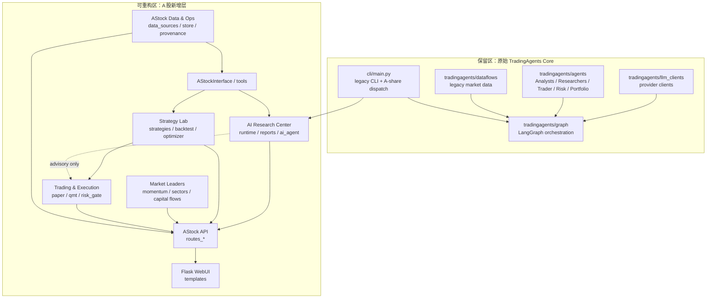
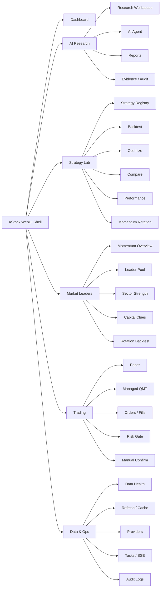
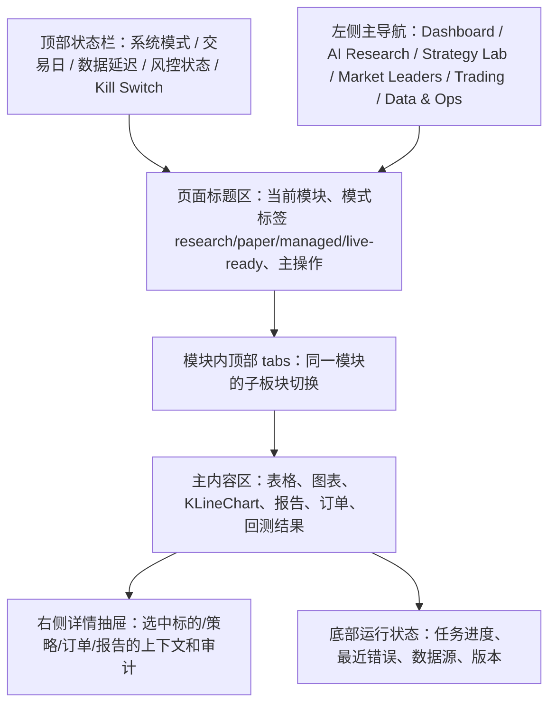
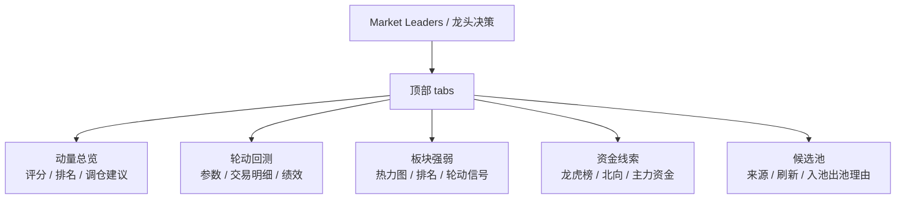
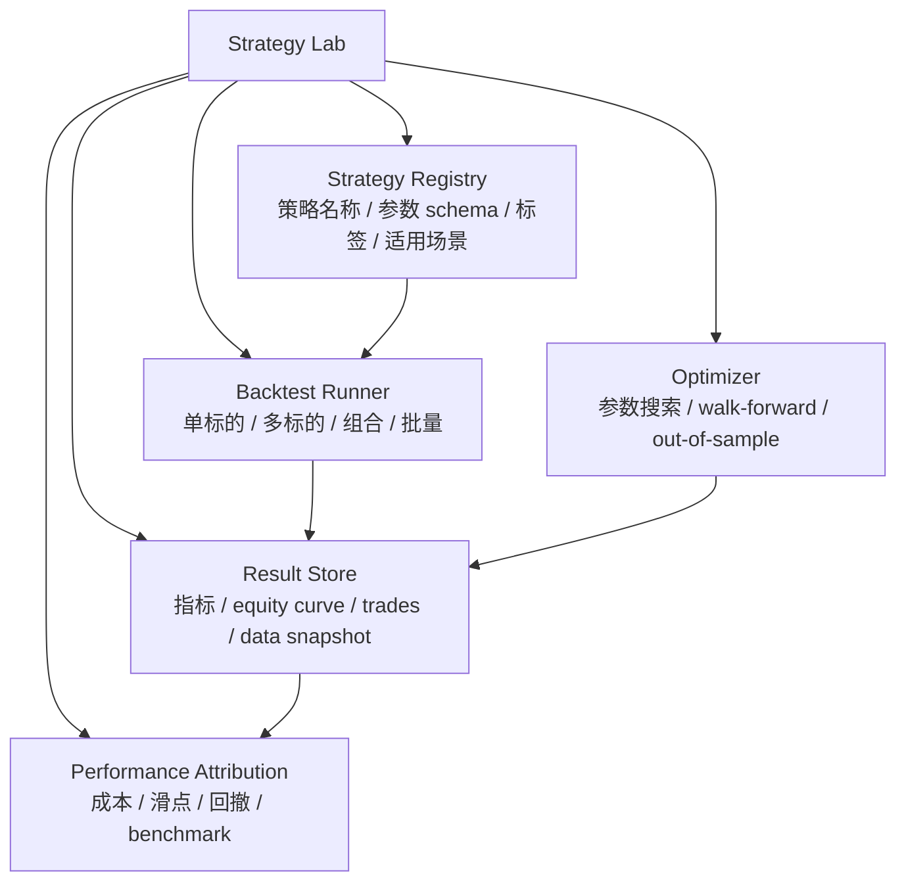
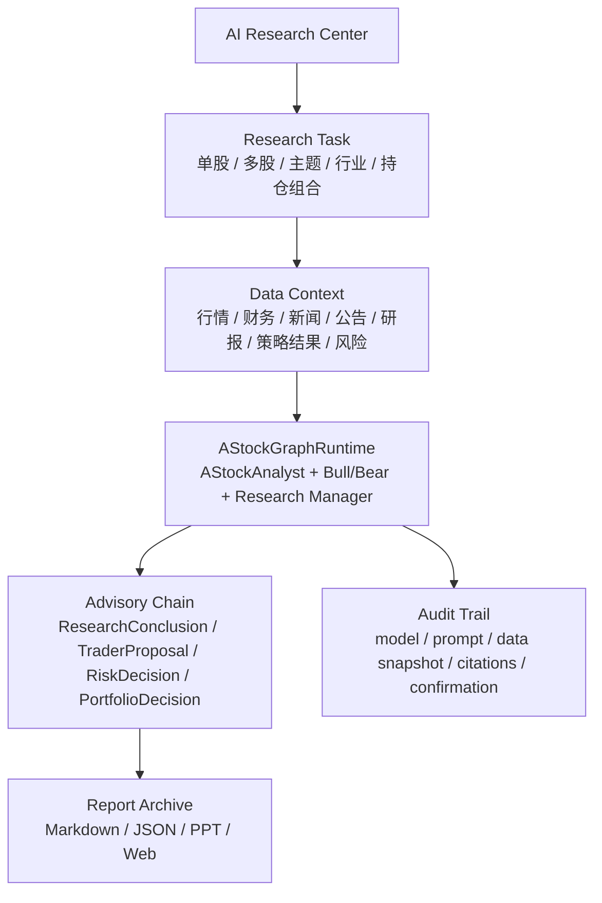

# TradingAgents-Astock 边界与 WebUI 重构设计

| 更新时间：2026-06-23 |

本文整合专业金融开发缺口评审、代码边界和 WebUI 重构设计，用于在后续实现前先固定边界：

- 文档边界：哪些文档负责需求、状态、缺口、执行队列和 phase 证据。
- 代码边界：哪些原始 TradingAgents 底层 AI 能力必须保留，哪些 A 股新增层允许重构。
- 模块边界：Strategy Lab、AI Research Center、Market Leaders、Live Trading Readiness、Data Quality 的目标边界。
- WebUI 边界：顶层导航、页面归属、旧入口迁移和界面设计图。

如果需要从金融产品经理视角直接拆后续开发任务，使用 `docs/ASTOCK_PRODUCT_OPTIMIZATION_ROADMAP.md`。本文负责固定边界，路线图负责把边界转成可执行 phase 顺序和验收标准。

## 1. 总体原则

当前项目已经具备 A 股投研、策略验证、模拟盘和 QMT 受控执行雏形，但尚不等同于完整实盘生产交易系统。后续重构必须遵守：

- 保留原始 TradingAgents 底层 AI 分析框架。
- 只重构后来新增的 A 股、策略、执行、API、WebUI、专题页面层。
- 不把 `paper` / `mock` / `managed` 能力标成 `live-ready`。
- UI 重构先收敛信息架构，再改页面实现。
- 所有真实交易相关能力必须先通过实盘准入清单，再进入代码实现。

## 2. 文档边界

| 文档 | 职责 | 不负责 |
|---|---|---|
| `docs/ASTOCK_REQUIREMENTS.md` | 总需求入口、范围、功能需求、当前未闭环项 | 不记录每个 phase 的细节实现证据 |
| `docs/ASTOCK_PRD.md` | 产品视角、用户场景、产品缺口、实盘分析判断 | 不展开模块文件级实现细节 |
| `docs/ASTOCK_TECH_REQUIREMENTS.md` | 技术模块拆解、目标模块、代码层边界 | 不作为当前状态唯一事实源 |
| `docs/ASTOCK_BACKLOG.md` | 后续执行队列、优先级、完成标准 | 不替代 phase 归档 |
| `docs/ASTOCK_CURRENT_STATUS.md` | 当前事实基线、完成阶段、验证基线、当前缺口摘要 | 不承载长期需求全文 |
| `docs/ASTOCK_BOUNDARY_AND_UI_REFACTOR_PLAN.md` | 本文，固定文档/代码/UI 边界和设计图 | 不替代实际 phase 实施文档 |
| `docs/phases/phase-XX-*.md` | 每个阶段的 scope、实现证据、测试、风险、commit SHA | 不作为总需求入口 |

后续新增 phase 建议（已按实际执行编号调整）：

- `docs/phases/phase-30-live-trading-readiness.md`
- `docs/phases/phase-31-data-quality-bias-control.md`
- `docs/phases/phase-32-strategy-lab-consolidation.md`
- `docs/phases/phase-33-ai-research-center.md`
- `docs/phases/phase-34-market-leaders-entry.md`

## 3. 代码边界

### 3.1 保留区：原始 TradingAgents 底层 AI 能力

以下模块属于原始 TradingAgents 底层能力，后续不做结构性重构，只允许兼容性修复、测试补强和 A 股分支适配：

| 模块 | 边界 |
|---|---|
| `tradingagents/agents/` | 保留原始 analyst / researcher / trader / risk / portfolio agent 结构 |
| `tradingagents/graph/` | 保留 LangGraph 编排、传播、反思、信号处理、检查点 |
| `tradingagents/llm_clients/` | 保留多 LLM provider client、model catalog、validator |
| `tradingagents/dataflows/` | 保留原始多市场/yfinance/Alpha Vantage/Reddit/StockTwits 数据工具 |
| `cli/main.py` | 保留原始 CLI 主流程，只允许 A 股分支接入和显示兼容 |

禁止事项：

- 不重写原始 agent 架构。
- 不把 A 股策略/执行逻辑塞回原始 TradingAgents core。
- 不让 A 股 `research_only` 输出进入原始 signal processing 自动交易路径。
- 不破坏美股/多市场 legacy 路径。

### 3.2 可重构区：后来新增的 A 股定制层

以下模块属于 A 股二次开发新增层，可以按边界逐步重构：

| 模块 | 后续方向 |
|---|---|
| `tradingagents/astock/data_sources/` | 数据质量、provider provenance、交易日历、复权/停牌/涨跌停约束 |
| `tradingagents/astock/interface.py` | 保持上层稳定接口，扩展数据质量元信息 |
| `tradingagents/astock/runtime.py` | 保持 A 股 research runtime，纳入 AI Research Center 审计 |
| `tradingagents/astock/execution/` | 重构为 Strategy Lab + Paper/Managed execution 边界 |
| `tradingagents/astock/api/` | 按产品模块拆分 API 能力边界，标注 `research` / `paper` / `managed` / `live-ready` |
| `tradingagents/astock/store/` | 承载数据快照、回测结果、AI 审计、订单状态、运行日志 |
| `tradingagents/astock/web/` | 重构 WebUI 信息架构和页面归属 |
| `run.py` / `flask_app.py` / `momentum_dashboard.py` | 降级为开发/演示入口，产品入口收敛到 Flask WebUI |
| `webui/` | React/TypeScript/Vite 前端实验项目，当前不作为产品主入口；如保留应作为独立前端实验或迁移目标，不能和 Flask WebUI 双主入口长期并行 |

## 4. 目标模块边界

### 4.0 专业缺口归口

当前系统更接近投研分析、策略验证、模拟盘和受控交易试运行系统，尚不应定义为完整实盘生产交易系统。缺口统一归入以下后续模块：

| 缺口 | 归口模块 |
|---|---|
| 交易日历、停复牌、涨跌停、复权、ST/退市、数据质量分级 | Data & Ops |
| provider 延迟、空值率、fallback 轨迹、数据快照 | Data & Ops |
| survivorship bias、look-ahead bias、未来函数、样本外验证 | Strategy Lab |
| 策略注册、参数 schema、搜索空间、结果 schema | Strategy Lab |
| 账户、持仓、委托、成交、撤单、拒单、部分成交、券商回报 | Trading & Execution |
| kill switch、交易时段、最大亏损、最大仓位、权限控制 | Trading & Execution |
| 行业暴露、集中度、相关性、Beta、流动性、VaR、压力测试 | Trading & Execution / Strategy Lab |
| prompt、模型、输入数据版本、引用来源、人工确认状态 | AI Research Center |
| 龙头动量、轮动回测、板块强弱、资金线索入口分散 | Market Leaders |

### 4.1 Strategy Lab

策略开发细则以 `docs/ASTOCK_STRATEGY_DEVELOPMENT_GUIDE.md` 为准。Phase 30 重构时不得只做页面归并，必须同步解决策略生命周期、注册点、参数 schema、结果 schema 和回测约束的工程一致性。

职责：

- 策略注册、参数 schema、默认参数、搜索空间。
- 单标的、多标的、组合、批量、优化、对比、动量轮动回测。
- 成本、滑点、T+1、停牌、涨跌停、成交量约束。
- 回测结果、交易明细、equity curve、benchmark、指标和数据快照。
- 绩效归因、反过拟合、out-of-sample、walk-forward。

主要代码归属：

- `tradingagents/astock/execution/backtest_engine.py`
- `tradingagents/astock/execution/strategy_base.py`
- `tradingagents/astock/execution/optimizer.py`
- `tradingagents/astock/execution/batch_backtest.py`
- `tradingagents/astock/execution/metrics.py`
- `tradingagents/astock/execution/momentum_rotation.py`
- `tradingagents/astock/api/routes_backtest.py`
- `tradingagents/astock/web/templates/strategy_hub.html`

必须收敛的问题：

- `StrategyBase -> generate_signals` 的单标的策略生命周期。
- Crossover、Deviation、Momentum、Threshold、Grid 五类信号模式。
- `execution/__init__.py`、`routes_backtest.py`、`routes_market.py` 三处注册点漂移。
- 优化器默认复合评分：`0.35 * Sharpe + 0.30 * Return - 0.25 * Drawdown + 0.10 * TradeFrequency`。
- 动量轮动等多股票组合策略的 Standalone 模式边界。
- baostock 游标批量拉取和回测数据快照隔离。
- 买入逻辑中含费用 `net_cost <= cash` 的防复发校验。

不负责：

- 不负责真实下单。
- 不负责 AI prompt 编排。
- 不直接读取底层 provider，必须通过数据接口或 store。

### 4.2 AI Research Center

职责：

- A 股研究任务入口：单股、多股、主题、行业、持仓组合。
- 汇聚行情、财务、新闻、公告、研报、龙虎榜、北向、板块、策略结果作为上下文。
- 调用 A 股 research runtime，并保留原始 TradingAgents agent 能力。
- 记录模型、prompt、输入数据版本、引用来源、生成时间、人工确认状态。
- 统一 Markdown / JSON / PPT / Web report。

主要代码归属：

- `tradingagents/astock/runtime.py`
- `tradingagents/astock/analyst.py`
- `tradingagents/astock/phase9_schemas.py`
- `tradingagents/astock/reporting/`
- `tradingagents/astock/api/routes_ai_agent.py`
- `tradingagents/astock/api/routes_reports.py`
- `tradingagents/astock/web/templates/ai_agent.html`
- `tradingagents/astock/web/templates/research.html`
- `tradingagents/astock/web/templates/reports.html`

不负责：

- 不改原始 `tradingagents/agents/` 底层结构。
- 不直接生成真实订单。
- 不绕过 `research_only` / advisory 安全边界。

### 4.3 Market Leaders

职责：

- 龙头股候选池、动态刷新、入池/出池理由。
- 龙头动量评分、排名、调仓建议。
- 动量轮动回测入口。
- 板块强弱、资金线索、龙虎榜、北向资金。

主要代码归属：

- `tradingagents/astock/execution/momentum_rotation.py`
- `tradingagents/astock/api/routes_market_data.py`
- `tradingagents/astock/web/templates/momentum_dashboard.html`
- `tradingagents/astock/web/templates/momentum_rotation.html`
- `tradingagents/astock/web/templates/dragon_tiger.html`
- `tradingagents/astock/web/templates/northbound.html`
- `tradingagents/astock/web/templates/sectors.html`

不负责：

- 顶层不再拆多个入口。
- 不继续保留独立 Streamlit 看板作为产品主入口。
- 不把龙虎榜/北向/板块独立成平级产品线。

### 4.4 Trading & Execution

职责：

- Paper Trading 状态。
- Managed QMT 受控执行。
- 订单生命周期模型。
- 风控门、kill switch、权限、人工确认。
- 账户/订单/成交 reconciliation。

主要代码归属：

- `tradingagents/astock/execution/paper_trader.py`
- `tradingagents/astock/execution/qmt_bridge.py`
- `tradingagents/astock/execution/qmt_execution.py`
- `tradingagents/astock/execution/risk_gate.py`
- `tradingagents/astock/api/routes_paper.py`
- `tradingagents/astock/api/routes_qmt.py`
- `tradingagents/astock/api/routes_trade.py`
- `tradingagents/astock/web/templates/trading.html`
- `tradingagents/astock/web/templates/paper.html`
- `tradingagents/astock/web/templates/qmt.html`
- `tradingagents/astock/web/templates/risk.html`

不负责：

- 不承载策略研究页面。
- 不把 paper 状态伪装为真实账户。
- 不默认开启自动实盘。

### 4.5 Data & Ops

职责：

- provider 健康、数据刷新、缓存管理、数据质量。
- DuckDB 状态、导入/导出、数据快照。
- 运行日志、任务状态、审计日志、错误告警。

主要代码归属：

- `tradingagents/astock/data_sources/`
- `tradingagents/astock/store/`
- `tradingagents/astock/verification_provenance.py`
- `tradingagents/astock/api/routes_data.py`
- `tradingagents/astock/api/routes_data_health.py`
- `tradingagents/astock/api/routes_sse.py`
- `tradingagents/astock/web/templates/data_health.html`
- `tradingagents/astock/web/templates/settings.html`

## 5. 代码架构设计图

## 6. WebUI 边界

### 6.1 顶层导航目标

后续 WebUI 顶层只保留 6 个主入口：

| 顶层入口 | 职责 |
|---|---|
| Dashboard | 全局状态、市场概览、风险摘要、任务/数据健康摘要 |
| AI Research | AI 分析、研究报告、新闻/公告/研报解读、报告归档 |
| Strategy Lab | 策略、回测、优化、对比、绩效、动量轮动 |
| Market Leaders | 龙头动量、轮动回测、板块强弱、资金线索、候选池 |
| Trading | Paper / Managed / Live-ready 状态、订单、风控、确认 |
| Data & Ops | 数据刷新、缓存、provider 健康、任务状态、审计日志 |

### 6.2 旧页面迁移表

| 当前页面 | 目标归属 | 处理方式 |
|---|---|---|
| `dashboard.html` | Dashboard | 保留为首页 |
| `research.html` | AI Research | 收敛为 Research Workspace |
| `ai_agent.html` | AI Research | 作为 AI task / chat tab |
| `reports.html` | AI Research | 作为 report archive tab |
| `strategy_hub.html` | Strategy Lab | 作为主入口 |
| `strategies.html` | Strategy Lab | 合并为 strategy registry tab |
| `momentum_rotation.html` | Strategy Lab 或 Market Leaders | 若强调策略回测，归 Strategy Lab；若强调龙头决策，作为 Market Leaders 子 tab |
| `momentum_dashboard.html` | Market Leaders | 作为 momentum overview tab |
| `dragon_tiger.html` | Market Leaders | 作为 capital clues tab |
| `northbound.html` | Market Leaders | 作为 capital clues tab |
| `sectors.html` | Market Leaders | 作为 sector strength tab |
| `trading.html` | Trading | 作为交易控制台主入口 |
| `paper.html` | Trading | 作为 Paper tab |
| `qmt.html` | Trading | 作为 Managed QMT tab |
| `risk.html` | Trading 或 Dashboard | 交易硬风控归 Trading，摘要归 Dashboard |
| `data_health.html` | Data & Ops | 作为 data health tab |
| `settings.html` | Data & Ops | 作为 system settings tab |
| `tv_chart.html` / `kc_chart.html` | AI Research / Trading / Strategy Lab 共享组件 | 不作为独立产品线，按上下文嵌入 |
| `screener.html` | Market Leaders 或 Strategy Lab | 若用于选股池，归 Market Leaders；若用于策略输入，归 Strategy Lab |

### 6.3 WebUI 信息架构设计图

### 6.4 主界面布局设计图

### 6.5 Market Leaders 单入口设计图

### 6.6 Strategy Lab 设计图

### 6.7 AI Research Center 设计图

## 7. WebUI 设计边界

页面设计规则：

- 顶层导航只放主工作台，不放每个小页面。
- 所有交易相关页面必须显示模式标签：`research`、`paper`、`managed`、`live-ready`。
- Paper 和真实账户状态必须视觉区分。
- KLineChart 是共享组件，不是独立产品入口。
- AI 结论必须带数据来源、模型、生成时间和是否人工确认。
- Strategy Lab 所有结果必须展示数据区间、成本模型、benchmark、是否样本外。
- Market Leaders 顶层最多一个入口。
- Data & Ops 必须能看到 provider 健康、缓存、刷新任务、错误和审计状态。

## 8. 实施顺序

更新后的开发主线以 `docs/ASTOCK_PRODUCT_OPTIMIZATION_ROADMAP.md` 为准：

1. Phase 30：Live Trading Readiness，固定实盘准入 checklist、能力等级和订单生命周期模型。
2. Phase 31：Data Quality & Bias Control，固定交易日历、复权、停牌、涨跌停、ST/退市和回测反偏差。
3. Phase 32：Strategy Lab，固定策略 registry、结果 schema、页面迁移表。
4. Phase 33：AI Research Center，固定 AI 审计模型、上下文包和报告归档边界。
5. Phase 34：Market Leaders，固定单入口、顶部 tab、候选池和资金线索归属。
6. Phase 35：Trading & Execution，固定账户、订单、成交、撤单、拒单、reconciliation 和风控门。
7. Phase 36：Portfolio Risk & Attribution，固定组合级风险、暴露、归因和压力测试。
8. Phase 37：Ops & Audit，固定任务、错误、provider、模型、数据和人工确认审计。
9. Phase 38：Product Navigation Cleanup，清理重复入口和统一终端体验。

代码实施必须等对应 phase 文档明确以下内容后再开始：

- 目标模块和不改模块。
- API / UI / store schema 是否变更。
- 旧入口迁移和兼容策略。
- 验收测试命令。
- 风险与回滚方式。

## 9. 关联文档

- `docs/ASTOCK_REQUIREMENTS.md`
- `docs/ASTOCK_PRD.md`
- `docs/ASTOCK_TECH_REQUIREMENTS.md`
- `docs/ASTOCK_BACKLOG.md`
- `docs/ASTOCK_CURRENT_STATUS.md`
- `docs/ASTOCK_PRODUCT_OPTIMIZATION_ROADMAP.md`
