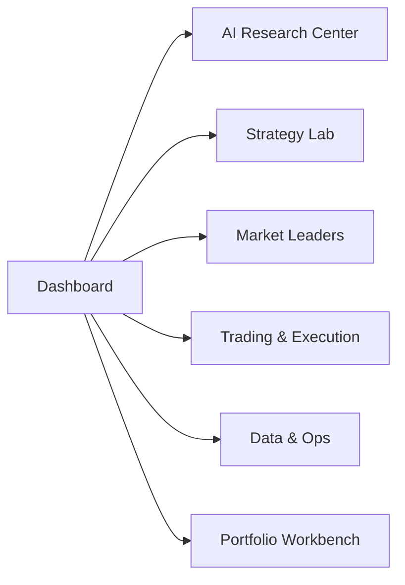

# A 股开发进度与 5 分钟任务拆解

| 更新时间：2026-06-26（§1 总览表已同步 Phase 31-38 完成状态；§2.x 待开发描述为历史记录保留） |

本文基于当前开发文档和实际代码目录，梳理 TradingAgents-Astock 的后台、前台、API、真实数据源、测试验收和后续开发任务。本文只覆盖核心功能开发，不展开安全与隐私、SLA 与故障分级、用户角色/RBAC。

## 1. 当前开发进度总览

| 模块 | 后台状态 | 前台状态 | 当前判断 | 下一步 |
|---|---|---|---|---|
| Data & Ops | 已完成 provider router、DuckDB、cache、data health、refresh API、data quality tags、calendar、bias detection | 已有 data_health、settings | 可用；数据质量标签与反偏差已在 Phase 31 完成 | Phase 31 |
| AI Research Center | 已有 AStock runtime、AI Agent API、ResearchTask/Audit schema、报告/PPT | 已有 research、ai_agent、reports | 功能可用，advisory-only 与降级标识已完成 | Phase 33 |
| Strategy Lab | 已有 backtest、optimizer、batch、compare、momentum rotation、bias flags | 已有 strategy_hub、strategies、momentum_rotation | 功能完备，Strategy Lab 统一入口已落地 | Phase 32 |
| Market Leaders | 已有 leader_pool、dragon-tiger、sectors、northbound、momentum APIs | 已有 market_leaders（内含 5 tab iframe）+ 旧入口 redirect + deprecation banner | 单入口已完成收敛 | Phase 34 |
| Trading & Execution | 已有 paper、risk gate、Order/Fill/Position/Reconciliation schema、trade quote/state、QMT managed 雏形 | 已有 trading（含 mode switcher）、paper、risk、qmt | 可受控试运行；真实券商 reconciliation 标记 P3 暂不处理 | Phase 30/35（done-with-exclusions） |
| Portfolio Workbench | 已有 portfolio_risk.py（VaR/HHI/Brinson/stress）、routes_portfolio.py、portfolio.html | 已有 portfolio.html（组合风险仪表盘） | 组合风险与归因已完成 | Phase 36 |
| Ops & Audit | 已有 audit_store.py（内存+DuckDB）、routes_ops.py（3 endpoints）、ops_audit.html | 已有 ops_audit.html（事件日志+任务中心+数据源健康） | Ops & Audit 已完成 | Phase 37 |
| WebUI Shell | 多页面已完成 | 25 个模板（23 页面 + 2 基础） | 导航已收敛为 7 模块 sidebar，旧入口有 redirect/deprecation banner | Phase 38 |

## 2. 后台模块拆分与 API 定义

### 2.1 Data & Ops

目标：提供 A 股真实数据接入、缓存、健康检查、数据刷新和 TradingView datafeed。

| 功能 | API | 数据来源 | 当前状态 | 测试验收 |
|---|---|---|---|---|
| K 线 | `GET /api/v1/kline` | DuckDB 优先，分钟线缺失时 mootdx live fallback；历史可走 akshare / baostock / Tencent router | 已实现 | `tests/test_astock_api.py`, `tests/test_astock_data_sources.py`, `tests/test_astock_live_providers.py` |
| 估值 | `GET /api/v1/valuation` | Tencent 优先，akshare fallback，mootdx 补充 | 已实现 | `tests/test_astock_api.py`, `tests/test_astock_data_sources.py` |
| 盘口 | `GET /api/v1/orderbook` | mootdx / Tencent，QMT 除外 | 已实现 | `tests/test_astock_data_sources.py` |
| 分笔 | `GET /api/v1/trade_tape` | mootdx / Tencent，QMT 除外 | 已实现 | `tests/test_astock_data_sources.py` |
| 新闻 | `GET /api/v1/news`, `/news/live`, `/news/stock` | akshare、东方财富、Sina、Tencent | 已实现 | `tests/test_astock_api.py` |
| 研报 | `GET /api/v1/research`, `/research/pdf`, `/research/expectation`, `/research/search` | iwencai、akshare、东方财富 | 已实现，iwencai 依赖 cookie | `tests/test_astock_provider_fixtures.py`, live guard |
| 基本面/F10 | `GET /api/v1/fundamentals`, `/f10` | akshare、mootdx | 已实现 | `tests/test_astock_interface_analyst.py` |
| 公告 | `GET /api/v1/announcements` | cninfo、mootdx | 已实现 | `tests/test_astock_data_sources.py` |
| 数据刷新 | `POST /api/v1/data/refresh/kline`, `/valuation`, `/all` | provider -> DuckDB | 已实现 | `tests/test_astock_store.py`, `tests/test_astock_api.py` |
| 缓存状态 | `GET /api/v1/cache/status`, `POST /api/v1/cache/clear` | 本地 cache | 已实现 | `tests/test_astock_api.py` |
| 数据健康 | `GET /api/v1/data/health` | akshare、Tencent、mootdx、iwencai、EastMoney 探测 | 已实现 | `tests/test_astock_web.py`, live guard |
| TV 搜索/历史 | `/api/v1/tv/stock-search`, `/tv/stock-info`, `/tv/symbols`, `/tv/history` | mootdx stock list、akshare 指数成分、Tencent valuation、mootdx kline | 已实现 | `tests/test_astock_tv_routes.py` |

待开发：

- 数据质量标签从文档落到 API envelope：`freshness`、`quality`、`fallback_path`、`snapshot_id`。
- 回测数据假设：交易日历、停复牌、涨跌停、T+1、复权口径、容量约束。
- DuckDB/cache/schema 变化补迁移记录和校验。

### 2.2 AI Research Center

目标：统一 AI Agent、A 股研究报告、新闻/公告/研报解读、报告归档和模型审计。

| 功能 | API | 数据来源 | 当前状态 | 测试验收 |
|---|---|---|---|---|
| AI 分析 | `POST /api/v1/ai/analyze` | kline、valuation、news、fundamentals、LLM provider | 已实现基础版 | `tests/test_astock_web.py`, `tests/test_astock_graph_runtime.py` |
| 研究链 runtime | CLI / Streamlit / runtime 调用 | AStockInterface 五层数据 + LLM | 已实现 | `tests/test_astock_graph_runtime.py`, `tests/test_astock_graph_bridge.py` |
| PPT 报告 | `GET /api/v1/reports/pptx` | report payload | 已实现 | `tests/test_astock_ppt.py` |

待开发：

- `ResearchTask` API：创建、查询、取消、归档研究任务。
- `ResearchAudit` schema：model、prompt version、input snapshot、引用来源、生成时间。
- 报告中心从下载页升级为可检索、可复查、可对比的投研档案。

### 2.3 Strategy Lab

目标：统一策略、回测、优化、绩效、对比、动量轮动和结果 schema。

| 功能 | API | 数据来源 | 当前状态 | 测试验收 |
|---|---|---|---|---|
| 运行回测 | `POST /api/v1/backtest/run` | DuckDB / provider K 线 | 已实现 | `tests/test_astock_backtest.py`, `tests/test_astock_api.py` |
| 回测结果 | `GET /api/v1/backtest/results`, `DELETE /backtest/results`, `DELETE /backtest/results/<run_id>` | DuckDB / memory store | 已实现 | `tests/test_astock_api.py` |
| 策略对比 | `GET /api/v1/backtest/compare` | 回测结果 | 已实现 | `tests/test_astock_api.py` |
| 回测分析 | `POST /api/v1/backtest/analyze` | 回测结果 | 已实现 | `tests/test_astock_backtest.py` |
| 参数优化 | `POST /api/v1/backtest/optimize` | provider K 线 + optimizer | 已实现 | `tests/test_astock_optimizer.py` |
| 策略列表 | `GET /api/v1/market/strategies` | strategy registry | 已实现 | `tests/test_astock_api.py` |
| 动量轮动 | `POST /api/v1/market/momentum-rotation`, `GET /market/momentum` | EastMoney 龙头池、akshare、DuckDB | 已实现 | `tests/test_astock_web.py`, `tests/test_astock_api.py` |

待开发：

- 单一 Strategy Registry：参数 schema、搜索空间、适用行情、适用市场。
- 统一 BacktestResult：指标、净值、交易明细、成本模型、benchmark、数据假设。
- 反偏差字段：out-of-sample、walk-forward、look-ahead check、survivorship check。
- 动量轮动归属：Strategy Lab 主入口，同时可被 Market Leaders 作为子 tab 调用。

### 2.4 Market Leaders

目标：把龙头、板块、资金、候选池和轮动回测收敛到一个入口。

| 功能 | API | 数据来源 | 当前状态 | 测试验收 |
|---|---|---|---|---|
| 龙虎榜 | `GET /api/v1/market/dragon-tiger` | EastMoney，mock 兜底 | 已实现 | `tests/test_astock_api.py`, `tests/test_astock_web.py` |
| 板块强弱 | `GET /api/v1/market/sectors` | EastMoney -> Sina fallback -> mock | 已实现 | `tests/test_astock_api.py` |
| 北向资金 | `GET /api/v1/market/northbound` | EastMoney，mock 兜底 | 已实现 | `tests/test_astock_api.py` |
| 个股板块 | `GET /api/v1/market/blocks` | EastMoney，mock 兜底 | 已实现 | `tests/test_astock_api.py` |
| 动量实时 | `GET /api/v1/market/momentum` | EastMoney 龙头池、akshare/本地行情 | 已实现 | `tests/test_astock_web.py` |

待开发：

- `LeaderPool` schema：候选来源、入池理由、出池理由、评分变化、刷新时间。
- 顶层只保留 `Market Leaders`，内部 tab：动量总览、候选池、板块强弱、资金线索、轮动回测。
- 所有 mock fallback 必须前端显著标注，不能误导为实时数据。

### 2.5 Trading & Execution

目标：提供 paper/managed/live-ready 分级交易能力。QMT 相关真实数据不纳入本文真实数据源要求。

| 功能 | API | 数据来源 | 当前状态 | 测试验收 |
|---|---|---|---|---|
| Paper cycle | `POST /api/v1/paper/cycle` | PaperTrader + 策略/行情 | 已实现 | `tests/test_astock_paper_trader.py` |
| Paper state | `GET /api/v1/paper/state` | PaperTrader 状态 | 已实现 | `tests/test_astock_paper_trader.py` |
| Paper trades | `GET /api/v1/paper/trades` | PaperTrader 交易记录 | 已实现 | `tests/test_astock_paper_trader.py` |
| 下单入口 | `POST /api/v1/trade/order` | PaperTrader / managed bridge | 已实现，能力需标注 | `tests/test_astock_api.py`, risk tests |
| 实时报价 | `GET /api/v1/trade/quote` | Sina -> EastMoney -> cache | 已实现 | `tests/test_astock_api.py` |
| 交易状态 | `GET /api/v1/trade/state` | PaperTrader + live quote 估值 | 已实现，非真实账户 | `tests/test_astock_api.py` |

待开发：

- 订单生命周期 schema：created、submitted、confirmed、partial_filled、filled、cancelled、rejected、expired、error。
- Reconciliation schema：本地订单状态 vs 券商回报。QMT 接入另行处理。
- kill switch、最大单笔、最大日亏损、最大持仓、交易时段硬风控。

### 2.6 Ops & Audit

| 功能 | API | 数据来源 | 当前状态 | 测试验收 |
|---|---|---|---|---|
| SSE 进度 | `GET /api/v1/sse/paper-progress` | event bus | 已实现 | `tests/test_astock_sse.py` |
| SSE 事件 | `GET /api/v1/sse/events`, `DELETE /sse/events` | event bus | 已实现 | `tests/test_astock_sse.py` |
| Dashboard | `GET /api/v1/dashboard/overview` | DuckDB、PaperTrader、回测结果 | 已实现 | `tests/test_astock_api.py`, `tests/test_astock_web.py` |

待开发：

- `TaskRun` schema：data refresh、backtest、AI research、report generation、trade action。
- `AuditEvent` schema：输入、输出、数据快照、模型、人工确认、错误。
- Ops Dashboard：任务中心、错误中心、provider health、DuckDB/cache/LLM/QMT 状态。

## 3. 前台模块拆分

| 前台模块 | 当前页面 | 当前状态 | 待开发 |
|---|---|---|---|
| Dashboard | `dashboard.html` | 已完成 | 接入 capability、TaskRun、风险摘要 |
| AI Research Center | `research.html`, `ai_agent.html`, `reports.html` | 已完成基础页面 | 合并为顶层 AI Research Center，tab 化 |
| Strategy Lab | `strategy_hub.html`, `strategies.html`, `momentum_rotation.html` | 已完成基础工作台 | 统一策略、回测、优化、绩效、对比 |
| Market Leaders | `momentum_dashboard.html`, `dragon_tiger.html`, `northbound.html`, `sectors.html` | 已完成分散页面 | 单入口 + 顶部 tab |
| Trading & Execution | `trading.html`, `paper.html`, `risk.html`, `qmt.html` | 已完成基础页面 | 统一模式标签、订单生命周期、风控前置门 |
| Data & Ops | `data_health.html`, `settings.html` | 已完成基础页面 | 增加 TaskRun、AuditEvent、数据质量面板 |
| KLine / TV Chart | `kc_chart.html`, `tv_chart.html` | 已完成 | 统一数据质量、延迟和 fallback 标签 |
| Portfolio Workbench | `portfolio.html`（组合风险仪表盘） | 已完成 | VaR/归因/压力测试扩展 |

## 4. 前台效果图

### 4.1 总体导航



### 4.2 AI Research Center

```text
+--------------------------------------------------------------------------------+
| AI Research Center                                                             |
| [单股研究] [多股对比] [新闻/公告/研报] [报告档案] [模型审计]                  |
+--------------------------------------------------------------------------------+
| Symbol: 600519.SH | Date | Mode: live_research | Run                           |
+-------------------------------+------------------------------------------------+
| 左：K线/估值/新闻/公告上下文   | 右：AI 结论、Bull/Bear、Risk、Portfolio        |
| source/freshness/quality 标签  | model / prompt / snapshot / advisory-only      |
+-------------------------------+------------------------------------------------+
| 下：报告列表、引用来源、复查、下载、对比                                       |
+--------------------------------------------------------------------------------+
```

### 4.3 Strategy Lab

```text
+--------------------------------------------------------------------------------+
| Strategy Lab                                                                   |
| [策略列表] [单次回测] [参数优化] [策略对比] [绩效分析] [动量轮动]              |
+--------------------------------------------------------------------------------+
| Strategy | Symbol/Pool | Date Range | Cost | Slippage | Benchmark | Run        |
+------------------------+--------------------------+----------------------------+
| 左：净值曲线/回撤/收益  | 中：指标卡 Sharpe/Return/DD | 右：交易明细/数据假设      |
+------------------------+--------------------------+----------------------------+
| 下：Top N 参数、样本外、walk-forward、反偏差状态                               |
+--------------------------------------------------------------------------------+
```

### 4.4 Market Leaders

```text
+--------------------------------------------------------------------------------+
| Market Leaders / 龙头决策                                                      |
| [动量总览] [候选池] [板块强弱] [资金线索] [轮动回测]                           |
+--------------------------------------------------------------------------------+
| 今日强势板块 | 北向/龙虎榜资金 | 龙头候选数 | 数据更新时间 | source quality     |
+----------------------+----------------------+--------------------------------+
| 候选池表：symbol / score / 入池理由 / 出池理由 / 资金线索 / 刷新时间          |
+----------------------+----------------------+--------------------------------+
| 右侧：候选股 K线、板块、资金、轮动回测入口                                    |
+--------------------------------------------------------------------------------+
```

### 4.5 Trading & Execution

```text
+--------------------------------------------------------------------------------+
| Trading & Execution                                                            |
| Mode: [research] [paper] [managed] [live-ready disabled] | Kill Switch: OFF     |
+--------------------------------------------------------------------------------+
| 左：KLine + 实时报价(Sina/EastMoney/cache) | 右：订单面板 + 风控解释           |
+-------------------------------------------+------------------------------------+
| 下：Paper 持仓 / 委托 / 成交 / 风控拦截 / Audit Event                         |
+--------------------------------------------------------------------------------+
```

### 4.6 Data & Ops

```text
+--------------------------------------------------------------------------------+
| Data & Ops                                                                     |
| [Provider Health] [Data Quality] [Cache] [TaskRun] [AuditEvent]                |
+--------------------------------------------------------------------------------+
| Provider: akshare / mootdx / Tencent / iwencai / EastMoney / Sina              |
| Status: ok / stale / fallback / degraded / mock                                |
+--------------------------------------------------------------------------------+
| 任务中心：refresh / backtest / ai_research / report / trade_action             |
+--------------------------------------------------------------------------------+
```

## 5. 5 分钟粒度开发任务拆解

以下任务以“每项约 5 分钟可执行”为粒度。执行时每完成一组 6-10 个任务，应更新 phase 文档和测试证据。

### 5.1 Phase 30 Live Trading Readiness

| 序号 | 5 分钟任务 | 产物 | 验收 |
|---|---|---|---|
| 30-01 | 搜索所有 `/trade`, `/paper`, `/qmt` API 返回字段 | API 字段清单 | 字段清单写入 phase |
| 30-02 | 标注每个交易 API capability | capability 表 | 不出现未标注交易 API |
| 30-03 | 梳理 `trade_state` 当前 paper 语义 | paper 状态说明 | 页面/API 文案不误导 |
| 30-04 | 定义 `TradingMode` enum | 文档 schema | 包含 research/paper/managed/live-ready |
| 30-05 | 定义 `ExecutionCapability` schema | 文档 schema | API 可复用 |
| 30-06 | 画订单生命周期状态机 | Mermaid | 覆盖拒单/撤单/部分成交 |
| 30-07 | 梳理风控 reason code | reason code 表 | Risk Gate 可引用 |
| 30-08 | 定义 kill switch 文档行为 | checklist | 默认阻断后续执行 |
| 30-09 | 更新交易页页面验收清单 | 页面验收记录 | paper/managed 标签截图要求 |
| 30-10 | 跑 `tests/test_astock_paper_trader.py` | 测试结果 | passed 或记录原因 |

### 5.2 Phase 31 Data Quality & Bias Control

| 序号 | 5 分钟任务 | 产物 | 验收 |
|---|---|---|---|
| 31-01 | 列出 K 线 API 当前字段 | 字段表 | 包含 source/generated_at |
| 31-02 | 定义 `DataQualityTag` | schema | normal/stale/partial/fallback/mock |
| 31-03 | 定义 `BacktestDataAssumption` | schema | 复权/成本/成交约束 |
| 31-04 | 梳理交易日历数据来源 | 来源表 | akshare/mootdx 可选 |
| 31-05 | 梳理停复牌字段来源 | 来源表 | 无来源则标 planned |
| 31-06 | 梳理涨跌停约束 | 规则表 | 回测不可成交条件明确 |
| 31-07 | 梳理 survivorship bias 风险 | 风险项 | 更新风险登记表 |
| 31-08 | 给回测结果增加文档字段 | schema 草案 | data_assumption 可读 |
| 31-09 | 更新 Data & Ops 效果图验收点 | 页面清单 | 展示 freshness/quality |
| 31-10 | 跑 `tests/test_astock_data_sources.py` | 测试结果 | passed 或记录 skip |

### 5.3 Phase 32 Strategy Lab

| 序号 | 5 分钟任务 | 产物 | 验收 |
|---|---|---|---|
| 32-01 | 搜索所有策略注册点 | 注册点清单 | init/registry/API/UI 均列出 |
| 32-02 | 定义 Strategy Registry schema | schema | name/category/params/search_space |
| 32-03 | 定义 Backtest Result schema | schema | metrics/equity/trades/assumption |
| 32-04 | 定义 Optimize Result schema | schema | score/top_n/in_sample/out_sample |
| 32-05 | 梳理 Strategy Hub 当前 tab | 页面清单 | 当前入口不遗漏 |
| 32-06 | 标记旧策略入口迁移策略 | 迁移表 | 旧入口有跳转或保留说明 |
| 32-07 | 更新 Strategy Lab 效果图 | wireframe | tab 清晰 |
| 32-08 | 更新 ADR 如改 registry 决策 | ADR | 需要时新增 |
| 32-09 | 跑 `tests/test_astock_strategies.py` | 测试结果 | passed |
| 32-10 | 跑 `tests/test_astock_optimizer.py` | 测试结果 | passed |

### 5.4 Phase 33 AI Research Center

| 序号 | 5 分钟任务 | 产物 | 验收 |
|---|---|---|---|
| 33-01 | 搜索 AI/report/research 入口 | 入口清单 | research/ai_agent/reports 覆盖 |
| 33-02 | 定义 ResearchTask schema | schema | task_id/symbol/mode/status |
| 33-03 | 定义 ResearchAudit schema | schema | model/prompt/snapshot/citation |
| 33-04 | 定义 advisory-only 输出要求 | 文案规则 | 不触发真实订单 |
| 33-05 | 梳理 LLM 不可用降级 | 降级表 | fail closed |
| 33-06 | 梳理报告归档字段 | schema | markdown/json/ppt/web report |
| 33-07 | 更新 AI Research 效果图 | wireframe | tab 和审计区明确 |
| 33-08 | 更新模型治理文档 | 文档 diff | prompt version 明确 |
| 33-09 | 跑 `tests/test_astock_graph_runtime.py` | 测试结果 | passed |
| 33-10 | 跑 `tests/test_astock_ppt.py` | 测试结果 | passed |

### 5.5 Phase 34 Market Leaders

| 序号 | 5 分钟任务 | 产物 | 验收 |
|---|---|---|---|
| 34-01 | 列出现有龙头/板块/资金页面 | 页面清单 | 5 个入口覆盖 |
| 34-02 | 定义 Market Leaders 顶层入口 | 导航规则 | 顶层最多一个入口 |
| 34-03 | 定义 LeaderPool schema | schema | source/reason/score/refreshed_at |
| 34-04 | 梳理 EastMoney/Sina/mock fallback | 来源表 | mock 必须标注 |
| 34-05 | 定义候选池入池理由字段 | 字段表 | 可解释 |
| 34-06 | 定义候选池出池理由字段 | 字段表 | 可解释 |
| 34-07 | 更新 Market Leaders 效果图 | wireframe | tab 清晰 |
| 34-08 | 更新页面级验收清单 | 验收记录 | success/empty/error |
| 34-09 | 跑 `tests/test_astock_web.py` | 测试结果 | passed |
| 34-10 | 跑 `tests/test_astock_api.py` | 测试结果 | passed |

### 5.6 Phase 35 Trading & Execution

| 序号 | 5 分钟任务 | 产物 | 验收 |
|---|---|---|---|
| 35-01 | 定义 Order schema | schema | 状态完整 |
| 35-02 | 定义 Fill schema | schema | 部分成交可表达 |
| 35-03 | 定义 Position schema | schema | paper/managed 可共用 |
| 35-04 | 定义 Reconciliation schema | schema | 本地 vs 外部回报 |
| 35-05 | 梳理 trade/order 当前行为 | 行为表 | 不误标 live |
| 35-06 | 梳理 risk gate 前置条件 | checklist | 下单前阻断 |
| 35-07 | 更新 Trading 效果图 | wireframe | capability visible |
| 35-08 | 更新 runbook checklist | 文档 diff | live-ready 前置 |
| 35-09 | 跑 paper/risk 测试 | 测试结果 | passed |
| 35-10 | 记录 QMT 相关暂不纳入真实数据要求 | 范围说明 | 与本文一致 |

### 5.7 Phase 36 Portfolio Risk & Attribution

| 序号 | 5 分钟任务 | 产物 | 验收 |
|---|---|---|---|
| 36-01 | 定义 Portfolio schema | schema | holdings/cash/nav |
| 36-02 | 定义 RiskExposure schema | schema | industry/concentration/beta |
| 36-03 | 定义 Attribution schema | schema | benchmark/selection/timing/cost |
| 36-04 | 梳理回测结果复用字段 | 字段表 | 可接 Strategy Lab |
| 36-05 | 梳理 paper 状态复用字段 | 字段表 | 可接 Trading |
| 36-06 | 画 Portfolio Workbench 效果图 | wireframe | 风险+归因 |
| 36-07 | 定义页面输入输出 | 验收记录 | 输入/输出明确 |
| 36-08 | 定义压力测试指标 | 指标表 | VaR/DD/stress |
| 36-09 | 补测试计划 | 测试项 | 单元+API slice |
| 36-10 | 更新追踪矩阵状态 | 文档 diff | PROD-07 有证据 |

### 5.8 Phase 37 Ops & Audit

| 序号 | 5 分钟任务 | 产物 | 验收 |
|---|---|---|---|
| 37-01 | 定义 TaskRun schema | schema | type/status/start/end |
| 37-02 | 定义 AuditEvent schema | schema | actor/input/output/snapshot |
| 37-03 | 梳理 SSE event 当前字段 | 字段表 | 可迁移 |
| 37-04 | 梳理 data refresh 任务 | 任务表 | 可追踪 |
| 37-05 | 梳理 backtest 任务 | 任务表 | 可追踪 |
| 37-06 | 梳理 AI research 任务 | 任务表 | 可追踪 |
| 37-07 | 画 Ops Dashboard 效果图 | wireframe | 任务/错误/健康 |
| 37-08 | 更新 metrics/Ops 文档 | 文档 diff | 指标可验收 |
| 37-09 | 跑 `tests/test_astock_sse.py` | 测试结果 | passed |
| 37-10 | 更新风险登记表 | 风险状态 | R-009/R-005 |

### 5.9 Phase 38 Product Navigation Cleanup

| 序号 | 5 分钟任务 | 产物 | 验收 |
|---|---|---|---|
| 38-01 | 列出所有 template 页面 | 页面清单 | 25 HTML 模板（23 页面模板 + 2 基础模板）覆盖 |
| 38-02 | 列出 sidebar/nav 入口 | 导航清单 | 无重复 |
| 38-03 | 定义目标顶层导航 | 导航表 | 7 个顶层模块 |
| 38-04 | 标记旧入口迁移策略 | 迁移表 | redirect/hidden/legacy |
| 38-05 | 更新 WebUI 产品规范 | 文档 diff | 页面状态一致 |
| 38-06 | 更新页面级验收清单 | 验收记录 | 每页输入输出 |
| 38-07 | 画最终导航图 | Mermaid | 模块关系清晰 |
| 38-08 | 跑 WebUI/API slice | 测试结果 | passed |
| 38-09 | 更新 ADR 如导航决策变化 | ADR | accepted/superseded |
| 38-10 | 更新当前状态文档 | 文档 diff | Phase 38 证据闭合 |

## 6. 后续执行规则

- 每个 5 分钟任务完成后不必单独提交；建议每 6-10 个任务形成一个小提交。
- 每个 phase 完成必须更新 `docs/phases/phase-XX-*.md`、追踪矩阵、风险登记表、必要 ADR。
- 涉及 DuckDB/cache/schema 的任务必须同步 `docs/ASTOCK_DATA_MIGRATION_AND_UPGRADE.md`。
- 涉及 WebUI 的任务必须同步 `docs/ASTOCK_WEBUI_PAGE_ACCEPTANCE_CHECKLIST.md`。
- 涉及真实数据源的任务必须注明 source、fallback、quality 和测试方式；QMT 相关真实数据不纳入本文真实数据源要求。
